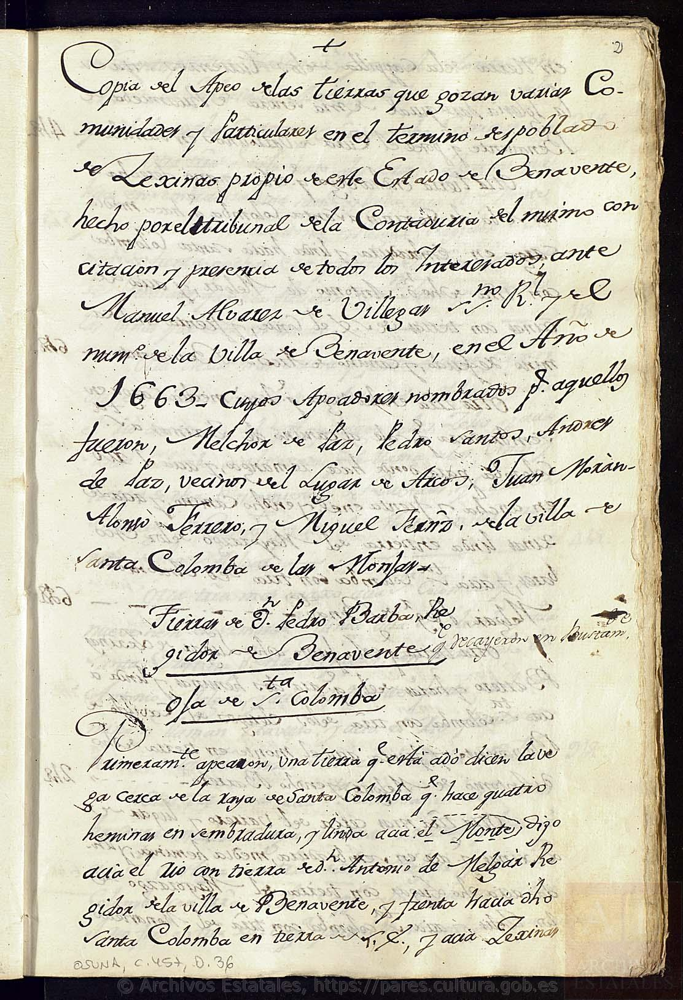
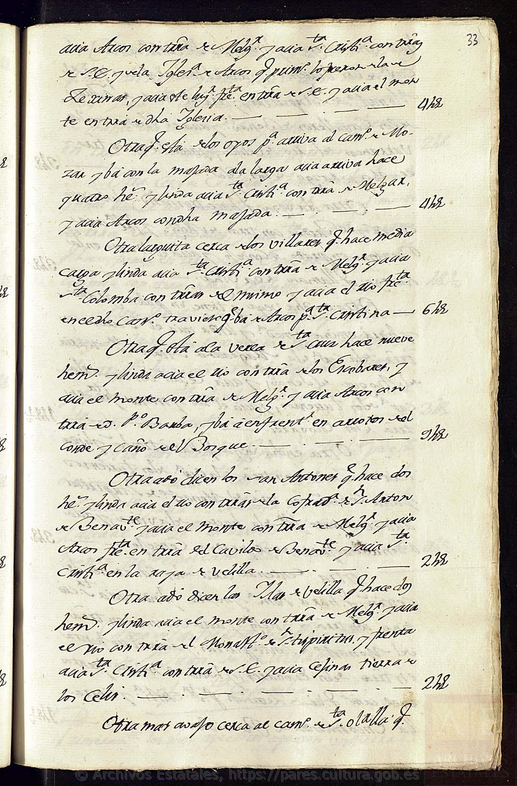
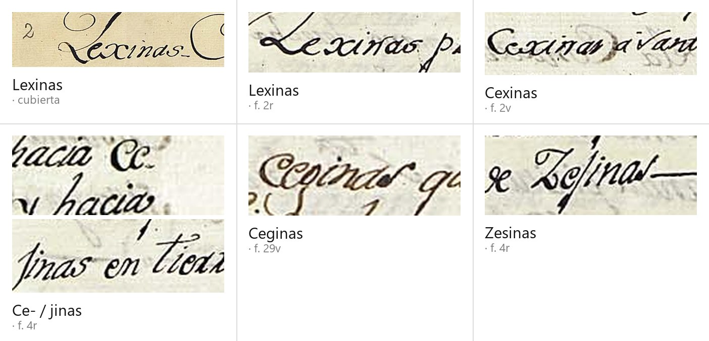
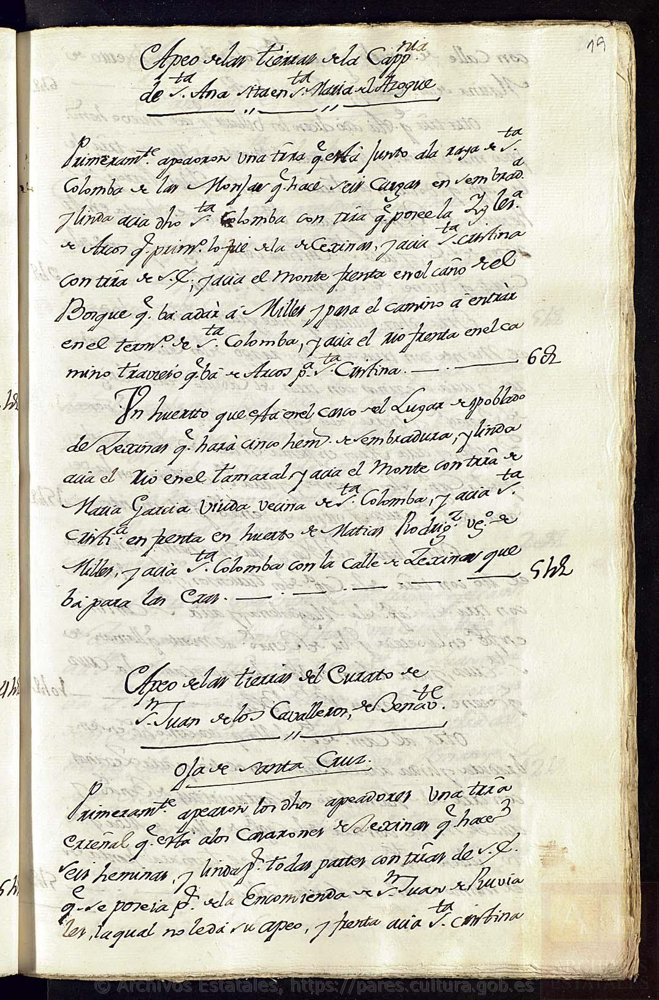
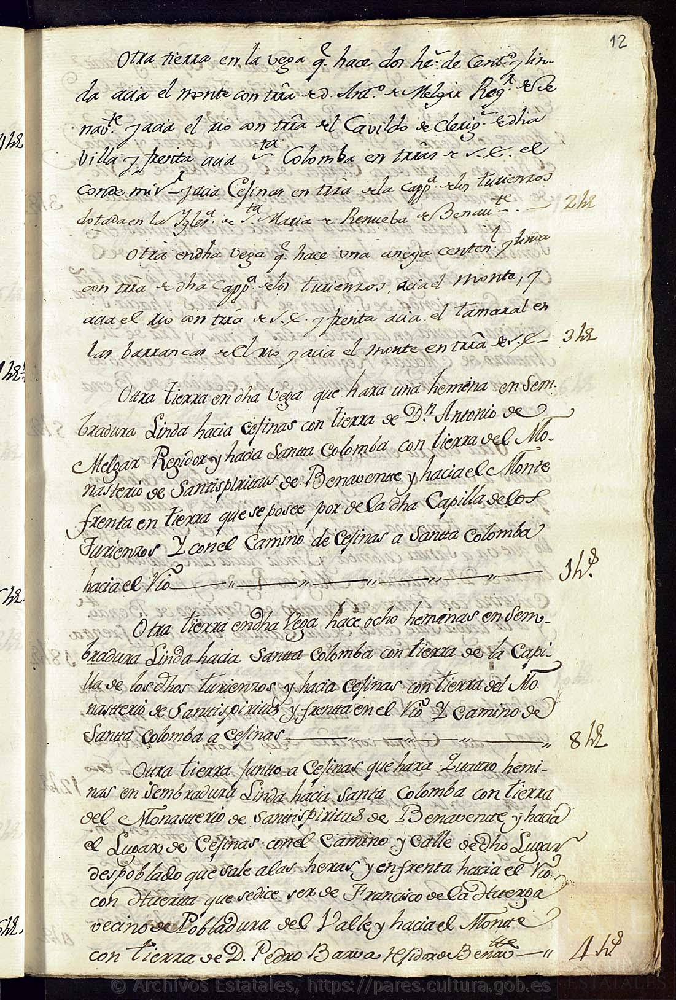
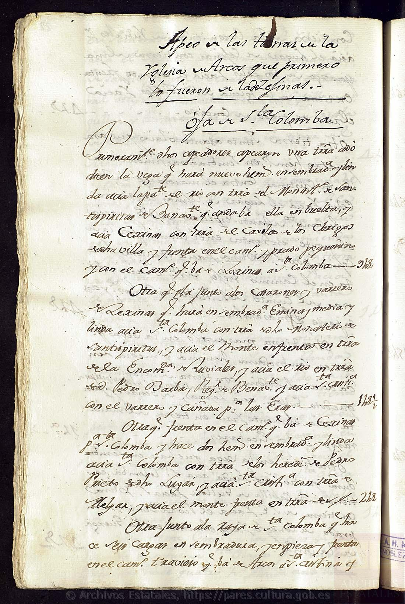
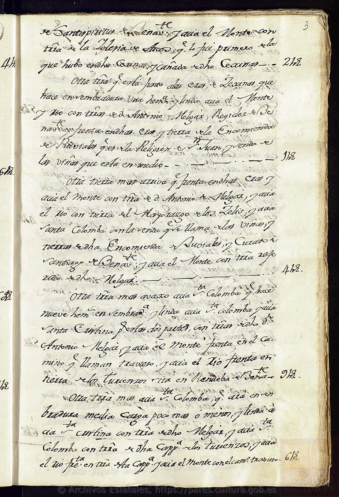
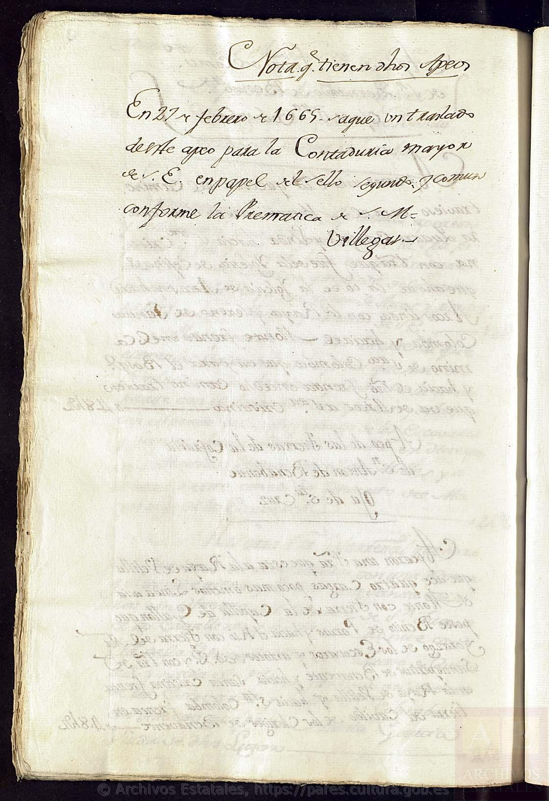

# El apeo del despoblado de **Lexinas**, 1663

> **Estado: ✅ DESCARGADO Y LEÍDO ENTERO.** 5 de octubre de 2026. **85 planas, las 85 vistas a
> resolución completa.** `OSUNA,C.457,D.36`, Archivo Histórico de la Nobleza.
>
> 🚨 **Colinas de Trasmonte NO aparece en este documento.** Ni una vez en cuarenta y dos folios.
> Se dice lo primero, y se dice sin rodeos, porque es lo que hay que saber antes de leer el resto.
>
> ✅ **Lo que sí hace** es cerrar, desde una fuente del propio señorío, **dónde estaba el lugar que
> tres rollos fiscales ponían pegado a Colinas en el renglón entre 1526 y 1591** — y, de paso,
> obligar a **matizar un negativo que este proyecto publicó hace unas horas**.

---

## 0. Por qué se ha leído un papel que no nombra a Colinas

Esta tarea (`TAR-31`) se registró **a propósito en prioridad 4**, con la razón escrita en el
registro: «*Cejinas está a 11 km del término y no es historia de Colinas; son 85 planas de letra
del XVII para cerrar un topónimo ajeno*». Se ha hecho igualmente porque era **la única pendiente
que no necesitaba a nadie más**, y porque de ella colgaba `TAR-21`: el topónimo que aparece junto a
Colinas en el **censo de pecheros de 1528** («Vezinas»), en la **relación del obispo de Astorga de
1587** («Jecinas») y en el **censo de 1591** («Xeçinas»).

> 📏 **Un apeo nombra lindes.** Ésa era toda la apuesta: si el documento deslindaba tierras, diría
> **contra qué términos** estaba el despoblado. La apuesta sale.

---

## 1. La unidad

| | |
|---|---|
| **Archivo** | Archivo Histórico de la Nobleza (Toledo) |
| **Signatura** | **`OSUNA,C.457,D.36`** — comprobada **en el sello del propio folio** |
| **Código de referencia** | `ES.45168.AHNOB/1.4.5.4//OSUNA,C.457,D.36` |
| **PARES** | `catalogo/description/5270529` |
| **Título del catálogo** | «Apeo del despoblado de Cejinas, en el estado de Benavente (Zamora).» |
| **Fecha del catálogo** | «Sin fecha, S.L.» — **el propio texto dice 1663** |
| **Escritura** | humanística; **tres manos** distintas se reparten el cuaderno |
| **Extensión real** | **ff. 2r–43v** = 42 hojas, **84 planas escritas** + cubierta = **85 imágenes** |
| **Conservación** | buena; tinta muy legible |

> ⚠️🔁 **Y una advertencia de método que conviene guardar.** El catálogo de PARES describe esta
> unidad como **«Unidad Documental Simple · 1 Documento(s) en Papel. Hoja(s)»**. Es **un cuaderno
> de cuarenta y dos folios**. La sospecha quedó anotada en el registro *antes* de abrirlo —«*lo que
> no cuadra con 85 imágenes*»— y se confirma: **el campo de extensión del catálogo no es fiable; el
> tamaño real sólo lo dice el número de imágenes**, y el contenido sólo lo dice mirarlas.

---

## 2. El encabezamiento, transcrito

> «**Copia del Apeo de las tierras que gozan varias Comunidades y Particulares en el término
> despoblado de Lexinas, propio de este Estado de Benavente**, hecho por el **tribunal de la
> Contaduría** del mismo, **con citación y presencia de todos los Interesados**, ante **Manuel
> Álvarez de Villegas**, n[otari]o R[ea]l y del núm[er]o de la villa de Benavente, en el **Año de
> 1663**. Cuyos **Apeadores** nombrados para aquello fueron: **Melchor de Paz, Pedro Santos,
> Andrés de Paz, vecinos del Lugar de Arcos**; **Juan Morán, Alonso Ferrero y Miguel Ibáñez** `[?]`,
> de la villa de **Santa Colomba de las Monjas**.»

| | |
|---|---|
| Qué es | un **apeo**: deslinde parcela a parcela de un término, con lindes y cabida |
| Quién lo manda | la **Contaduría del estado de Benavente** — es decir, **el conde** |
| Ante quién | **Manuel Álvarez de Villegas**, notario real y del número de Benavente |
| Cuándo | **1663** |
| Quién lo anda | **seis apeadores**: tres de **Arcos**, tres de **Santa Colomba de las Monjas** |
| Cómo | «**con citación y presencia de todos los Interesados**» |

> ★ **Fíjese en quiénes son los apeadores.** No son de Benavente ni funcionarios: son **vecinos de
> los dos pueblos que lindan con el despoblado**. Son los que saben dónde está cada mojón porque
> labran allí. Es el procedimiento ordinario, y es también la razón de que el documento sirva como
> fuente topográfica: **lo dictó la gente que andaba el terreno**.

---

## 3. 🚨 Dónde estaba — y esto es lo que se venía a buscar

El apeo no da coordenadas: da **direcciones**. Y usa, con una constancia casi mecánica a lo largo
de los cuarenta y dos folios, **un sistema de cuatro rumbos** que es, por sí solo, el mapa:

| Rumbo que usa el apeo | Qué es |
|---|---|
| «**hacia Santa Colomba**» | Santa Colomba de las Monjas |
| «**hacia Santa Cristina**» | Santa Cristina de la Polvorosa |
| «**hacia Arcos**» | Arcos de la Polvorosa |
| «**hacia el Río**» | el **Órbigo** — el documento lo nombra: «*frenta en el **río Órbigo***» (f. 6v) |
| «**hacia el Monte**» | el lado opuesto al río |

Y las **rayas** que el texto cita como término contra término: «**la raya de Santa Colomba**», «**la
raya del Lugar de Arcos**», «**la raya de Velilla**».

### Los caminos que lo cruzan

Todos salen o entran del propio despoblado, y todos van a sitios de la Polvorosa y de Benavente:

- el camino **de Cexinas a Santa Colomba**
- el **camino nuevo de Lexinas a Santa Cristina**
- el **camino travieso**, que va **de Arcos a Santa Cristina**
- el camino **de Arcos a Benavente**
- el **camino de Milles** (Milles de la Polvorosa)
- 🚨 el **camino de Mózar** (f. 33r)
- el camino **de Santa Olalla**, y el **camino viejo** de lo mismo
- la **vereda de Santa Cruz**, «*que va de Benavente al Monte*»
- el **camino de la Cruz**, «*que va de Lexinas a San Blas*»
- la **senda de las Viñas**
- el **vado del río de Ventosa**

### ✅ Conclusión

> ✅ **El despoblado de Lexinas / Cejinas estaba encajado entre Santa Colomba de las Monjas, Santa
> Cristina de la Polvorosa y Arcos de la Polvorosa, a la vera del Órbigo.** Lo dicen, sin margen, los
> deslindes de cuarenta y dos folios de un apeo del propio señorío.

> 🚨 **Y eso devuelve, desde una fuente mucho mejor, la pata que el 5 de octubre por la mañana se
> había caído.** La **relación del obispo de Astorga de 1587** coloca a «**Jecinas**» en la lista
> **entre Santa Coloma y Santa Christina** → [`censo-1591`, § 7](../censo-1591/README.md). Ese
> orden, que era un indicio, **resulta ser la descripción exacta del terreno**. No es ya una
> noticia de divulgación: es **un apeo notarial de 1663**.

> ⚠️ **Lo que sigue sin haber: una coordenada.** El apeo es relativo de principio a fin — «hacia»,
> «frenta», «linda», «la raya de»—. **Sitúa el lugar contra cuatro términos; no lo pone en un
> punto.** Para eso haría falta el parcelario, o un trabajo de toponimia (**`LIB-05`**, Riesco
> Chueca).

---

## 4. 🚨 Seis grafías del mismo nombre, en el mismo cuaderno

Éste es el hallazgo que no se esperaba, y el que más lejos llega.

| Grafía | Dónde | Observación |
|---|---|---|
| **Lexinas** | cubierta y f. 2r | la forma del encabezamiento; la **L** se contrasta con la de «*Lugar de Arcos*», más abajo en la misma plana |
| **Cexinas** | f. 2v | la **C** es idéntica a la de «*Colomba*» en la misma línea |
| **Ce-/jinas** | f. 4r | partida entre renglones; la **j** lleva punto y no sube |
| **Ceginas** | f. 29v | **g** con lazo inferior, inconfundible |
| **Zesinas** | f. 4r | **Z** con lazo descendente y **ſ** alta |
| **Cesinas** | *passim* | ⚠️ ver la salvedad de abajo |

> ⚠️ **Una salvedad palaeográfica, y no es menor.** En estas manos la **ſ alta** y la **j** se
> parecen mucho: la primera sube y baja, la segunda sólo baja y lleva punto. En las ocurrencias
> aisladas **no siempre es posible separarlas**, de modo que «**Cesinas**» y «**Cejinas**» pueden
> ser, en parte, **la misma letra leída de dos maneras**. Se anota así, con `[?]` implícito, en vez
> de inflar la cuenta.

> 🚨 **Lo que esto documenta, que es mucho:** en **un solo cuaderno**, copiado por **tres manos**,
> en **un solo año**, el nombre se escribe con **L-, C-, Z-**, y con **-x-, -j-, -g-, -s-**. La
> inicial y la sibilante del topónimo eran **gráficamente inestables para los propios escribanos
> del señorío que lo administraba**.

> ⚠️ **Lo que NO demuestra.** No demuestra que «**Vezinas**» del censo de pecheros de 1528 sea este
> lugar. Demuestra que **la variación que esa identificación necesita existía de hecho**, y que no
> hay que postularla. **La cadena 1587 → 1663 queda cerrada; el eslabón de 1528 sigue siendo
> propuesta.** Se mantiene ★★.

---

## 5. Lo que quedaba en pie del pueblo, en 1663

Un despoblado no es un solar vacío. Setenta años largos después de la última vez que se le contaron
vecinos, el apeo sigue deslindando contra **las cosas del pueblo**, porque seguían viéndose:

| Lo que el apeo nombra | Cita |
|---|---|
| **el casco del lugar** | «*un huerto que está en **el casco del Lugar despoblado de Lexinas***» (f. 19r) |
| **la calle** | «*con la **calle de d[ic]ho Lugar despoblado que sale a las heras***» (f. 12r) |
| **las casas** | «*el barrero de **las Casas que hubo en Cexinas***» |
| **los corralones** | «*los **Corralones caydos***» |
| **las eras** | «*las **eras de Cexinas***», constantes como linde |
| **el barrero** | el barrero del lugar, donde se sacaba el barro |
| **huertos dentro del pueblo** | «*un huerto hortezal que está **dentro de d[ic]ho Lugar***» |
| **un palomar** | «*un huerto… con un **Palomar caydo***» (f. 41v) |
| **el pozo** | «*el huerto **del Pozo***» |
| **la iglesia** | ver § 6 |
| **dos ermitas, las dos caídas** | «*la **hermita que fue de San Blas***»; «*las **tapias de la hermita que fue de Santa Olaya***» |
| **el prado concejil** | «*prado de **Concejo***» — el común sobrevive al concejo |

> ★★ **Y esto da una ventana de despoblación.** En **1591** el lugar aún declara **21 vecinos**; en
> **1663** los corrales están **caídos**, las ermitas son «*la que **fue** de*», y la iglesia ya no
> tiene quien la sirva. ⚠️ **No fecha el abandono** —entre esas dos fechas caben setenta años y
> ninguna de las dos fuentes lo dice—, **pero lo acota**: ocurrió **entre 1591 y 1663**, y a juzgar
> por el estado de ruina, bastante antes de 1663.

> ★ **Y pone a Colinas en perspectiva, que es quizá lo único que este papel le aporta de verdad.**
> En **1587**, en la misma relación del mismo obispo, **Colinas declaró 34 vecinos y Jecinas 27**
> → [`censo-1591`, § 7](../censo-1591/README.md). **Eran dos lugares del mismo tamaño, del mismo
> señorío y del mismo obispado.** Uno sigue ahí. Del otro, en 1663, quedaba una calle.

---

## 6. 🚨 La iglesia de Cejinas, y a dónde fue a parar

Es el dato institucional más limpio del cuaderno, y se repite en siete u ocho lugares:

> «**Apeo de las tierras de la Iglesia de Arcos que primero lo fueron de la de Zesinas.**
> Oja de S[an]ta Colomba.» (f. 28v)

Y en los deslindes, una y otra vez: «*tierra de la **Iglesia de Cesinas que posee la de Arcos***»;
«*la Iglesia de Arcos, **que lo fue primero de la que hubo en d[ic]ho Cexinas***»; «*tierra de la
Iglesia **que fue de este Lugar**, que al presente la posee la Iglesia de Arcos*».

> ✅ **Documentado:** la parroquia de Cejinas **existió** —el apeo le reconoce patrimonio propio— y
> **su dotación pasó íntegra a la iglesia de Arcos de la Polvorosa**, que en 1663 la poseía y la
> hacía apear como sección aparte.
>
> ★ **Interpretado:** eso **confirma por otra vía** lo que decía la relación de 1587, donde
> «Jecinas» figura **con pila propia** —no como anejo ni como pago—. Un lugar sin parroquia no
> tiene tierras de iglesia que legar.
>
> 📏 **Y señala dónde seguir**, si alguien quiere: **el archivo parroquial de Arcos de la
> Polvorosa**, o el del obispado de Astorga, heredaron esos papeles.

---

## 7. Quién tenía el suelo de un pueblo muerto

El término, despoblado, **seguía produciendo renta** — y la cobraba media Benavente eclesiástica.
El cuaderno está organizado **por titular**, cada uno con su apeo y, dentro, con sus dos hojas:

→ [`apeo-cejinas-1663-titulares.tsv`](../../03-archivos/apeo-cejinas-1663-titulares.tsv)

**Comunidades y fundaciones** · Monasterio de **Santi Spíritus** de Benavente · Convento de **San
Bernardo** · Convento de **Santo Domingo** · **Cabildo de los clérigos de San Vicente** · Curato de
**Santiago** · Curato de **San Juan de los Caballeros** · **Iglesia de Arcos** (antes de Cejinas) ·
**Encomienda de San Juan de Rubiales** · capellanías de los **Turienzos** (la Anunciación y Santa
Catalina, en N.ª S.ª de **Renueva**), de **Bartolomé Gullón** (Misa de Alba, en **Santa María del
Azogue**), de **la Magdalena** y de **Santa Ana** (las dos en el Azogue) · **Cofradía de San Antón**.

**Mayorazgos** · los **Celis** · los **Escobar** · los **Enríquez**.

**Particulares** · **D. Pedro Barba** y **D. Antonio de Melgar**, regidores de Benavente —los dos
mayores con diferencia— · **D. Fernando de Escobar, vecino de Valladolid** · **Matías Rodríguez**,
de Milles · **Francisco de la Huerga**, de **Pobladura del Valle** · **María García** e **Isabel
Domínguez**, de Santa Colomba · **Gregorio Rubio**, de Santa Cristina · herederos de **Pedro
Prieto** y de **Marina de las Casas**.

**Y el conde**, que no apea: sus tierras aparecen como linde de todas las demás, casi siempre como
«**arrotos de Su Excelencia**» — roturaciones.

> ⚠️🔁 **Ojo con un nombre.** «**Francisco de la Huerga, vecino de Pobladura del Valle**» es de
> **Pobladura del Valle**, villa viva al norte de Benavente — **no** de la **Pobladura de
> Trasmonte** que este proyecto persigue en el valle de Vidriales. Son dos sitios distintos y el
> parecido es sólo del primer nombre. Se deja escrito para que nadie los cruce.

### Las dos hojas

Cada titular apea **en dos secciones**: «**Oja de Santa Colomba**» y «**Oja de Santa Cruz**».

> ★ **Interpretado, y con poca duda:** son **las dos hojas de la rotación** —el sistema de año y
> vez—, nombradas por el rumbo de cada una. El término de un pueblo que ya no existía **seguía
> organizado en hojas** y labrándose como tal desde los pueblos de al lado.

---

## 8. 🚨🔁 Y esto obliga a matizar un negativo publicado esta misma mañana

Horas antes de leer este apeo, el proyecto cerró `TAR-29` con esta conclusión:

> *«el Catastro de hoy no tiene en Santa Colomba de las Monjas ningún paraje llamado Cejinas»* —y
> de ahí— *«le quita una pata a la identificación»*
> → [`parajes-catastro.md`](../../04-cartografia/parajes-catastro.md).

**El hecho sigue en pie. La inferencia no, o no entera.** El apeo dice en su primera línea que
Lexinas era **«término» propio** —«*el término despoblado de Lexinas, propio de este Estado de
Benavente*»— con **raya contra Santa Colomba, contra Arcos y contra Velilla**. Es decir:

> 🚨 **El sitio no tenía por qué caer en el término de Santa Colomba.** La premisa de `TAR-29` —que
> venía de una descripción divulgativa que lo ponía «en la zona norte del término de Santa
> Colomba»— **era una de cuatro posibilidades**, y el barrido midió **sólo una**. **Arcos de la
> Polvorosa y Santa Cristina de la Polvorosa no se barrieron nunca.**

> ⚠️ **Se ha intentado barrerlos hoy mismo, y no se ha podido.** El servicio del Catastro
> (`ovcservweb`) **rechaza la conexión** desde esta máquina —`ECONNRESET`, probado con dos clientes
> distintos y por dos rutas—, horas después de haberle pedido las 233 parcelas de `TAR-29`. Queda
> como **`TAR-32`**, con el guion ya escrito.

> 📏 **Lo que corresponde decir mientras tanto:** <s>«el parcelario no lo confirma, y el negativo es
> cerrado»</s> → **el parcelario *de Santa Colomba* no lo confirma, y ese negativo sí es cerrado —
> pero no decide nada, porque el despoblado lindaba con tres términos más**.

---

## 9. La nota final: qué es exactamente esta copia

> «**Nota que tienen dichos Apeos.** En **27 de febrero de 1665** saqué un **traslado** de este
> apeo para la **Contaduría mayor de Su Excelencia**, en papel **del sello segundo y común**
> conforme la **Premática**. — **Villegas**»

> 📏 **Léase despacio, porque fija la naturaleza del papel.** Lo que PARES sirve es, según su
> propia ficha, una «**copia simple**». La nota la firma **Villegas** —el mismo notario del
> encabezamiento de 1663— y dice que **de aquí** sacó en 1665 **el traslado en papel sellado** para
> la Contaduría mayor. Es decir: **esto es el ejemplar de trabajo de la contaduría**, y el traslado
> solemne fue otro, que puede o no existir todavía en el mismo legajo.

---

## 10. Lo que queda abierto

| | |
|---|---|
| **`TAR-32`** | barrer el parcelario de **Arcos de la Polvorosa** y **Santa Cristina de la Polvorosa** (§ 8) |
| **`LIB-05`** | **Riesco Chueca**, *Toponimia de la provincia de Zamora* — la vía propiamente toponímica |
| **Velilla** | el apeo cita «**la raya de Velilla**», «**la Isla de Velilla**» y «**el río de Velilla**». **Un segundo despoblado** en la misma raya, del que este proyecto no sabe nada |
| **Ventosa** | lo mismo: «**el río de Ventosa**», «**el vado**», «**la molinera de Ventosa**» |
| **Santa Olalla** | una **tercera** ermita-despoblado, con sus tapias en pie en 1663 |
| Archivo parroquial de **Arcos** | heredó la dotación de la iglesia de Cejinas (§ 6) |

> ⚠️ **Y una advertencia de alcance, que cierra como abrió la ficha.** Velilla, Ventosa y Santa
> Olalla **están a once kilómetros de Colinas y no son historia de Colinas**. Se anotan porque el
> criterio del proyecto manda registrar lo que una fuente da aunque no se vaya a seguir — **no
> porque haya que seguirlo**.

---

## Nota de reutilización

**Archivo Histórico de la Nobleza**, fondo **Osuna**, signatura **`OSUNA,C.457,D.36`**. Imágenes
obtenidas de **PARES** (Ministerio de Cultura); documento en dominio público. Cítese el Ministerio
de Cultura, el archivo, la signatura y la URL de PARES. En este repositorio se han depositado
**once de las ochenta y cinco planas**, las citadas en esta ficha; **las ochenta y cinco se han
leído**.

---

*Ficha redactada el 5 de octubre de 2026 · `TAR-31`.*
