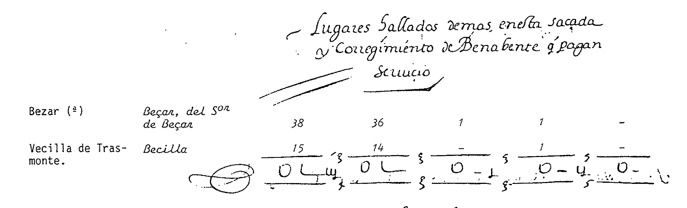
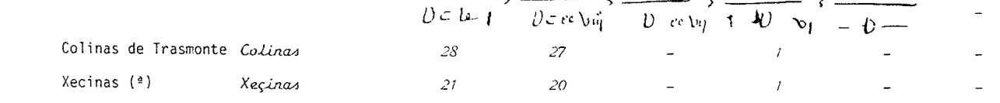
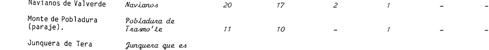
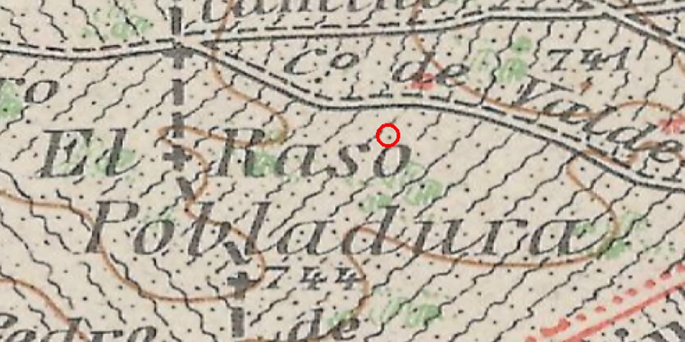

# El Censo de la Corona de Castilla, 1591 — el punto más antiguo de la serie

> **Estado: ✅ FUENTE CERRADA Y AHORA COMPLETA.** 22 de septiembre de 2026; **corregida y
> terminada el 23**. Colinas de Trasmonte aparece con **28 vecinos** en el vecindario de 1591,
> **ciento sesenta y un años antes** del Catastro de Ensenada.

> ## 🚨 CORRECCIÓN DEL 23 DE SEPTIEMBRE — Y EL HALLAZGO QUE TRAJO
>
> **Esta transcripción estaba incompleta y no lo decía.** Se leyeron las planas **666-669** porque
> la tira de contactos situó ahí «los pueblos del Tera». Pero la sacada de Benavente **no termina
> en la 669: termina en la 670**, y en esa plana —la que no se leyó— había **diez lugares más**.
>
> Lo descubrió el cotejo con el Censo de Pecheros de 1526: ocho lugares que estaban en 1526 no
> aparecían en 1591, y **ocho desapariciones simultáneas no son un hecho histórico, son un fallo de
> método**. Lo eran.
>
> ### 🚨🚨 Y en esa plana estaba Vecilla de Trasmonte
>
> 
>
> Bajo un encabezamiento que el proyecto no conocía:
>
> > «**Lugares hallados demás en esta sacada y Corregimiento de Benabente q[ue] pagan servicio**»
>
> > | Denominación actual (editor) | Nombre en 1591 | Vec. | Pech. | Hid. | Cler. |
> > |---|---|---:|---:|---:|---:|
> > | Bezar | «Beçar, del S[eñ]or de Beçar» | 38 | 36 | 1 | 1 |
> > | **Vecilla de Trasmonte** | «**Becilla**» | **15** | **14** | **–** | **1** |
>
> ★★★ **Vecilla de Trasmonte sí está en el censo de 1591.** El `[?]` que este proyecto arrastraba
> —«Vecilla no aparece»— **era mío, no de la fuente**. Queda anulado más abajo, en el punto 5.
>
> ★★ **Y el documento dice por qué no estaba con las demás**: es un lugar **«hallado demás»**,
> encontrado *aparte* al hacer la averiguación y añadido al final. No faltaba: llegó tarde.
>
> ⚠️ Y otra vez, como en 1526 y como en el cuaderno de dezmeros: **«Becilla», a secas**, sin «de
> Trasmonte». El determinante es del editor.
>
> ### La prueba de que ahora sí está entera
>
> La plana 670 cierra con la suma del propio censo. Las cuatro columnas de la transcripción
> **cuadran exactamente** con ella:
>
> | | Vecinos | Pecheros | Hidalgos | Clérigos |
> |---|---:|---:|---:|---:|
> | **Suma del censo («MONTA»)** | **4.030** | **3.602** | **294** | **133** |
> | **Los 117 lugares transcritos** | **4.030** | **3.602** | **294** | **133** |
>
> Antes eran 107 lugares y 3.695 vecinos: faltaban **335 vecinos**. Ahora no falta ninguno.
> Y sumando la villa de Benavente (728 vec. / 656 pech., según la tabla comparativa del Censo de
> Pecheros), la tierra entera da **4.758 vecinos**, que es justo lo que el INE publica.

---

## La ficha

| | |
|---|---|
| **Fuente** | *Censo de la Corona de Castilla, 1591* — el llamado **«Censo de los Millones»**, levantado para repartir el servicio extraordinario de ocho millones de ducados |
| **Edición** | INE, *Censo de la Corona de Castilla 1591*, t. II, **«Vecindarios»**, Madrid, 1985 `[?]` *(año tomado del catálogo, no de la portada)* |
| **Dónde cae Colinas** | **Provincia de las tierras del Conde de Benavente** → «*Lugares de la tierra y sacada de Benavente*», **p. 667** |
| **Acceso** | En abierto: `ine.es/prodyser/pubweb/censo_corona/Censo_Corona_T2.pdf` (852 pp., **sin capa de texto**) |
| **Cómo se ha leído** | Sobre el facsímil, a 200 ppp. **No hay OCR que copiar**, de modo que aquí no cabía la tentación |

---

## La entrada

| Denominación actual | Como se escribe en 1591 | Todos vecinos | Pecheros | **Hidalgos** | Clérigos | Religiosos |
|---|---|---|---|---|---|---|
| **Colinas de Trasmonte** | ***Colinas*** | **28** | **27** | **—** | **1** | — |

---

## Lo que resuelve

### ★★★ 1. La serie se alarga ciento sesenta y un años

| Año | Vecinos | Almas | Fuente |
|---|---|---|---|
| **1591** | **28** | — | **Censo de la Corona de Castilla** |
| 1752 | 27 | — | Catastro de Ensenada |
| 1787 | — | 156 | Censo de Floridablanca |
| 1826 | 55 | 226 | Miñano |
| 1847 | 33 | 132 | Madoz |

**Entre 1591 y 1752 el pueblo no se mueve: 28 vecinos y 27.** Ciento sesenta y un años, dos
dinastías y tres guerras, y el mismo tamaño. Ésa es la línea de base de Colinas: **un lugar de
treinta vecinos**.

> ⚠️ **Cuidado con convertir.** La cifra es de **vecinos**, no de habitantes, y el coeficiente no es
> constante. Las dos fuentes del proyecto que dan las dos cosas —Miñano y Madoz— arrojan **4,1 y
> 4,0 almas por vecino**. Con ese orden de magnitud, 28 vecinos serían **unas 110-115 almas**, pero
> **eso es una estimación y en este proyecto no se publica como dato**.

### ★★★ 2. Y eso aprieta el frente nº 16

Con 1591 en la mano, la forma de la serie cambia de sentido. **No hay un pueblo que oscile**: hay un
pueblo estable en torno a 27-28 vecinos durante siglo y medio, que **crece de verdad en el último
tercio del XVIII** —156 almas en 1787, 226 en 1826— y que después **pierde el 42 % en veintiún
años**, hasta las 132 de 1847.

**El agujero de 1826-1847 se refuerza como caída real**, y no como artificio de unidad de cuenta:
una fuente anterior y homogénea confirma que el nivel bajo del XIX no es «el nivel de siempre».

### ★★★ 3. Cero hidalgos — y ahora la comparación **está hecha**

Colinas declara **ningún hidalgo** en 1591, igual que en **1752** y que en **1787**. Tres recuentos,
dos siglos, el mismo cero.

Este proyecto ya se corrigió una vez por afirmar, sin comprobarlo, que los pueblos vecinos
declaraban hidalgos «entre uno y siete». **Ahora la comprobación existe**: se han transcrito del
facsímil los **117 lugares** de la provincia del Conde de Benavente —**4.030 vecinos**, la
provincia entera— y el resultado está en
[`vecindario-1591-conde-de-benavente.tsv`](vecindario-1591-conde-de-benavente.tsv):

> **56 de los 117 lugares (el 47,9 %) declaran CERO hidalgos.**
>
> **El cero de Colinas es el caso normal de su comarca, no una singularidad.** Lo singular está en
> el otro extremo: **Grajal de la Ribera** (22 hidalgos de 64 vecinos), **Villaquejida** (16),
> **San Pedro de Zamudia** (15 de 24), **Verdenosa** (14) y **Junquera de Tera** (13 de 28).

Y de tamaño, lo mismo — sólo que al completar la lista el resultado se vuelve más exacto de lo
que nadie habría pedido:

> ★★ **La mediana de los 117 lugares es de 28 vecinos. Colinas tiene 28.**
>
> No «parecido a la media»: **Colinas es literalmente el lugar mediano de la tierra del Conde de
> Benavente en 1591**, con 54 lugares por debajo y 58 por encima.

### ★★★ 4. Pobladura de Trasmonte: la cifra, y por fin el sitio

> «**Monte de Pobladura (paraje).** | *Pobladura de Trasmo'te* | **11** | **10** | — | **1**»

Dos cosas, y las dos importan:

1. ✅ **Queda comprobada en la fuente** la cifra que el proyecto tenía de segunda mano por Lobato
   Vidal: **11 vecinos, 10 pecheros y un clérigo**. Ahora está vista.
   > 🚨 **Y el 23 de septiembre esta cifra pasa a ser la última que se le conoce.** En **1526**
   > Pobladura tenía 15 pecheros y el escribano la anotó «despoblado por la peste»; aquí, sesenta y
   > cinco años después, **sigue viva con 11 vecinos**; y en el **Censo de Aranda (1768-69)** el
   > obispado de Astorga tiene cinco Pobladuras y **ninguna «de Trasmonte»**.
   > **Pobladura de Trasmonte desapareció entre 1591 y 1768**
   > → [`censo-aranda-1768/`](../censo-aranda-1768/README.md).
2. ⚠️ **La edición del INE la identifica como «Monte de Pobladura (paraje)»** — y esa
   identificación **hay que ponerla en cuarentena**, como se explica abajo. Lo que sí es del
   documento, y no del editor, es el **lugar que ocupa en la lista**: entre **Villanázar**,
   **Navianos de Valverde** y **Junquera de Tera**.

> 🚨 **Cuarta indicación de que Pobladura no era de Colinas.** Ya son: la entrada propia de Madoz
> («térm. de Villanazar»), Lobato Vidal, el apeo de Vecilla de 1706 —que trata «azia Pobladura» y
> «azia Colinas» como dos vecinos distintos— y ahora **el orden del vecindario de 1591**, que la
> coloca entre Villanázar, Navianos de Valverde y Junquera de Tera. Frente a todo eso, **sólo el
> artículo de Colinas de Madoz** dice lo contrario. Ver
> [inventario, §8.2](../../03-archivos/inventario-documental.md).

#### 🚨 La identificación del INE no se sostiene, y se comprobó el mismo día

Esta ficha llegó a decir que «Monte de Pobladura (paraje)» era **una pista para localizar el
despoblado**. Comprobado en el **Nomenclátor Geográfico Básico** del IGN, no lo es:

- El **único** «Monte de Pobladura (Paraje)» que registra el nomenclátor está en **Valderas
  (León)**, a más de **cincuenta kilómetros** de aquí y en otra provincia. Hay allí, además, una
  «Casa del Monte de Pobladura». **El editor de 1985 emparejó nuestro «Pobladura de Trasmo'te» con
  un topónimo de la Tierra de Campos leonesa.**
- **No existe** ningún «Pobladura de Trasmonte» en el nomenclátor.

**Lo que sí existe, y en el sitio correcto**, es un paraje llamado, a secas, **«Pobladura»**:

| | |
|---|---|
| **Pobladura (Paraje)** | IGN, Nomenclátor Geográfico Básico, `ngbe_214444` |
| Municipio | **Navianos de Valverde** (Zamora) |
| Coordenadas | **41,954530 N · 5,831604 O** |
| Navianos de Valverde queda | **1.159 m al E** |
| El casco de Colinas queda | **5.756 m al NNE** |
| **Del término de Colinas** | **3.368 m fuera del límite** |

Y encaja con el orden de la lista de 1591, que pone Pobladura **justo detrás de Navianos de
Valverde**.

> ⚠️ **Pero no es el sitio que describe Lobato Vidal**, que la pone «entre Villanázar y Vecilla de
> Trasmonte, **no distando de ambos un kilómetro**». Este paraje está a **4.769 m de Villanázar** y a
> **5.459 m de Vecilla**.

#### ✅ Y entonces se miró el mapa — que es lo que había que hacer desde el principio

En el **MTN50 de primera edición**, en ese punto exacto, está rotulado:

> ### «El Raso Pobladura»

**Tres registros independientes dicen lo mismo, cada uno con un trozo del nombre:**

| Registro | Lo que conserva |
|---|---|
| **MTN50 de 1.ª edición** (IGN) | «**El Raso Pobladura**» — el nombre entero |
| **Nomenclátor Geográfico Básico** (IGN) | «**Pobladura** (Paraje)», Navianos de Valverde |
| **Catastro**, parcelario de Navianos | «**EL RASO**» — la otra mitad, a 94 m del punto |

**Ahí estuvo Pobladura de Trasmonte.** El ráster, con su encuadre en el nombre, queda en
[`04-cartografia/ign-historico/`](../../04-cartografia/ign-historico/README.md).

En la misma plana aparecen, alrededor, el «**Camino de San Pedro de Zamudia**» —otro de los lugares
del vecindario de 1591—, el «**Cº de Valdesón**» y, al suroeste, **Castrón**.

> ⚠️ **Lo que esto demuestra y lo que no.** Demuestra que **el nombre del despoblado sobrevive en el
> sitio**, y dónde. **No es una excavación**: no hay aquí vestigio arqueológico documentado, y un
> topónimo no fecha nada.
>
> `[?]` **Y sigue sin cuadrar con Lobato Vidal.** Se buscó su sitio expresamente: en el punto medio
> entre Villanázar y Vecilla de Trasmonte —los dos pueblos distan **2.499 m**— el parcelario da
> **Los Arrotos, Prado, Carrales, Mangas, Desagüe los Jarales** y **Castillo**. Ningún Pobladura. Y
> en las **127 parajes** que el muestreo del parcelario de **Villanázar** devuelve, **tampoco**.
> O describe otra cosa, o se equivocó.

> ✅ **Lo que sí queda cerrado, y era la pregunta del proyecto:** Pobladura de Trasmonte **no estaba
> en el término de Colinas**. Está **3.368 m fuera del límite**, en término de **Navianos de
> Valverde**. El artículo de Colinas de Madoz, que es la única fuente que la pone dentro, **se
> equivoca** — y lo dice su propia entrada de «Pobladura», que la manda a Villanázar.

> 🔎 **Nota de método, otra vez la misma.** El editor del INE identificó un topónimo por parecido de
> nombre, sin mirar el mapa; este proyecto estuvo a punto de repetirlo dándolo por bueno. **Es
> exactamente el error que el criterio del proyecto nombra**: «ni una frase de una fuente se
> interpreta sin mirar el mapa».

### ★ 5. Los confrontantes, medidos en 1591

| Linde | Vecinos en 1591 |
|---|---|
| **Quiruelas de Vidriales** (O) | 58 |
| **Manganeses de la Polvorosa** (N) | 30 |
| **Aguilar de Tera** (S) | 23 |
| **Santa Cristina de la Polvorosa** (NE) | 21 |
| **Vecilla de Trasmonte** (E) | ✅ **15** |

> ## ✅ RESUELTO el 23 de septiembre — y la respuesta estaba a una plana de distancia
>
> Aquí decía: «*Vecilla de Trasmonte no está en la provincia del Conde de Benavente […] Sin
> resolver*». **Era falso, y el error era mío**: la transcripción paraba en la plana 669 y Vecilla
> está en la **670**, en la lista de «**lugares hallados demás en esta sacada y Corregimiento de
> Benabente que pagan servicio**», escrita «**Becilla**»:
>
> > **15 vecinos · 14 pecheros · ningún hidalgo · 1 clérigo**
>
> ★ **Y ahora los cinco confrontantes de Colinas están medidos en la misma fuente y el mismo año.**
>
> ★★ **Vecilla es el más pequeño de los cinco** —15 vecinos frente a los 58 de Quiruelas—, y aun
> así es el concejo con el que Colinas pleiteó en **1600-1608** por el agua del Calero. El pleito
> no era entre iguales.
>
> ⚠️ **Lo que esto deshace, además**: ya no hace falta la explicación de «otra jurisdicción». En
> 1591 Vecilla **paga servicio con la sacada de Benavente** como Colinas. Lo que tenía de distinto
> es que **la averiguación no la había encontrado a la primera**.
>
> ⚠️ **Y lo que NO resuelve**: en el Censo de Pecheros de **1526** Vecilla sigue sin aparecer —
> tampoco entre los «hallados demás», porque allí no hay tal lista. Ver
> [`censo-pecheros-1528/`](../censo-pecheros-1528/README.md).
>
> **Las otras dos Vecillas son otras**: «Polvorosa y Veçilla» (8 vec.) es Vecilla de la Polvorosa, y
> «Veçilla de Chantre» (10 vec.) es un tercer lugar, sin identificar, que en las dos listas —1526 y
> 1591— aparece **entre Donadillo y Rosinos**, es decir, en la Carballeda y no en Trasmonte.

### ★ 6. «Verdenosa» existe

El `[?]` abierto esta misma tarde al leer la entrada de Quiruelas en Madoz —que dice confinar «con
térm. de **Verdenosa**»— queda resuelto: en 1591 figura «**La Verdenos que es del obispo de
astorga**», hoy **Verdenosa de la Polvorosa**, con **52 vecinos**, de los cuales **14 hidalgos**.
No era una errata.

### `[?]` 7. Un nombre que queda apuntado: «Xecinas»

Inmediatamente después de Colinas, la lista trae «**Xeçinas**», 21 vecinos, con marca de nota.
El término de Colinas tiene un pago llamado **Valancinas**, y OpenStreetMap lo escribe «Las
Valencinas». **No se afirma ninguna relación**: se anota porque el parecido existe y porque el lugar
aparece pegado a Colinas en la lista. Lo dirimiría la nota de la edición.

> ★ **23 de septiembre de 2026: hay un segundo testimonio.** El cuaderno de *dezmeros* del
> conde-duque de Benavente, de 1561 `[?]` / 1565 `[?]` (AHNOB, `OSUNA,C.426,D.135`), recorre el
> señorío lugar por lugar — y en el **folio 8**, **inmediatamente después del epígrafe «Colinas»**,
> trae otro que se lee «**Ce[z]inas**» `[?]`. **Tampoco figura entre los 54 lugares que PARES
> identifica**, y PARES advierte que quedan algunos sin identificar. Facsímil y detalle en
> [`dezmeros-benavente/`](../dezmeros-benavente/README.md).
>
> **Lo documentado:** dos fuentes del mismo señorío, separadas por unos treinta años, colocan
> **junto a Colinas** un lugar que nadie ha identificado, y las dos lecturas terminan igual.
>
> **Lo interpretado, y sólo eso:** si en 1591 tenía **21 vecinos**, era un **lugar poblado**, no un
> pago; y si hoy no existe, es un **despoblado**. Eso haría de él un vecino desaparecido de Colinas,
> que es cosa distinta —y más interesante— que un parecido de nombre.
>
> ⚠️ **Lo que sigue sin saberse:** si «Xeçinas» y «Ce[z]inas» son el mismo sitio, dónde estaba, y si
> tiene algo que ver con el pago **Valancinas**. La lectura del epígrafe de 1565 es **mía y
> dudosa**. Se anota como frente, no como resultado.

> 🚨 **Y el mismo día, por la tarde, aparece el tercero — y éste no es una lectura mía.** El **Censo
> de Pecheros de 1528** (datos de **1526**) trae, en la **inscripción 44**, **inmediatamente antes
> de Colinas** (inscripción 45): «**Vezinas**», **21 vecinos pecheros**, y el INE lo marca como
> **no identificado** → [`censo-pecheros-1528/`](../censo-pecheros-1528/README.md).
>
> | Fuente | Nombre | Cifra | Posición respecto a Colinas | Identificado |
> |---|---|---:|---|---|
> | **1526** | «**Vezinas**» | **21** | justo antes | ❌ |
> | **1561/65** `[?]` | «**Ce[z]inas**» `[?]` | — | justo después | ❌ |
> | **1591** | «**Xeçinas**» | **21** | junto a Colinas | ❌ |
>
> **Tres fuentes independientes del mismo señorío, en sesenta y cinco años, y dos dan la misma
> cifra: 21.** Ninguna edición ha sabido identificarlo.
> ⚠️ **Que 1526 y 1591 coincidan en 21 puede indicar identidad — o que una fuente copió de otra.**
> No se afirma que las tres grafías sean el mismo sitio.
>
> ★ **Y hay un segundo sin identificar en la misma lista de 1526**: «**Vecilla del Chantre**», 16
> pecheros (inscr. 76). Como **«Vecilla de Trasmonte» no aparece en todo el censo de 1528** —
> comprobado en los dos tomos—, es **candidata**, y se dice como hipótesis. ⚠️ En contra juega que
> **Villanázar sí está** en esa misma lista, lo que debilita la explicación de que Vecilla faltase
> por pertenecer a otra jurisdicción.

---

## Lo que esta fuente **no** es

- **No es un censo de población**: es un **reparto fiscal**. Cuenta **vecinos** —unidades
  contributivas— y los clasifica por condición. Quien no paga puede no estar.
- **No cubre toda la comarca.** Aquí sólo se ha vaciado la **provincia de las tierras del Conde de
  Benavente** —ahora sí, entera: los 117 lugares—. Los de realengo y los de otras jurisdicciones
  están en otras secciones del mismo tomo.
  > ⚠️ **Aquí decía que «Vecilla de Trasmonte es el ejemplo de lo que eso deja fuera».** No lo era:
  > Vecilla estaba dentro, en la plana que no se había leído. **El ejemplo de lo que la fuente deja
  > fuera era mi propia lectura.**
- **La columna «denominación actual» es del editor de 1985**, no de 1591. Cuando dice «Monte de
  Pobladura (paraje)» está identificando, y una identificación es una hipótesis con firma, no un
  dato del documento.
- El propio censo distingue entre lo **cobrado** y lo **suspendido**: el sumario de esta provincia
  da **17.423 vecinos** y, tras la corrección de la edición, **17.403**. Colinas está en la parte no
  suspendida.

---

## Cómo se obtuvo

1. El frente nº 16 apuntaba el censo de 1591 como «adquisición pendiente». Resultó estar **en
   abierto en el INE**, como ya lo estaban Floridablanca y Miñano.
2. Descarga del tomo II (33,9 MB, 852 pp.). **Sin capa de texto**: hay que navegarlo a ojo.
3. Localización por **tira de contactos**: se renderizó la franja superior de una de cada doce
   páginas a 95 ppp y se apilaron con su número, para leer los encabezados de sección. Así apareció
   «**Benavente, 1**» hacia la p. 663 del PDF.
4. Dentro de la sección, segunda tira de contactos con sólo la **columna de nombres**, que situó los
   pueblos del Tera en las pp. 666-669.
5. Lectura de esas cuatro planas a **200 ppp** y transcripción de 107 lugares.
6. ⚠️ **Y ahí estuvo el fallo.** La tira de contactos decía dónde estaban *los pueblos del Tera*, no
   dónde **terminaba la sacada**. Al cotejar con 1526 (23 de septiembre) aparecieron ocho lugares
   de 1526 sin correspondencia en 1591 — demasiados a la vez para ser historia.
7. Lectura de la plana **670** a **420 ppp**: diez lugares más, entre ellos **Vecilla de
   Trasmonte**, y la **suma del propio censo** al pie. Y de la **671**, que ya es Mayorga: la
   sacada termina, en efecto, en la 670.
8. **Verificación aritmética**: las cuatro columnas de los 117 lugares cuadran al vecino con la
   suma manuscrita (4.030 / 3.602 / 294 / 133). Sólo entonces se dio por cerrada.

> **La lección, anotada para el proyecto:** *ninguna transcripción está completa hasta que cuadra
> con el total que la propia fuente escribe al pie.* El facsímil traía la comprobación en la misma
> plana que faltaba por leer.

---

## Nota de reutilización

Edición del **Instituto Nacional de Estadística**, publicada en abierto en su portal de
publicaciones históricas. El documento original de 1591 se conserva en el **Archivo General de
Simancas**.

---

*Ficha redactada el 22 de septiembre de 2026.*

---

## 🚨🚨★ Dos recuentos de Colinas que el proyecto no tenía: 1571 y 1587

**25 de septiembre de 2026.** Vaciando MARTÍN BENITO, José Ignacio, «En la merindad de Valverde. Villanázar: notas para su historia», *Brigecio* **21-22** (2011-2012), pp. 145-168 aparecen **dos vecindarios del siglo XVI** que este
proyecto desconocía, los dos con signatura:

| Año | **Colinas** | Instrumento | Fuente |
|---|---:|---|---|
| **1571** | **48 vecinos** | «Relación que envía el **alcalde mayor del adelantamiento del reino de León** a Su Majestad de las ciudades, villas y lugares de dicho partido y de los vecinos y parroquias que tienen» | **AGS, Cámara de Castilla, Leg. 2159, F-9** |
| **1587** | **34 vecinos** | «Relación de **pilas y vecinos** remitida por el **obispo de Astorga** a Felipe II» | T. GONZÁLEZ, *Censo de población… en el siglo XVI*, Madrid 1829, pp. 180 y 183 |

### 🚨 Y obligan a revisar la frase que este proyecto más repite

El inventario y la web vienen diciendo que **«el pueblo estaba estable en 27-28 vecinos desde 1591
hasta 1752»**, y llamando a eso **una meseta de dos siglos y medio**. Con los dos datos nuevos, la
serie del XVI queda así:

| Año | Vecinos | Qué se cuenta |
|---|---:|---|
| **1526** | **25** | **pecheros** (Censo de Pecheros) |
| **1571** | **48** | vecinos (relación del adelantamiento) |
| **1587** | **34** | vecinos (relación del obispo de Astorga) |
| **1591** | **28** | vecinos: 27 pecheros, 0 hidalgos, 1 clérigo |
| **1752** | **27** | vecinos (Catastro) |

> ⚠⚠ **La meseta no se sostiene tal como estaba escrita.** Entre **1571 y 1591** —veinte años— la
> cifra pasa de **48 a 28**: un **42 % menos**, exactamente la misma magnitud del desplome de
> 1826-1847 que el frente nº 16 persigue.

### ⚠️ Pero antes de reescribir nada, cuatro cautelas — y son serias

1. **No se cuenta lo mismo.** 1526 cuenta **pecheros**; 1571 y 1587 cuentan **vecinos**; 1591 cuenta
   vecinos con desglose. Un pueblo de 25 pecheros puede tener más de 25 vecinos. **La serie no es
   homogénea**, y este proyecto ya se obligó una vez a distinguir unidades de cuenta.
2. **Los instrumentos tienen finalidades distintas**: el de 1571 es **fiscal-administrativo** del
   adelantamiento; el de 1587 es **eclesiástico** —relación de *pilas* y vecinos del obispado—; el de
   1591 es **fiscal**. Cuentan para cosas distintas y pueden contar distinto.
3. **El propio autor desconfía.** Escribe que la merma «se habría producido», **«si damos por buenos
   los datos anteriores»**. No afirma la caída: la condiciona.
4. ⚠️ **Estos datos no se han leído en su fuente.** Vienen de un artículo, no del facsímil.
   **Este proyecto no da por verificado lo que no ha visto**, y las dos signaturas están anotadas
   arriba precisamente para poder ir a comprobarlas.

> **Lo que sí puede decirse ya, sin forzar nada:** la idea de una **meseta lisa de 1526 a 1768**
> **queda en entredicho**, y el siglo XVI pasa de ser un tramo tranquilo a ser **un tramo sin
> resolver**. → Frente nº 16.

### ★ Y el dato sirve también para situar a Colinas entre sus vecinos

Con las mismas dos relaciones, el artículo da los pueblos de alrededor:

| Lugar | 1571 | 1587 |
|---|---:|---:|
| **COLINAS DE TRASMONTE** | **48** | **34** |
| Milles de la Polvorosa | 42 | — |
| Mózar | 18 | 23 |
| Villanázar | 25 | 15 |
| Vecilla de Trasmonte | 19 | 14 |
| Olmillos | 15 | 17 |
| **Pobladura de Trasmonte** | **10** | **9** |

> ★★ **En 1571 Colinas es, con diferencia, el mayor de su entorno inmediato** —el doble que
> Villanázar, dos veces y media Vecilla—. **No era el pueblo pequeño que la serie posterior sugiere.**
> ⚠️ Con las mismas cuatro cautelas de arriba.
>
> 🚨★ **Y Pobladura de Trasmonte está viva y contada**: **10 vecinos en 1571** y **9 en 1587**.
> El proyecto la tenía ya despoblada en 1526. **No lo estaba**: se despuebla después.
> → §8.2 del [inventario](../../03-archivos/inventario-documental.md).
