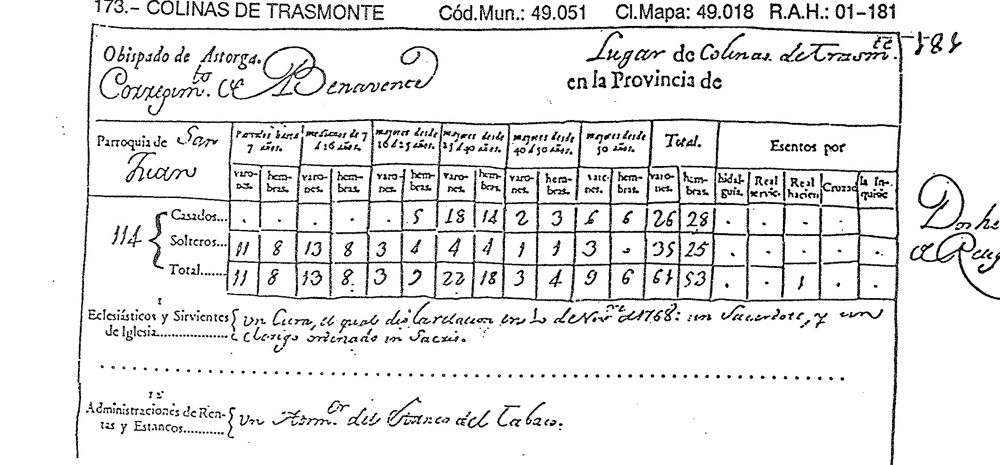
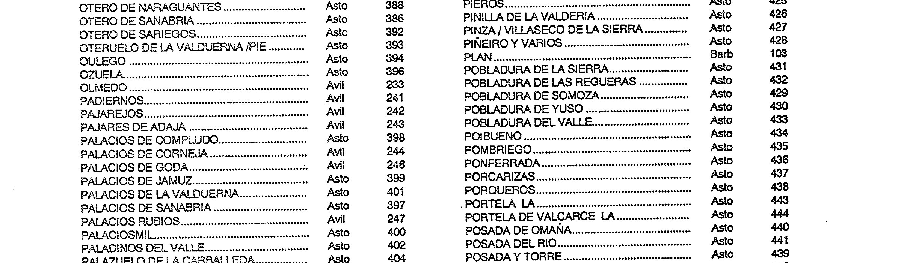
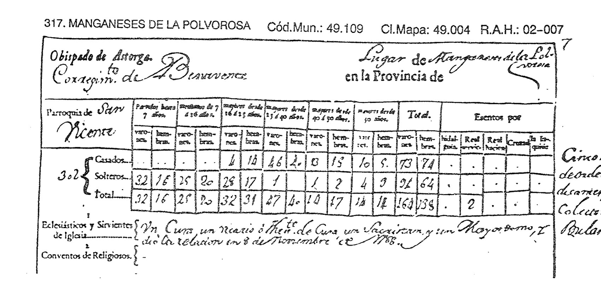
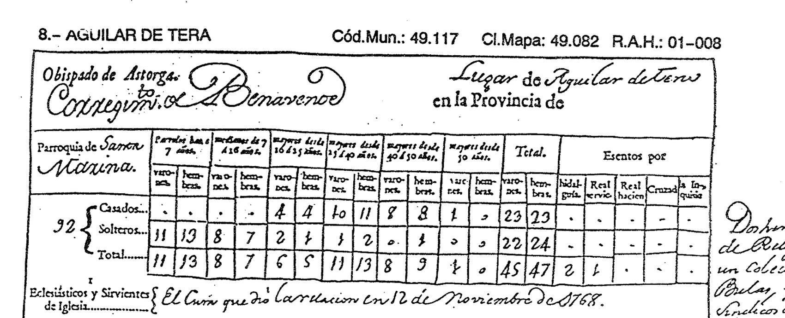
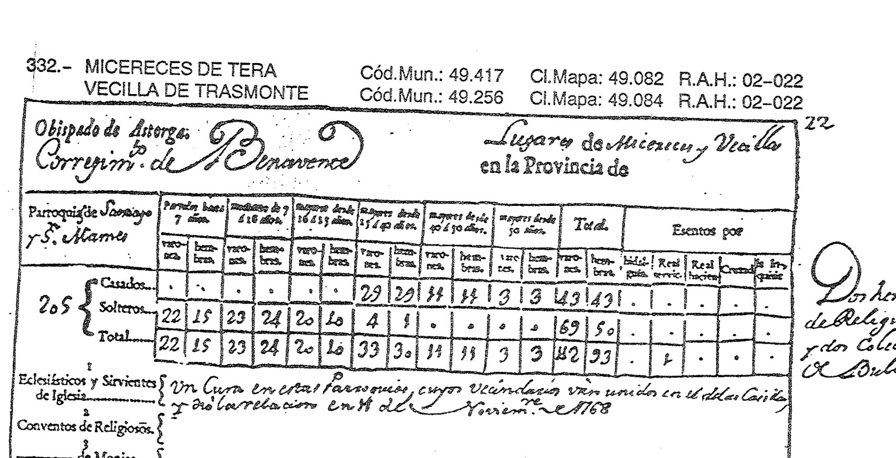
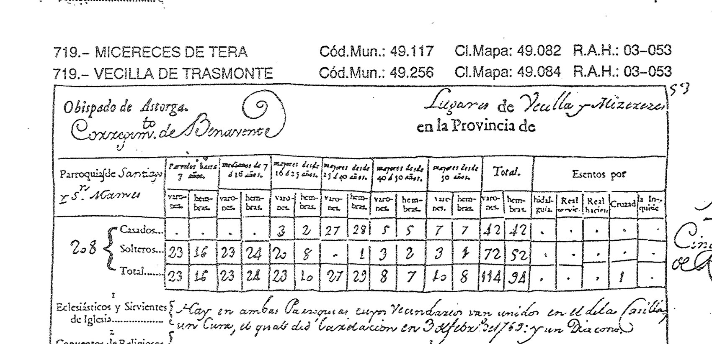
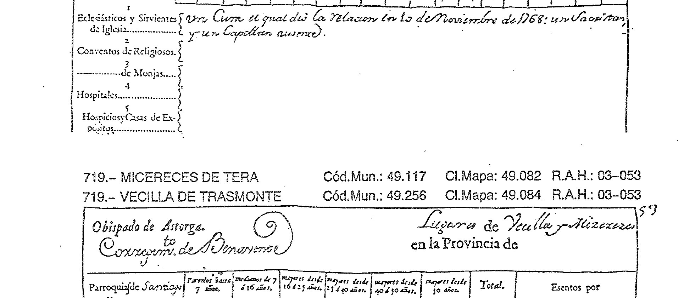
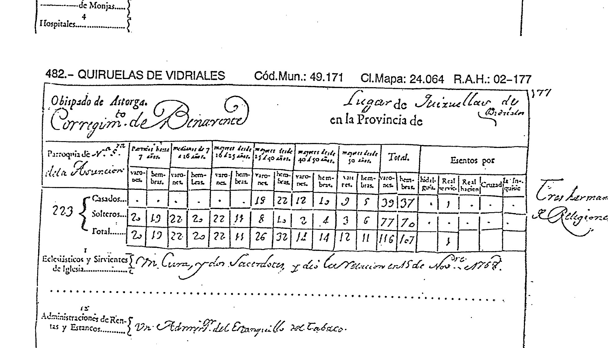

# El Censo de Aranda (1768-1769): **114 almas**, contadas una a una

> **Estado: ✅ FUENTE LOCALIZADA, OBTENIDA Y LEÍDA.** 23 de septiembre de 2026.
>
> 🚨 Tres cosas que el proyecto no tenía:
> 1. ★★ **La advocación de San Juan, adelantada setenta y nueve años**: la escribe el propio cura
>    en 1768. Hasta hoy el testimonio más antiguo era **Madoz, 1847**.
> 2. ★★★ **114 almas**, con el desglose por sexo, edad y estado — un punto nuevo de la serie,
>    entre el Catastro de 1752 y Floridablanca de 1787.
> 3. ★★★ **Pobladura de Trasmonte ya no existe** en todo el obispado de Astorga.
>
> Está **en abierto en el INE**, como el Censo de Pecheros, el de 1591, Floridablanca y Miñano.
> **No estaba en ninguna lista del proyecto**: apareció probando nombres de carpeta en el servidor.

---

## La ficha

| | |
|---|---|
| **Fuente** | **Censo de Aranda**, 1768-1769 — recuento **eclesiástico**, mandado levantar por el conde de Aranda y ejecutado **por los párrocos** |
| **Edición** | INE, *Censo de Aranda*, **tomo I** (facsímil de los originales) |
| **Original** | **Real Academia de la Historia** |
| ⚠️ **Es una edición parcial** | El tomo I sólo trae las diócesis de **Albarracín, Almería, ASTORGA, Ávila, Badajoz, Barbastro y Barcelona**, más dos órdenes militares. El tomo II, Burgos y Cádiz. **Colinas cae en Astorga, y por eso está** |
| **Dónde cae Colinas** | Obispado de **Astorga**, asiento **173**, plana impresa **138** |
| **Signatura del original** | **R.A.H.: 01-181** |
| **Códigos que da la edición** | Cód.Mun. **49.051** · Cl.Mapa **49.018** |
| **Acceso** | `https://www.ine.es/prodyser/pubweb/censo_aranda/tomo1.pdf` (68 MB, 694 pp., **sin capa de texto**) |
| **Cómo se ha leído** | Sobre el facsímil, a **300-600 ppp**. No hay OCR |

---

## ★★★ 1. El asiento de Colinas

> «**Obispado de Astorga. Corregim[ien]to de Benavente** — **Lugar de Colinas de Trasm[on]te** en la
> Provincia de ———»
>
> «**Parroquia de San Juan**»

### ★★ La advocación de San Juan, setenta y nueve años antes

⚠️ **Esto no es un hallazgo, y conviene decirlo primero.** El proyecto **ya tenía documentada** la
advocación: Madoz, en **1847**, escribe que Colinas tiene «*parr. (**San Juan Bautista**), servida
por 1 cura de primer ascenso y libre provisión*», y de ahí salen la ficha de identificación del
inventario y la fiesta del **24 de junio**.

**Lo que añade el Censo de Aranda es la antigüedad y la firma:**

| | Fuente | Qué dice | Quién lo dice |
|---|---|---|---|
| **1768** | Censo de Aranda | «Parroquia de **San Juan**» | **el propio cura del lugar**, en su relación |
| 1847 | Madoz | «parr. (**San Juan Bautista**)» | un diccionario, de segunda mano |

> ★★ **La advocación retrocede de 1847 a 1768** —setenta y nueve años— y pasa de estar en un
> repertorio a estar **en la declaración del párroco**. Para un proyecto que anota quién firma cada
> dato, **eso es una mejora real de la prueba, no una novedad**.
>
> ⚠️ **Una diferencia menuda que no hay que borrar:** el documento de 1768 dice «**San Juan**», a
> secas. **«Bautista» lo añade Madoz.** No hay motivo para dudarlo —la fiesta del 24 de junio lo
> corrobora—, pero **el documento más antiguo no lo especifica**.
>
> ★ **Dónde sí cuenta.** El inventario anotó que el «**A.º de San Juan**» del MTN50 «puede venir de
> la parroquia». Esa explicación tenía como apoyo más antiguo 1847; ahora lo tiene en 1768.
> ⚠️ **Sigue sin probar** que el arroyo, el pago **San Juan-El Valle** y la parroquia sean la misma
> cosa: son tres testimonios del mismo nombre, no una identificación. Y **San Juanico el Nuevo**
> sigue siendo otro sitio, en Camarzana
> → [`censo-pecheros-1528/`](../censo-pecheros-1528/README.md).
>
> → [`06-identidad-simbolos/`](../../06-identidad-simbolos/repertorio-simbolico.md)

---

## ★★★ 2. Ciento catorce almas, contadas una a una

El Censo de Aranda no cuenta vecinos ni pecheros: **cuenta personas**, por sexo, edad y estado.
Es, con diferencia, **el recuento más detallado que el proyecto tiene de Colinas antes del siglo XIX**.

| Estado | ≤7 años | 7-16 | 16-25 | 25-40 | 40-50 | +50 | **Varones** | **Hembras** |
|---|---|---|---|---|---|---|---:|---:|
| **Casados** | – / – | – / – | – / 5 | 18 / 14 | 2 / 3 | 6 / 6 | **26** | **28** |
| **Solteros** | 11 / 8 | 13 / 8 | 3 / 4 | 4 / 4 | 1 / 1 | 3 / – | **35** | **25** |
| **TOTAL** | 11 / 8 | 13 / 8 | 3 / 9 | 22 / 18 | 3 / 4 | 9 / 6 | **61** | **53** |

> ### **114 almas.** 61 varones y 53 hembras.
>
> *(Las dos columnas de cada casilla son varones / hembras. Las sumas del documento cuadran: 26+35
> = 61 y 28+25 = 53.)*

**Lo que se ve en la tabla, y es del propio documento:**

- ★ **Casi un tercio del pueblo son niños**: 19 párvulos de hasta 7 años y 21 «medianos» de 7 a 16
  — **40 de 114, el 35 %**.
- ★ **Sólo 15 personas pasan de 50 años** (9 varones y 6 hembras), y **22 pasan de 40** — el
  **19 %** del pueblo. La pirámide es la de una población de Antiguo Régimen: ancha abajo y muy
  estrecha arriba.
- ⚠️ **Ninguna mujer casada menor de 16**, y **cinco casadas de 16 a 25 frente a ningún varón**
  casado de esa edad: **las mujeres se casaban antes que los hombres**. Es lo esperable, y aquí
  está medido.
- ★★ **«Esentos por hidalguía»: ninguno.** Es **el cuarto recuento seguido** que da **cero
  hidalgos** en Colinas: 1591, 1752, **1768** y 1787.
- ★ Un solo exento, y lo es **por Real Hacienda** — que es el estanquero (ver abajo).

---

## ★★ 3. Quién lo firmó, y qué más había en el pueblo

> «**Eclesiásticos y Sirvientes de Iglesia: Un Cura, el qual dio la relación en 1.º de
> Nov[iemb]re de 1768: un Sacerdote, y un Clérigo ordenado in Sacris.**»

- ★ **La fecha de la relación: 1.º de noviembre de 1768** `[?]` *(el día se lee «1º»; la entrada de
  **Barcial del Barco**, en la misma comarca, trae la misma fecha con la misma mano, lo que
  refuerza la lectura sin cerrarla)*.
- **Tres eclesiásticos** para 114 almas: el cura, un sacerdote y un clérigo ordenado *in sacris*.
- Al margen, de otra mano: «**Dos hermanos de Religiones**» — dos naturales del lugar profesos en
  órdenes religiosas, contados aparte.

> «**Administraciones de Rentas y Estancos: Un Adm[inistrad]or del Estanco del Tabaco.**»

★★ **Había estanco de tabaco en Colinas en 1768**, con administrador propio. Es el **único oficio
no agrícola ni eclesiástico** que el documento registra, y explica el único exento del pueblo
—por **Real Hacienda**—.
⚠️ No dice quién era ni si vivía de ello. Se anota como lo que es: **la primera noticia de una
administración del Estado en el pueblo**.

> ⚠️ **Matizado por el vaciado comarcal (§7): no era una singularidad.** **Siete de los veintitrés
> lugares del valle** declaran estanco o estanquillo, y Morales de Valverde declara **tres
> administradores**. Tener estanco era **lo corriente en un lugar de algún tamaño**. Sigue siendo
> cierto que es la primera administración del Estado documentada **en Colinas**; deja de ser cierto
> que fuese algo notable **para la comarca**.

---

## ★★★ 4. Lo que le hace a la serie demográfica

| 1526 | 1591 | 1752 | **1768** | 1787 | 1826 | 1847 |
|---:|---:|---:|---:|---:|---:|---:|
| 25 pech. | 28 vec. | 27 vec. | **114 almas** | 156 almas | 226 almas | 132 almas |

> ★★★ **El nuevo punto alarga la meseta y fecha el despegue.**
>
> Si se toma el coeficiente que sugieren los dos recuentos contiguos —27 vecinos en 1752, 114 almas
> en 1768: **4,2 almas por vecino**—, entonces **1752 y 1768 son la misma cifra**. Y como 1591
> (28 vec.) y 1526 (25 pech.) son también la misma, resulta que:
>
> ## **De 1526 a 1768 —doscientos cuarenta y dos años— Colinas no cambia de tamaño.**
>
> Y luego, en **cincuenta y ocho años**, **dobla**: 114 → 156 (1787) → **226** (1826).
>
> ⚠️ **El coeficiente 4,2 es interpretación, no documento.** Los tres puntos en almas (1768, 1787,
> 1826) son homogéneos entre sí y no dependen de él: **entre 1768 y 1787 Colinas crece un 37 %, y
> entre 1787 y 1826 otro 45 %**. Eso sí es comparación directa.
>
> ★★ **Y desplaza la pregunta del proyecto, otra vez y en la misma dirección.** El frente nº 16 se
> abrió preguntando por el derrumbe de 1826-1847. Ahora hay además **un crecimiento que explicar**,
> y está acotado: **empieza después de 1768**.

---

## ★★★ 5. Pobladura de Trasmonte no está

La «Relación de pueblos» del tomo I lista **todos** los lugares censados, con su diócesis y su
número de asiento. En el obispado de Astorga hay **cinco Pobladuras**:

| Pobladura | Asiento |
|---|---:|
| de la Sierra | 431 |
| de las Regueras | 432 |
| de Somoza | 429 |
| de Yuso | 430 |
| del Valle | 433 |

**No hay «Pobladura de Trasmonte».**

> 🚨 **Y eso acota su desaparición.** El proyecto sabía que en **1526** figuraba con 15 pecheros y
> la nota «**despoblado por la peste**», y que en **1591** seguía viva con **11 vecinos**. Ahora
> sabe que **en 1768-69 ya no existe como lugar con vecindario**.
>
> ## **Pobladura de Trasmonte desapareció entre 1591 y 1768.**
>
> ★ **Y la ausencia aquí pesa más de lo normal**, porque este censo **sí nombra a los lugares que
> habían perdido parroquia propia**: Vecilla de Trasmonte aparece por su nombre aunque su
> vecindario vaya unido al de Micereces (punto 6). Si Pobladura hubiera sobrevivido como anejo,
> **cabría esperar que apareciera igual**.
>
> ⚠️ **Lo que sigue sin saberse:** el año, y si fue por despoblación lenta o por un golpe. El
> siguiente escalón razonable es el **Catastro de Ensenada (1752)**, que el proyecto ya maneja, y
> los **libros parroquiales de Astorga** (frente nº 8).

---

## ★★★ 6. Colinas y sus cinco confrontantes, en el mismo censo

> **Vaciado hecho el 23 de septiembre de 2026.** El censo va **por orden alfabético dentro de cada
> obispado**, de modo que los vecinos de Colinas **no están al lado**: hay que ir por número de
> asiento, y el número lo da la **«Relación de pueblos»** del final del tomo (planas 660-670).
> Los cinco confrontantes son los que declara el **Catastro de 1752** —Vecilla al levante,
> Manganeses al norte, Quiruelas al poniente y **Aguilar de Tera al sur**— más el quinto que
> añadieron los planos de 1975-77 por el nordeste, **Santa Cristina de la Polvorosa**.

| Asiento | Lugar | Rumbo desde Colinas | Parroquia | **Almas** | Varones / hembras | Relación dada el | Exentos |
|---:|---|---|---|---:|---|---|---|
| 317 | **Manganeses de la Polvorosa** | **norte** | San Vicente | **302** | 164 / 138 | 8-XI-1768 | 2 Real servicio |
| 482 | **Quiruelas de Vidriales** | **poniente** | N.ª S.ª de la Asunción | **223** | — | — | — |
| 719 | **Vecilla de Trasmonte** *con* Micereces de Tera | **levante** | Santiago y San Mamés `[?]` | **208** | 114 / 94 | 3-II-1769 | 1 Cruzada |
| *332* | *(las mismas dos, segunda relación — ver 6.1)* | | | *205* | *112 / 93* | *14-XI-1768* | *1 Real servicio* |
| 602 | **Santa Cristina de la Polvorosa** | **nordeste** | Santa Cristina | **190** | 98 / 92 | 13-XI-1768 | **5 hidalguía** |
| **173** | **COLINAS DE TRASMONTE** | — | **San Juan** | **114** | 61 / 53 | **1-XI-1768** | 1 Real Hacienda |
| 8 | **Aguilar de Tera** | **sur** | Santa Marina | **92** | 45 / 47 | 12-XI-1768 | **2 hidalguía**, 1 Real servicio |

**Y de propina, tres del mismo valle que ya estaban en el proyecto o salieron de paso:**

| Asiento | Lugar | Parroquia | Almas |
|---:|---|---|---:|
| 334 | Milles de la Polvorosa | San Miguel | 208 |
| 718 | Barcial del Barco | Santa Marina | 117 |
| 720 | Vega de Tera | San Pelayo | 180 |
| 758 | **Villanázar** *(no es confrontante; importa por Pobladura)* | San Martín | **106** |

> ✅ **Todas las cifras están tomadas del propio documento**: cada asiento escribe su total al
> margen izquierdo, y las columnas «varones» y «hembras» suman ese total. **Se han comprobado las
> dos sumas en los seis asientos leídos.** ⚠️ El desglose por edades **no se publica aquí**: a la
> resolución del facsímil algunas casillas no se leen con seguridad, y el total sí.

### Lo que dice el cuadro

> ## **De los seis, Colinas es el penúltimo.** Sólo Aguilar de Tera es menor.

- ★★ **Manganeses casi triplica a Colinas** (302 frente a 114) y **Quiruelas la dobla** (223) —lo
  que ya se sabía y ahora tiene un tercer punto—. Entre los dos extremos de la raya, norte y
  poniente, están los dos pueblos grandes.
- ★ **La raya del sur y la del levante son de pueblos pequeños**: Aguilar 92, y Vecilla —que no
  puede separarse de Micereces— dentro de un conjunto de 208.
- 🚨 **Y el «cero hidalgos» de Colinas deja de ser unánime en su propia raya.** El proyecto venía
  diciendo, con razón y para 1591, que **la mitad de los lugares de la tierra de Benavente
  declaraban cero hidalgos**. En 1768 y en su propia raya, de los cinco confrontantes:
  **dos declaran cero con la casilla leída** (Manganeses y Micereces-Vecilla, ésta en sus dos
  copias), **dos declaran hidalgos** —**Santa Cristina, 5**, y **Aguilar de Tera, 2**— y **del
  quinto, Quiruelas, no se anotó la casilla** `[?]`. **El cero de Colinas sigue siendo corriente;
  no es universal.**
- ★ **Colinas dio su relación antes que ninguno de sus vecinos**: 1 de noviembre de 1768, frente al
  8, el 12, el 13 y el 14 del mismo mes. *Es una curiosidad, no un dato con consecuencias.*

---

## 🚨 6.1. El censo cuenta dos veces a Vecilla y Micereces — y no dan lo mismo

Buscando a Micereces en la «Relación de pueblos» aparece **dos veces, con dos números de asiento
distintos**: **332** y **719**. No es un desliz del índice —que sí repite algún nombre con el mismo
número—: son **dos asientos completos y distintos** del mismo tomo, para **los mismos dos lugares**.

| | Asiento **332** | Asiento **719** |
|---|---|---|
| Signatura del original | **R.A.H. 02-022** | **R.A.H. 03-053** |
| Encabezamiento | «Lugares de **Micereces y Vecilla**» | «Lugares de **Vecilla y Micereces**» |
| Parroquias | Santiago y San Mamés `[?]` | Santiago y San Mamés `[?]` |
| **Total** | **205 almas** (112 v. / 93 h.) | **208 almas** (114 v. / 94 h.) |
| Casados / solteros | 43-43 / 69-50 | 42-42 / 72-52 |
| **Fecha de la relación** | **14 de noviembre de 1768** | **3 de febrero de 1769** |
| Clero declarado | un Cura | un Cura **y un Diácono** |
| Al margen | «Dos hermanos de Religiones, y dos Colectores de Bulas» | «Cinco hermanos de Religiones» |

### ★★★ Por qué esto vale para todo el proyecto

**Es una medida del error de esta fuente, hecha con la fuente misma.** La misma parroquia, contada
dos veces con **ochenta y un días** de diferencia, da **205 y 208**: una discrepancia de **3 almas,
el 1,5 %**.

> Luego, cuando este proyecto escribe «**Colinas, 114 almas en 1768**», la cifra **no es exacta al
> alma**: es buena en torno a un **1,5 %**, que es lo que el propio censo se desvía de sí mismo.
> ⚠️ **Un solo par de relaciones no es una estadística**, y no se pretende que lo sea. Es el único
> control interno disponible, y vale más que no tener ninguno.

⚠️ **Y Colinas no está duplicada.** Comprobado en la «Relación de pueblos»: «COLINAS DE TRASMONTE …
Asto **173**» aparece **una sola vez** *(«Colinas del Campo de Martín Moro», asiento 172, es otro
pueblo, de León)*. **Su 114 no tiene segunda opinión.**

⚠️ **De dónde sale la duplicación, sin resolver.** Las signaturas del original apuntan a que el
tomo I reproduce **tres volúmenes de la Real Academia de la Historia** (01, 02 y 03), **cada uno
alfabético por su cuenta** —Colinas es 01-181, Manganeses 02-007, Villanázar 03-098—, y que
Micereces-Vecilla está **en dos de ellos**. `[?]` **Esto es reconstrucción, no lectura**: el tomo
no lo explica en ninguna parte que se haya visto.

---

## ⚠️ 6.2. Corrección: la segunda parroquia es **San Mamés**, no San Marcos

Este README escribía «Parroquias de Santiago y **San Marcos**». Leídas **las dos copias del
asiento** a 300 ppp —la 332 y la 719, manos distintas— **las dos escriben lo mismo**, y no es
Marcos: es «**S.n Mames**».

- La palabra tiene **cinco letras tras la M** y **termina en -es**; «Marcos» exigiría una *r* y una
  *c* que no están.
- `[?]` **La duda que queda es sólo la última letra**: *Mamés* o *Mamed*, que son **el mismo
  santo**. Se escribe **San Mamés**, que es la forma corriente en la comarca.

*Se corrige aquí, en el cuadro de arriba y en el inventario.*

---

## ★★ 6.3. Vecilla y Micereces van en un solo asiento

> «**Lugares de Vecilla y Micereces** […] **Parroquias de Santiago y S[a]n Mamés** `[?]` […] Hay en
> ambas Parroquias, cuyos **vecindarios van unidos** […] **un Cura**, el qual dio la relación en
> **3 de febr[er]o de 1769**: y un Diácono.»

★ **Dos parroquias, un solo cura y un solo vecindario.** Es un dato nuevo sobre el vecino oriental
de Colinas —el del pleito del Calero de 1600-1608—: en 1768 **no tenía cura propio**.
⚠️ **Y por eso no hay cifra separada de Vecilla**: las 208 almas son de las dos juntas. No se puede
repartir.

## ★ 6.4. Quiruelas, otra vez cerca del doble

| | 1526 | 1591 | **1768** |
|---|---:|---:|---:|
| Quiruelas / Colinas | 42 / 25 = **1,68** | 58 / 28 = **2,07** | 223 / 114 = **1,96** |

★★ **Tres siglos, tres recuentos, y Quiruelas siempre en torno al doble de Colinas.** La relación
de tamaño entre los dos pueblos **es estable desde 1526**. *Se anota; de aquí no sale una
explicación de la incorporación de 1975.*

> ⚠️ **Un homónimo que conviene no pisar:** la parroquia de **Vega de Tera es San Pelayo**. El
> proyecto tiene un **San Pelayo** como mojón en el documento de **1129** y como pago en el **apeo
> de Vecilla de 1706**. **No hay relación demostrada**: San Pelayo es advocación frecuentísima en
> la zona. Se deja anotado precisamente para que no se confundan.

---

## ★★★ 7. El valle entero, medido en almas

> ✅ **Vaciado terminado el 23 de septiembre de 2026.** **Veintitrés lugares** del valle del Tera,
> de Vidriales y de la Polvorosa, todos del **corregimiento de Benavente** y del obispado de
> Astorga, leídos uno a uno en el facsímil. Datos completos, con signatura y plana de cada uno, en
> **[`comarca-1768.tsv`](comarca-1768.tsv)**.
>
> ✅ **Comprobación aritmética**: en los veintiún asientos con desglose, **varones + hembras da
> exactamente el total que el propio documento escribe al margen**. Ni un descuadre.

| Almas | Lugar | Parroquia | Hidalgos |
|---:|---|---|---:|
| **302** | Manganeses de la Polvorosa | San Vicente | 0 |
| **294** | Morales de Valverde | N.ª S.ª de la Asunción | **7** |
| **235** | Pozuelo de Vidriales | N.ª S.ª de la Concepción | 0 |
| **229** | Santibáñez de Vidriales *(villa)* | **San Juan** | 0 |
| **223** | Quiruelas de Vidriales | N.ª S.ª de la Asunción | **0** |
| **223** | Santa Croya de Tera | Santo Tomás | 0 |
| **208** | Milles de la Polvorosa | San Miguel | 0 |
| **208** | Micereces de Tera *y* Vecilla de Trasmonte | Santiago y San Mamés `[?]` | 0 |
| **190** | Santa Cristina de la Polvorosa | Santa Cristina | **5** |
| **184** | Villaferrueña | **San Juan** | 0 |
| **180** | Vega de Tera | San Pelayo *(anexa)* | 0 |
| **175** | Rosinos de Vidriales | San Salvador *(matriz)* | **1** |
| **165** | La Milla de Tera | N.ª S.ª de la Asunción | 0 |
| **134** | Bercianos de Vidriales | N.ª S.ª de la Visitación | **1** |
| **129** | Pumarejo de Tera | Santiago | 0 |
| **117** | Barcial del Barco | Santa Marina | 0 |
| **114** | Sitrama de Tera | San Miguel | **2** |
| **114** | **COLINAS DE TRASMONTE** | **San Juan** | **0** |
| **106** | Villanázar | San Martín | 0 |
| **100** | Melgar de Tera | San Pedro | 0 |
| **95** | Santa Marta de Tera *(villa)* | Santa Marta *(matriz)* | 0 |
| **92** | Aguilar de Tera | Santa Marina | **2** |
| **59** | Moratones | Santiago | **1** |
| **3.876** | **23 lugares** | | **19** |

### ★★ Dónde queda Colinas

**Media 168,5 almas · mediana 175 · del menor (59) al mayor (302).**

> ## **Colinas, con 114 almas, es el sexto más pequeño de los veintitrés.**

⚠️ **Y esto no se compara con lo de 1591.** Allí se dijo que «Colinas es el lugar mediano de la
tierra del Conde de Benavente», y era cierto: la **mediana de los 117 lugares de toda la sacada**
era de 28 vecinos, la cifra de Colinas. **Aquí la muestra es otra**: veintitrés lugares de su propio
valle, que no incluye ni la villa de Benavente ni los pueblos del páramo. Lo que dice este cuadro
es más modesto y más local: **dentro de su valle, Colinas está en el tercio bajo.**

★ **Y tiene un gemelo exacto**: **Sitrama de Tera, 114 almas**, la misma cifra al alma.

### 🚨 San Juan es advocación corriente en este valle — y eso pesa

De los veintitrés lugares, **tres tienen parroquia de San Juan**: **Colinas de Trasmonte**,
**Santibáñez de Vidriales** y **Villaferrueña**.

> ⚠️ **Consecuencia directa, y es una cautela, no un hallazgo.** El proyecto maneja cuatro
> testimonios del nombre *San Juan* en el término de Colinas —la parroquia (1768, 1847), el pago
> **San Juan-El Valle**, el **arroyo de San Juan** del MTN50 y el **préstamo de San Juan** de
> 1756—, y viene repitiendo que ninguno prueba nada sobre el monasterio excavado. **Ahora se sabe
> por qué la cautela era obligada**: en este valle **San Juan es una advocación de las corrientes**,
> y un topónimo *San Juan* junto a una iglesia de San Juan es **lo esperable**, no un indicio.
> Ver §7.1 del [inventario](../../03-archivos/inventario-documental.md).

### ★★ Dos de cada tres lugares no tienen ni un hidalgo

✅ **Desde el 23 de septiembre de 2026 la casilla de «esentos por hidalguía» está leída en los
veintitrés**, sin excepción (antes eran 21):

- **16 declaran cero** — el **70 %**.
- **7 declaran alguno**: Morales de Valverde **7**, Santa Cristina de la Polvorosa **5**,
  Aguilar de Tera **2**, Sitrama de Tera **2**, Bercianos de Vidriales **1**,
  Rosinos de Vidriales **1**, Moratones **1**.
- **En todo el valle hay 19 hidalgos entre 3.876 almas: el 0,5 %.**

> ✅ **El «cero hidalgos» de Colinas queda situado con precisión**: es **lo normal** —dos de cada
> tres lugares—, pero **no es universal**, y dos de sus cinco confrontantes declaran hidalgos.
> Es el quinto recuento seguido con cero en Colinas: 1591, 1752, 1768 y 1787.
>
> ✅ **Y cierra un fleco que quedaba abierto**: **Quiruelas de Vidriales declara cero hidalgos**
> (su único exento lo es por **Real servicio**). Leído a 300 ppp sobre el asiento 482.

### ★★★ Colinas es pequeña, pero tiene cura propio — y muchas mayores que ella no

El censo dice, lugar por lugar, **quién dio la relación**, y ahí aparece una jerarquía que el
proyecto no tenía:

| Matriz | Almas | Sus anexas | Almas de las anexas |
|---|---:|---|---:|
| **Santa Marta de Tera** *(villa)* | **95** | Santa Croya de Tera · Pozuelo de Vidriales | 223 · 235 |
| **Rosinos de Vidriales** | 175 | Moratones | 59 |
| **Sitrama de Tera** | 114 | Pumarejo de Tera | 129 |

También son anexas **La Milla de Tera** (165) y **Villanázar** (106) `[?]`, y **Micereces y
Vecilla** tienen **dos parroquias y un solo cura**.

> ★★★ **Santa Marta de Tera tiene 95 almas y es matriz de dos parroquias que la doblan.** El tamaño
> del pueblo y su rango eclesiástico **no van juntos** en este valle: manda la antigüedad de la
> iglesia, no el vecindario. *(Santa Marta es, además, el monasterio del deslinde de 1129 —frente
> nº 6—, lo que explica el rango sin que haya que suponer nada.)*
>
> ★★ **Y Colinas, con 114 almas, tiene cura residente que firma su propia relación** el 1 de
> noviembre de 1768. Es pequeña, pero **eclesiásticamente autónoma** — lo que concuerda con la
> respuesta 15.ª del Catastro de 1752, donde los diezmos van «**enteramente al beneficio del curado
> de este lugar**». ⚠️ **No se concluye de aquí nada sobre el préstamo de San Juan de 1756**: sigue
> sin cuadrar, y sigue abierto.

### ★ Dos correcciones de matiz que salen del cuadro

1. **El estanco de tabaco de Colinas no era excepcional.** Este README lo presentaba como «el único
   oficio del pueblo que no es labrar ni decir misa», y lo es —dentro de Colinas—. Pero **siete de
   los veintitrés lugares declaran estanco o estanquillo**: Colinas, Quiruelas, Pozuelo de
   Vidriales, Santa Croya, Santa Marta de Tera, Santibáñez de Vidriales y Villaferrueña; Morales de
   Valverde declara **tres administradores**. **Era lo corriente en un lugar de algún tamaño**,
   no una singularidad.
2. **Colinas es «Lugar», no «Villa».** En el valle sólo llevan el título de **villa**
   **Santa Marta de Tera** y **Santibáñez de Vidriales**. El encabezamiento de cada asiento lo
   distingue, y el de Colinas dice **«Lugar de Colinas de Trasm[on]te»**.

### ✅ 8. Las dos casillas que faltaban, cerradas — y con tres ganancias

Quedaban **dos asientos sin desglosar**, los dos en la **plana impresa 328**: **718, Barcial del
Barco** y **720, Vega de Tera**. Leídos sobre el facsímil el 23 de septiembre de 2026, el vaciado
queda **completo**.

| Asiento | Lugar | Varones | Hembras | Total | ¿Cuadra? | Hidalguía | Otros exentos |
|---|---|---:|---:|---:|---|---:|---|
| **718** | Barcial del Barco | 64 | 53 | **117** | ✅ | **0** | ninguno |
| **720** | Vega de Tera | 90 | 90 | **180** | ✅ | **0** | **1 por Real Servicio** `[?]` |

> ★★★ **Y con esto, los veinticuatro asientos del vaciado cuadran al alma**: en los veinticuatro,
> varones + hembras da exactamente el total que el documento escribe al margen. **Ni un descuadre
> en todo el valle.**

**Ganancia 1 — dos ceros más de hidalguía.** Los dos declaran **cero**, lo que sube el recuento de
14 sobre 21 a **16 sobre 23, el 70 %**. El «cero hidalgos» de Colinas queda aún mejor situado.

**Ganancia 2 — ✅ se resuelve un `[?]` de La Milla de Tera.** La ficha daba a La Milla como «anexa
de **una matriz de la Junquera** `[?]`», sin poder decir cuál. El asiento de Vega de Tera la nombra
entera:

> «**Los mismos ecc[lesiástic]os de la Parroquia Matriz de S[a]n Zipriān de la Villa de Junquera,
> sirven esta de San Pelayo su anexa**, y la Relación fue dada en **25 de Noviembre de 1768**.»

Luego la matriz es **San Cipriano de la Villa de Junquera** —Junquera de Tera, que el documento
llama **villa**—, y **tiene al menos dos anexas**: **La Milla de Tera** y **Vega de Tera**.
⚠️ La matriz **no está en este vaciado**, porque el censo va alfabético y Junquera cae en otra
plana: **es un lugar más del valle que el proyecto aún no ha leído.**

**Ganancia 3 — y aparece la primera exención que no es de hidalguía.** Vega de Tera declara
**1 exento por Real Servicio**. ⚠️ **Con una salvedad que se anota y no se resuelve**: la cifra
aparece **sólo en la fila de totales**; las de casados y solteros llevan punto. O el exento no se
clasificó por estado, o el escribano lo anotó una sola vez. `[?]`

### ★ De propina, dos escenas menores

- **Barcial del Barco** declara, además del cura que da la relación el **1.º de noviembre de 1768**,
  **«un Sacristán y un Capellán ausente»**, y al margen **«Dos hermanos de órdenes Religiosas»**
  `[?]`. **Un capellán ausente** es exactamente la figura del *prestamero* que el proyecto persigue
  en Colinas desde la carta del obispo de 1756 (frente nº 8). **No se afirma relación**; se anota
  que la figura era corriente en la comarca.
- ⚠️ **Y la advertencia sobre San Pelayo se refuerza, no se debilita.** Vega de Tera es **parroquia
  de San Pelayo en 1768**, con lo que el proyecto tiene ya el nombre en **1129** (mojón del
  deslinde), **1706** (pago del apeo de Vecilla) y **1768** (parroquia viva). **Sigue sin haber
  relación demostrada entre los tres**; lo que hay es la confirmación de que **San Pelayo es
  advocación corriente en esta ribera**, que es justamente lo que obliga a la cautela.

### ⚠️ Lo que este vaciado no cubre

- **No es el corregimiento de Benavente entero.** Faltan la villa de Benavente y los lugares del
  páramo y del Órbigo. El censo va **alfabético dentro del obispado**, de modo que barrerlo exigiría
  recorrer las ~250 planas de Astorga una a una. **Se ha hecho el valle, que es la unidad que tiene
  sentido para este pueblo.**
- ~~**Barcial del Barco y Vega de Tera** entran con la cifra que el proyecto ya había leído; **sus
  casillas de exentos no se han anotado**.~~
  ✅ **CERRADO el 23 de septiembre de 2026**: leídas las dos sobre el facsímil. Ver abajo.
- ⚠️ **Un homónimo con el que no hay que tropezar**: en el mismo corregimiento de Benavente hay una
  **«Vecilla de la Polvorosa»** (asiento 68, parroquia de San Andrés, **70 almas**). **No es**
  Vecilla de Trasmonte.

---

## Ficheros

| Fichero | Qué es |
|---|---|
| `asiento-colinas-1768.jpg` | El asiento 173 completo: encabezamiento, tabla y notas |
| `plana-138-astorga.jpg` | La plana entera (Colinas, Columbrianos, Combarros) |
| `asiento-vecilla-micereces-1768.jpg` | El asiento 719, Vecilla y Micereces juntos |
| `asiento-quiruelas-1768.jpg` | El asiento 482, Quiruelas de Vidriales |
| `indice-pobladuras-astorga.jpg` | La «Relación de pueblos»: las cinco Pobladuras, y ninguna de Trasmonte |
| `asiento-manganeses-1768.jpg` | El asiento 317, Manganeses de la Polvorosa — el mayor de los confrontantes |
| `asiento-santa-cristina-1768.jpg` | El asiento 602, Santa Cristina de la Polvorosa — con cinco exentos por hidalguía |
| `asiento-aguilar-de-tera-1768.jpg` | El asiento 8, Aguilar de Tera — el menor de los confrontantes |
| `asiento-villanazar-1768.jpg` | El asiento 758, Villanázar — 106 almas, menos que Colinas |
| `asiento-micereces-332-1768.jpg` | El asiento **332**: Micereces y Vecilla, **primera** relación (14-XI-1768) |
| `asiento-micereces-719-1768.jpg` | El asiento **719**: las mismas dos, **segunda** relación (3-II-1769) |
| **`comarca-1768.tsv`** | ★ **Los 23 lugares del valle**: almas, sexo, hidalgos, parroquia, dependencia, fecha de la relación, signatura R.A.H. y plana |

---

## Cómo se encontró

1. La ficha del Censo de Pecheros dejaba pendiente leer la plana de datos fiscales. **Se leyó, y
   no sirve**: esa tabla sólo da totales por partido, no por lugar. Colinas no tiene ahí cifra
   propia. *(Lo que sí da: la villa de Benavente pagaba **45,83 mrs por pechero** y su tierra
   **63,90** — el campo pagaba un 39 % más por cabeza que la cabecera.)*
2. De ahí salió la pregunta: **¿qué más tiene el INE en abierto?** El buscador del portal no
   devuelve estas obras, así que se **probaron nombres de carpeta** contra
   `prodyser/pubweb/<obra>/tomo1.pdf`. Respondió **`censo_aranda`**.
3. El tomo I no tiene capa de texto. **Tira de contactos** de la franja superior de una de cada
   doce planas: así apareció que **Astorga empieza hacia la plana 76** y que los asientos van
   numerados y casi alfabéticos.
4. Segunda tira, plana a plana, entre «Cogorderos» (170) y «Congosto» (179): **Colinas es el 173**.
5. Lectura del asiento a **600 ppp**, con recortes por bandas para las cifras y las notas.
6. Para los vecinos y para Pobladura, la **«Relación de pueblos»** del final del tomo, que da
   diócesis y número de asiento de cada lugar.

> ⚠️ **Una trampa del orden alfabético**: los asientos siguen **la grafía del manuscrito**, no la
> moderna. **Barcial del Barco** está entre Valdavido y Vega de Magaz, porque el original escribe
> «**Varcial**». Sin la «Relación de pueblos» del final, buscar por la letra moderna lleva a error.

7. **El vaciado comarcal (23 de septiembre, tarde)**: sacados de la «Relación de pueblos» los
   números de asiento de los cinco confrontantes, se localizó cada plana **interpolando** —el tomo
   lleva unos **2,8 asientos por plana**, y la plana impresa es la **página del PDF más uno**— y se
   afinó con tiras de contactos de la franja superior. **Cinco asientos nuevos leídos, cinco
   facsímiles guardados**, y de camino apareció la duplicación de Micereces (§6.1).

> ⚠️ **Lo que este vaciado NO es.** No es el corregimiento de Benavente entero. El censo va
> alfabético y los lugares del corregimiento están **repartidos por todo el tomo**, de modo que
> vaciarlo exigiría leer las ~250 planas del obispado de Astorga una a una. **Se ha hecho el
> recorte defendible —el término y su raya—, no el barrido.**

---

## Lo que falta

1. ✅ **CERRADO el 23 de septiembre: el valle entero, leído** — **23 lugares y 3.876 almas**,
   con su hidalguía, su parroquia y su dependencia → **§7** y
   [`comarca-1768.tsv`](comarca-1768.tsv). ⚠️ **No es el corregimiento entero**: faltan la villa de
   Benavente, el páramo y el Órbigo, que exigirían recorrer las ~250 planas del obispado una a una.
2. ✅ **CERRADO: Quiruelas de Vidriales declara cero hidalgos** (asiento 482, leído a 300 ppp). Su
   único exento lo es por **Real servicio**.
3. ✅ **Comprobado si el Catastro de 1752 nombra la iglesia de San Juan: no la nombra.** Releído
   entero el 23 de septiembre → [`catastro-ensenada-1752/`](../catastro-ensenada-1752/README.md).
   El Catastro **no da advocación ninguna**, y el único «San Juan» que trae es **el hospital de San
   Juan de Astorga**, acreedor del común — que es otra cosa. **La advocación de 1768 sigue siendo
   el testimonio más antiguo.**
4. **Buscar el libro de fábrica de San Juan de Colinas** en el archivo diocesano de Astorga
   (frente nº 8). Ahora se sabe **qué nombre buscar** — y, desde el 23 de septiembre, también
   **qué obra buscar**: la de la ermita de 1756, dotada con 200 reales al año.
5. ⚠️ **Entender la duplicación de Micereces-Vecilla** (§6.1). La reconstrucción por signaturas de
   la R.A.H. —tres volúmenes, cada uno alfabético— **es hipótesis nuestra**: el tomo no lo explica.
   Convendría ver si hay **más lugares duplicados**, lo que daría más de un par para medir el error
   de la fuente.
6. **Averiguar si el tomo II o ediciones posteriores** traen más diócesis. La obra del INE es
   parcial y **no hay garantía de que exista el resto**.

---

## Nota de reutilización

**Censo de Aranda**, edición facsímil del **Instituto Nacional de Estadística** sobre los originales
de la **Real Academia de la Historia**. Publicación oficial de acceso libre en `ine.es`. Cítese el
INE, la diócesis, el número de asiento y la signatura R.A.H.

---

*Ficha redactada el 23 de septiembre de 2026.*
