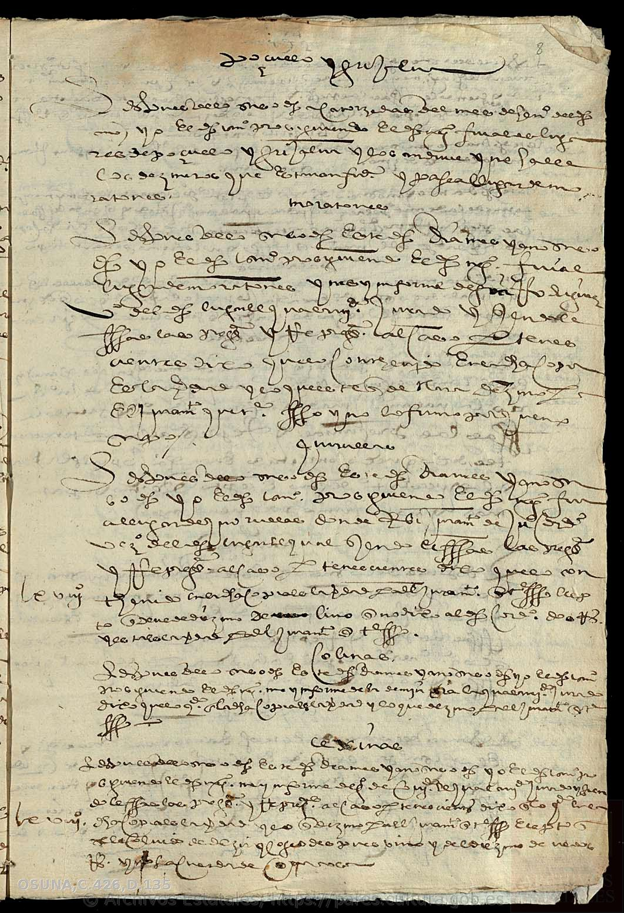
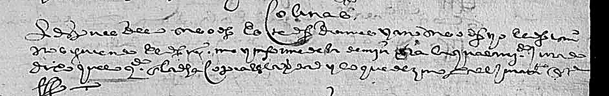
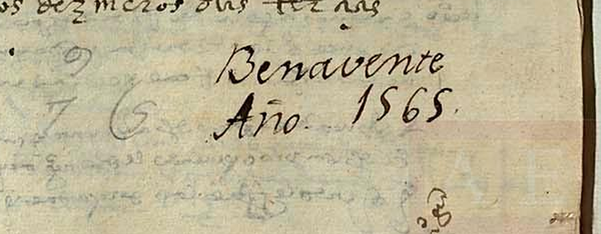

# La relación de dezmeros del conde-duque de Benavente (1561 `[?]` / 1565 `[?]`)

> **Estado: ✅ FUENTE VISTA Y LOCALIZADA — ⚠️ NO TRANSCRITA.** 23 de septiembre de 2026.
>
> Las 19 imágenes están descargadas y guardadas en [`facsimil/`](facsimil/). Se ha localizado con
> precisión **el asiento de Colinas** —folio 8— y se ha establecido su contexto en el cuaderno.
>
> ⚠️ **Lo que esta ficha NO hace es transcribir el asiento.** Está en **letra procesal** muy
> abreviada, y a la resolución máxima que sirve PARES (≈1.090 px de ancho de folio) una lectura mía
> sería adivinanza. El criterio del proyecto dice que un facsímil no se da por leído: **queda
> pendiente de paleografía**, y se dice.

---

## La ficha

| | |
|---|---|
| **Archivo** | Archivo Histórico de la Nobleza (Toledo) |
| **Signatura** | **OSUNA,C.426,D.135** |
| **Código de referencia** | `ES.45168.AHNOB/1.4.1.15//OSUNA,C.426,D.135` |
| **Signatura antigua** | «Benavente, Caxon 12, Número 83»; y «Leg. 426-15» |
| **Fecha** | **1561-12-30, Benavente** *(según PARES)* — ⚠️ **1565** *(según el propio documento, ver abajo)* |
| **Fondo** | 1. Archivo de los Duques de Osuna → 1.4. Ducado de Benavente → Administración de bienes y archivo → **Informes de administración** |
| **Productor** | Condado-ducado de Benavente |
| **Volumen** | 1 documento en papel, **11 hojas** — **19 imágenes** digitalizadas |
| **Escritura** | Española, **procesal** |
| **Conservación** | Bueno |
| **Título** | «Relación de declaraciones de los **dezmeros** asentados en las propiedades de [Antonio Alfonso Pimentel de Herrera, III] conde[-duque de Benavente], relativas a sus bienes, y recopiladas por **Julián Cordero**» |

Localizada en **PARES** el 22 de septiembre de 2026 y descargada el 23
→ [inventario, §10](../../03-archivos/inventario-documental.md).

---

## Qué es, y por qué importa

Es un **barrido fiscal**: un comisionado del conde-duque de Benavente, **Julián Cordero**, recorre
los lugares del señorío tomando declaración a los *dezmeros* —los vecinos encargados de recoger el
diezmo— sobre los bienes del conde y lo que de ellos se diezma. El cuaderno avanza **lugar por
lugar**, cada uno bajo su epígrafe centrado.

PARES identifica **54 lugares** entre Zamora y León, y añade con honradez que «**aparece alguno más
que no se ha podido identificar**». Uno de ellos es **Colinas**.

> ★★ **La importancia para este proyecto es de fecha.** El vecindario del conde de Benavente que el
> proyecto transcribió —[`censo-1591/`](../censo-1591/README.md)— es de **1591**. Este cuaderno es
> **veintiséis o treinta años anterior**, del mismo señorío, y también nombra a Colinas. Es, por
> ahora, **la mención más antigua de Colinas que el proyecto tiene en imagen**.

---

## Dónde está Colinas: folio 8

El folio 8 (imagen 14 de 19) lleva **cinco epígrafes**. En orden de arriba abajo:

| Orden | Epígrafe, tal como se lee | Lectura |
|---|---|---|
| 1 | «Quiruelas y Grijalua» | **Quiruelas de Vidriales** y **Grijalba de Vidriales** |
| 2 | «moratones» | **Moratones** (Santibáñez de Vidriales) |
| 3 | «J[?]nu[?]es» | ⚠️ **no se lee con seguridad** — probablemente uno de los que PARES no identifica |
| 4 | **«Colinas»** | **Colinas de Trasmonte** |
| 5 | «Ce[z]inas» `[?]` | ⚠️ **sin identificar** — ver abajo |

> 🚨 **Un detalle de toponimia que sí es seguro: el documento escribe «Colinas», a secas.** El
> «de Trasmonte» lo añade PARES en su descripción, como identificación editorial. Lo que está en el
> papel de 1565 `[?]` es **Colinas**, sin apellido.

### El asiento

Bajo el epígrafe **«Colinas»** hay **tres líneas** y una rúbrica. Es **uno de los asientos más
breves del cuaderno**: el de Moratones, que le precede en el mismo folio, ocupa nueve líneas, y el
de «Ce[z]inas», que le sigue, seis.

⚠️ **No se transcribe.** Se deja constancia de lo que sí es observable sin interpretar:

- El asiento sigue **la misma fórmula de protocolo** que todos los demás del cuaderno, que abre con
  la data («En este dicho mes… días… y año sobredicho…») y sigue con la comparecencia ante el
  escribano.
- Es **breve**, y termina en rúbrica.
- ⚠️ **De su brevedad no se deduce nada.** Podría significar pocos bienes del conde en Colinas, un
  solo declarante, o simplemente que el escribano abrevió. **Decidirlo exige leerlo.**

---

## ⚠️ El problema de la fecha: 1561 contra 1565

PARES data el documento el **30 de diciembre de 1561**. El propio documento, en cambio, lleva **1565
escrito dos veces**:

- En la **carpetilla** (imagen 1): «Benavente / Caxon… 12. / Numero… 83.» y debajo, **1565**.
- En el **endoso final** (imagen 19), tras la última línea del escribano: «**Benavente / Año 1565**».

> Las dos anotaciones están en **letra caligráfica posterior** —de mano de archivero, probablemente
> del siglo XVIII, la misma que puso el «Caxon 12, Número 83»—, **no del escribano de 1561**. Es
> decir: **1565 es la fecha que le atribuyó el archivo del ducado**, no necesariamente la del acto.
>
> ⚠️ **Queda abierto.** No se sabe de dónde sale el `1561-12-30` de PARES —presumiblemente de una
> data interna del texto, que aquí no se ha leído—, ni si el archivero de Osuna se equivocó o fechó
> la última diligencia. **Quien cite esta signatura debería saber que las dos fechas circulan.**
>
> Se resolverá cuando se lea la data del folio 1 `[?]`.

---

## ★ Una pista, con toda la cautela: «Ce[z]inas»

El epígrafe que **sigue inmediatamente a Colinas** en el folio 8 se lee «**Ce[z]inas**» `[?]` —la
letra tras «Ce» tiene un caído largo y cruzado, que en procesal vale tanto por *z* como por *x*.
**No figura entre los 54 lugares que PARES identifica**, y PARES advierte expresamente que quedan
algunos sin identificar.

El proyecto arrastra un `[?]` de la misma familia: en el vecindario de **1591**, en el mismo
señorío, aparece «**Xecinas**» (21 vecinos), **junto a Colinas**, y tampoco se ha podido identificar
→ [`censo-1591/`](../censo-1591/README.md).

> ⚠️ **Lo que se afirma y lo que no.**
> **Se afirma:** dos fuentes independientes del señorío de Benavente, separadas por unos treinta
> años, registran **junto a Colinas** un lugar cuyo nombre nadie ha sabido identificar, y las dos
> lecturas —«Ce[z]inas» y «Xecinas»— terminan igual.
> **No se afirma que sean el mismo lugar.** Podría ser una coincidencia de terminación, un error de
> lectura mío, o un error de lectura de la fuente de 1591. Lo que sí hay ahora es **un segundo
> testimonio y un sitio donde mirar**: los lugares vecinos a Colinas en este cuaderno.

---

## Nota de método: cómo se bajaron las imágenes

Se deja escrito porque costó, y porque el proyecto volverá a necesitarlo.

1. Sesión: primero `…/catalogo/description/<id>`, después `…/catalogo/show/<id>` **con el `Referer`
   de la anterior y el mismo tarro de cookies**. El servidor guarda estado; si se le piden imágenes
   sin esa secuencia, devuelve **0 bytes** en silencio.
2. Cada imagen tiene **su propio `dbCode`**, correlativo: `dbCode = base + (n−1)`.
3. La descarga es `ViewImage.do?accion=42&**txt_descarga=1**&dbCode=…&txt_id_imagen=n&txt_zoom=10…`.
   **Sin `txt_descarga=1` sólo se obtiene la miniatura de 49×70 px.**
4. Si la sesión se «envenena» (todo a 0 bytes), se rehace desde el paso 1.
5. `txt_zoom` está **topado**: 10 da ≈1.090 × 1.555 px y no hay más. Para procesal, **es poco**.

### Y una comprobación que salió negativa

PARES tiene un **buscador HTR** con inteligencia artificial
(`https://pares.cultura.gob.es/pares-htr/`), pero **sólo cubre seis series**, y **ni Osuna ni la
Chancillería están entre ellas**. De las seis, la única de época útil es el **Registro General del
Sello de Corte (1502-1517)** del Archivo General de Simancas.

Barrido hecho el 23 de septiembre de 2026, con índice de confianza 50-60:

| Búsqueda | Resultado |
|---|---|
| «benavente» | ✅ miles de resultados *(control positivo: la serie cubre la zona)* |
| «zamora» | ✅ miles de resultados *(control positivo)* |
| «trasmonte» | ❌ **cero** |
| «vidriales» | ❌ **cero** |
| «quiruelas» | ❌ **cero** |

> **Conclusión:** el Registro General del Sello de Corte, tal como está indexado por HTR, **no nombra
> a Colinas ni a su comarca**, y los controles demuestran que el silencio no es del método.
> ⚠️ Bajando la confianza por debajo de 20, «trasmonte» empieza a devolver resultados: son **ruido
> probabilístico** del indexado, no menciones, y no se han tomado por tales.

---

## Ficheros

| Fichero | Qué es |
|---|---|
| `facsimil/osuna-c426-d135-01…19.jpg` | **Las 19 imágenes completas**, tal como las sirve PARES |
| `portada-archivo-1565.jpg` | La carpetilla: «Benavente, Caxon 12, Número 83 — 1565» |
| `folio-8-colinas.jpg` | El folio 8 entero, con los cinco epígrafes |
| `asiento-colinas-detalle.png` | El epígrafe «Colinas» y sus tres líneas, ampliado ×3 |
| `endoso-benavente-1565.png` | El endoso final: «Benavente / Año 1565» |

---

## Lo que falta

1. **Transcribir el asiento de Colinas.** Tres líneas. Es trabajo de paleógrafo, no de método.
2. **Leer la data del folio 1**, que debería zanjar el 1561 contra el 1565.
3. **Leer los epígrafes 3 y 5** del folio 8 («J[?]nu[?]es» y «Ce[z]inas»), y cotejarlos con los
   lugares sin identificar del vecindario de 1591.
4. Y, si el asiento nombra personas, **cruzarlas con los 28 vecinos de Colinas de 1591**.

---

## Nota de reutilización

Imágenes del **Archivo Histórico de la Nobleza**, obtenidas de **PARES** (Portal de Archivos
Españoles, Ministerio de Cultura). Las condiciones de la ficha de PARES establecen que «*la
información descriptiva y las imágenes de documentos en dominio público conservados en Archivos
Estatales y accesibles a través de PARES pueden reproducirse y utilizarse sin permiso previo*», con
mención del Ministerio de Cultura y cita de la fuente: **AHNOB, OSUNA,C.426,D.135**,
`https://pares.cultura.gob.es/ParesBusquedas20/catalogo/description/5496338`.

---

*Ficha redactada el 23 de septiembre de 2026.*
