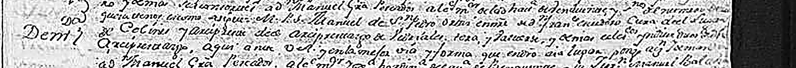
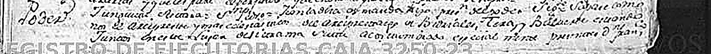
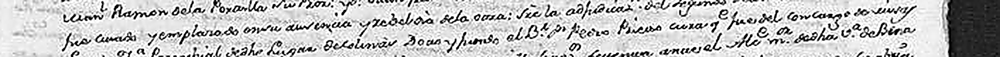
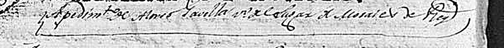

# Tres ejecutorias de la Chancillería de Valladolid: 1757, 1772 y 1804

> **Estado: ✅ FUENTES VISTAS Y LEÍDAS EN PARTE.** 23 de septiembre de 2026.
>
> Las **28 imágenes** de las tres unidades están descargadas → [`facsimil/`](facsimil/). De cada una
> se ha leído sobre el facsímil **la cabecera, la identificación de las partes y la cláusula del
> objeto**; el cuerpo procesal no se ha transcrito.
>
> ⚠️ **Lo que se afirma aquí está leído en la imagen.** Lo que sólo viene del catálogo de PARES se
> dice que viene del catálogo. Y **en dos sitios el documento y el catálogo no coinciden**: se
> señalan los dos.

---

## Por qué estas tres y no las otras seis

De las **17 unidades de PARES** que nombran a Colinas
([`pares-colinas.tsv`](../../03-archivos/pares-colinas.tsv)), la Chancillería aporta nueve. Y están
partidas en dos:

- Los **«Pleitos Civiles»** —el expediente entero, con las declaraciones de los testigos, que es lo
  que un historiador quiere— **no están digitalizados**. Ninguno de los seis.
- Los **«Registro de Ejecutorias»** —la sentencia firme, copiada en limpio para entregarla a la
  parte que ganó— **sí lo están**. Los tres.

> Una ejecutoria es **el final del pleito, no el pleito**. Trae el encabezamiento real, el nombre de
> las partes, el objeto del litigio y el fallo; no trae las pruebas. **Es poco, pero está, y es
> gratis.** Lo otro hay que pedirlo.

---

# 1. 1757 — el cura de Colinas era arcipreste

| | |
|---|---|
| **Signatura** | **ARCHV, REGISTRO DE EJECUTORIAS, CAJA 3250,23** |
| **Código** | `ES.47186.ARCHV/10.7.1//REGISTRO DE EJECUTORIAS,CAJA 3250,23` |
| **Fecha** | **agosto de 1757** *(PARES advierte que en el documento está el día completo)* |
| **id PARES** | 5819964 — **8 imágenes** |
| **Papel** | Sello cuarto, veinte maravedís, año de 1757 |

**Cabecera, leída:** «**A pedim.to de D.n Fran.co Escudero, Cura
del Lu[gar de Colinas]**».

### ★★★ Lo que dice el documento, y el catálogo no

> «… entre **d[o]n Fran.co Escudero, Cura del Lugar de Colinas y Arcipreste del
> Arciprestazgo de Vidriales, Tera y Valverde**, y otros ecles[iástic]os …»

Y otra vez, al pie de la misma plana:

> «… **Arcipreste y más eclesiásticos del Arciprestazgo de Vidriales, Tera y Balverde** …»

**Dos menciones independientes en la misma hoja.** De aquí salen dos cosas:

1. ★★★ **Francisco Escudero no era sólo el cura de Colinas: era el arcipreste.** La cabeza
   eclesiástica de los tres valles —Vidriales, Tera y Valverde— residía, en 1757, **en Colinas**.
   Para un lugar de esa talla, no es poco: es una **dignidad**, y sitúa a la parroquia por encima de
   lo que su vecindario haría esperar.
2. ⚠️ **PARES titula la unidad «…eclesiásticos del arciprestazgo de *Benavente*».** El documento
   dice, dos veces, **«Vidriales, Tera y Valverde»**. La descripción del catálogo es un resumen del
   catalogador; **el papel manda**.

> **Y esto toca al frente nº 8.** El inventario sostiene que la parroquia de Colinas depende de
> **Astorga**, no de Zamora, y que los libros sacramentales están en el **Archivo Histórico
> Diocesano de Astorga**. Un «arciprestazgo de Benavente» habría abierto una duda; un arciprestazgo
> **«de Vidriales, Tera y Valverde»** es una demarcación **de los valles de alrededor**, y encaja
> con lo que el inventario ya decía.
> ⚠️ **Pero encajar no es probar.** Este documento **no dice a qué diócesis pertenecía ese
> arciprestazgo en 1757**. Queda como `[?]` a verificar — y ahora con el nombre exacto de la
> demarcación que hay que buscar, que antes no se tenía.

### Y de qué iba el pleito

- **Contra Manuel García Pescador** *(según el título de PARES; en el facsímil aparece el nombre
  varias veces)*.
- Interviene un **alcalde mayor de la villa de Benavente** `[?]`.
- El asunto parece ser un **conflicto de jurisdicción sobre la inventariación de los bienes de los
  eclesiásticos que mueren** en los pueblos del juzgado `[?]` — el pleito clásico entre la justicia
  seglar y la eclesiástica. **Se marca `[?]` porque está leído a trozos, no transcrito.**
- Hay una **lista de nombres propios** en el cuerpo de la plana, sin transcribir.

---

# 2. 1772 — tres aniversarios en la iglesia de Colinas

| | |
|---|---|
| **Signatura** | **ARCHV, REGISTRO DE EJECUTORIAS, CAJA 3359,51** |
| **Fecha** | **agosto de 1772** |
| **id PARES** | 5814511 — **10 imágenes** |
| **Escribano del pleito** | **José Blanco y Peñas** — Escribanía: **Moreno** |
| **Papel** | Sello cuarto, veinte maravedís, año de 1772. Encabeza **Carlos III** |

**Cabecera, leída:** «A pedim.to de **D.n Simón Prieto Montero, clérigo de
menores, v[ecin]o del Lugar de Oteros**» *(Otero de Sanabria, según PARES)*.

### ★★ La cláusula

> «… sobre la **adjudicación del segundo** [de los tres aniversarios] «**que en la ig[lesi]a
> Parrochial de dicho Lugar de Colinas dotó y fundó el B.r D.n Pedro Prieto,
> cura que fue de …**»

**Lo que esto aporta, y es nuevo para el proyecto:**

1. ★★ **La iglesia parroquial de Colinas tenía, antes de 1772, tres aniversarios dotados y
   fundados** — misas perpetuas con renta detrás. Es **la primera fundación piadosa documentada** de
   la parroquia, y prueba que había **bienes vinculados a la iglesia** con renta suficiente para que
   mereciera la pena pleitear por uno de ellos en Valladolid.
2. ★ **El fundador fue un cura**: «cura que fue de …».
3. ★ **Es un asunto de familia.** El fundador es un **Prieto**; el que pleitea y obtiene la
   ejecutoria es **Simón Prieto Montero**. Contra él, **Francisco Gutiérrez**, vecino de **Friera de
   Valverde** *(según PARES)*.

> ⚠️ **Segunda discrepancia con el catálogo, y ésta es de lectura.** PARES nombra al fundador
> «**Bartolomé Pedro Prieto**». En el facsímil se lee «**el B.r D.n Pedro
> Prieto**» — y `B.r` delante de `D.n` es, casi con seguridad, **Bachiller**, el grado, no
> «Bartolomé». Se propone leer **«el bachiller don Pedro Prieto»**.
> **`[?]` No se da por cerrado**: la abreviatura está a 795 px de ancho de folio y podría ser otra
> cosa. Pero el sentido acompaña —un **bachiller que fue cura** funda aniversarios— y el catálogo no
> ofrece ningún «Bartolomé» en el resto del expediente.

---

# 3. 1804 — una casa vinculada, y dos vecinos con nombre

| | |
|---|---|
| **Signatura** | **ARCHV, REGISTRO DE EJECUTORIAS, CAJA 3767,43** |
| **Fecha** | **junio de 1804** |
| **id PARES** | 5803094 — **10 imágenes** |
| **Escribano del pleito** | **Francisco Javier Recio y Ramos** — Escribanía: **Alonso Rodríguez** |

**Objeto, según PARES:** pleito de **Alonso Gavilla y su mujer**, vecinos de **Morales del Rey**,
con **Domingo Bernardo**, vecino de **Colinas de Trasmonte**, «**sobre vinculación de una casa**».

**Cabecera, leída:** «A pedim.to de **Alonso Gavilla**, v[ecin]o de **Colinas**
`[?]` … de **Morales del Rey**».

> ⚠️ **Aquí no se resuelve una ambigüedad, y se dice.** En la línea del pedimento aparecen **Alonso
> Gavilla** y **los dos lugares**, y a esta resolución **no se distingue cuál es el suyo**. PARES le
> asigna Morales del Rey y da Colinas a Domingo Bernardo. **Puede que PARES tenga razón; puede que
> estén cambiados.** Se deja `[?]` hasta leerlo mejor.
>
> Lo que **sí** es seguro: la ejecutoria se expide **a pedimento de Alonso Gavilla**, que en el uso
> de la Chancillería significa que **fue él quien la pidió** —normalmente, quien ganó—.

**Y lo que sí aporta, sin discusión:** un vecino de Colinas con nombre y fecha, **Domingo Bernardo,
1804**, y el dato de que en Colinas había **casas vinculadas** —sujetas a mayorazgo o a vínculo—,
que es información sobre la estructura de la propiedad del casco.

---

## Lo que estas tres fuentes añaden al inventario de personas

| Año | Nombre | Qué era |
|---|---|---|
| 1757 | **Francisco Escudero** | Cura de Colinas **y arcipreste** de Vidriales, Tera y Valverde |
| ant. 1772 | **Pedro Prieto**, bachiller `[?]` | Cura; **fundó los tres aniversarios** de la iglesia de Colinas |
| 1772 | **Simón Prieto Montero** | Clérigo de menores, vecino de Otero; pleitea por el segundo aniversario |
| 1804 | **Domingo Bernardo** | Vecino de Colinas `[?]` |

Súmense a **Martín Alonso (1551)**, que sigue sin digitalizar, y a los **28 vecinos de 1591**
→ [`censo-1591/`](../censo-1591/README.md).

---

## Ficheros

| Fichero | Qué es |
|---|---|
| `facsimil/1757/` | Las 8 imágenes de `CAJA 3250,23` |
| `facsimil/1772/` | Las 10 imágenes de `CAJA 3359,51` |
| `facsimil/1804/` | Las 10 imágenes de `CAJA 3767,43` |
| `plana-1757.jpg`, `plana-1772.jpg`, `plana-1804.jpg` | La primera plana de texto de cada una |
| `detalle-1757-arciprestazgo{,-bis}.png` | Las dos menciones del arciprestazgo, ampliadas |
| `detalle-1772-aniversarios.png` | La cláusula de los tres aniversarios |
| `detalle-1804-pedimento.png` | El pedimento de 1804 |

---

## Lo que falta

1. **Transcribir el fallo** de las tres. Están al final de cada cuaderno y son las planas más
   legibles.
2. **Resolver el `[?]` de 1804**: quién era vecino de dónde.
3. **Confirmar la lectura «bachiller»** en la fundación de los aniversarios.
4. ★ **Averiguar a qué diócesis pertenecía en 1757 el arciprestazgo de Vidriales, Tera y Valverde**,
   y si su archivo —o el del arcipreste, que estaba **en Colinas**— dejó rastro. Frente nº 8.
5. **Y pedir los seis pleitos civiles**, que son los que traen los testigos.

---

## Nota de reutilización

Imágenes del **Archivo de la Real Chancillería de Valladolid**, obtenidas de **PARES** (Ministerio
de Cultura). Reproducibles sin permiso previo por tratarse de documentos en dominio público, con
mención del Ministerio y cita de archivo, signatura y URL de PARES.

---

*Ficha redactada el 23 de septiembre de 2026.*
