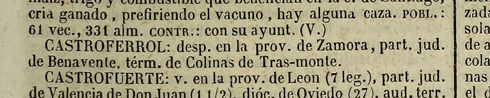
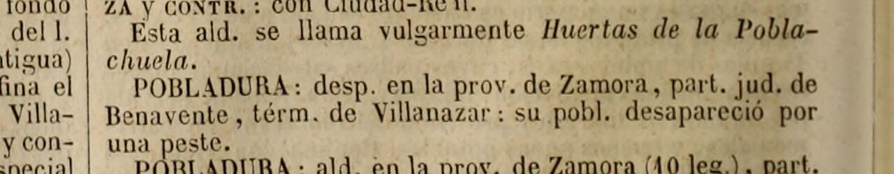
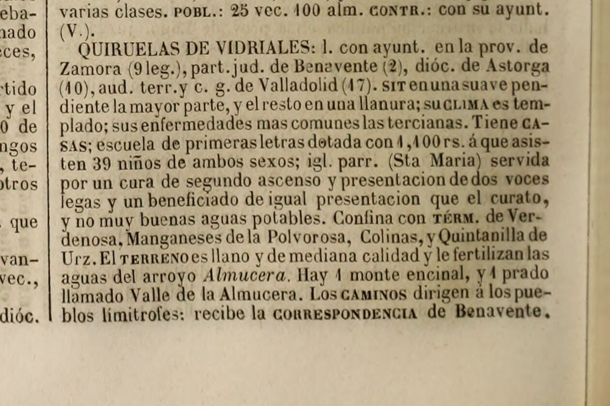
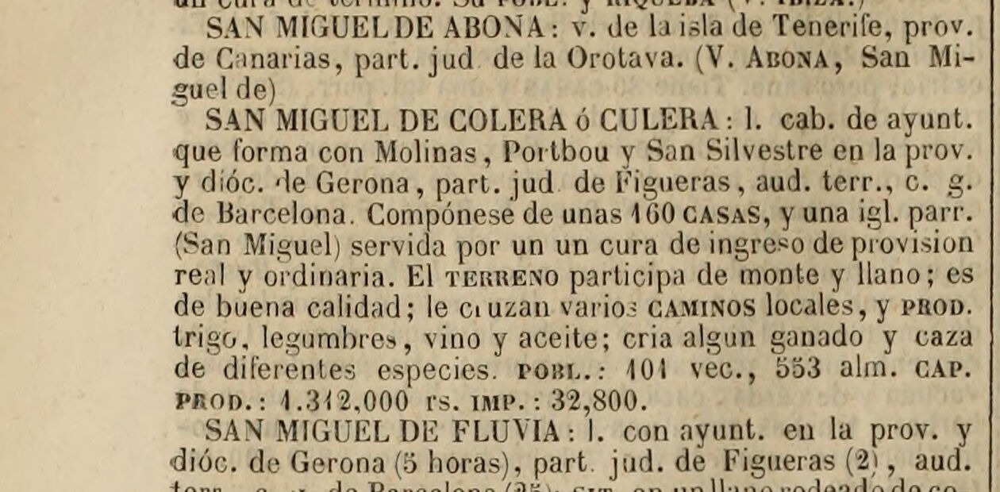

# Madoz, 1847 — la entrada de «Colinas de Trasmonte»

> **Estado: ✅ FACSÍMIL EN NUESTRO PODER, LEÍDO A RESOLUCIÓN COMPLETA.** 22 de septiembre de 2026.
> El proyecto llevaba meses **citando a Madoz de segunda mano** en cuatro sitios distintos. Ahora hay
> imagen de la página, y la entrada está transcrita entera.

---

## La ficha

| Campo | Valor |
|---|---|
| Obra | MADOZ, Pascual: *Diccionario geográfico-estadístico-histórico de España y sus posesiones de Ultramar* |
| Tomo | **VI** |
| Pie de imprenta | **Madrid, 1847** (leído en la portada, no supuesto) |
| Página | **521**, columna derecha |
| Entrada | **COLINAS DE TRASMONTE** |
| Facsímil | [`madoz-t6-p521-colinas.jpg`](madoz-t6-p521-colinas.jpg) (la entrada) · [`madoz-t6-p521-pagina.jpg`](madoz-t6-p521-pagina.jpg) (la plana) · [`madoz-t6-portada.jpg`](madoz-t6-portada.jpg) |
| Procedencia | Ejemplar digitalizado en **Internet Archive**, `diccionariogeogr06mado`, servido por su API IIIF a resolución completa (2480 × 3468 px) |

> ⚠️ **No se ha usado el OCR.** El texto que circula del *djvu.txt* de ese ejemplar contiene errores
> —lee «Vidriales» como «Vidr¡ales» y «Marón» como «Maron»—. La transcripción de abajo se ha hecho
> **sobre la imagen**, y las dos cifras que importan (33 vec. y 132 alm.) se han comprobado ampliadas.

---

## La entrada, transcrita

> **COLINAS DE TRASMONTE**: ald. con ayunt. en la prov. de Zamora (9 leg.), part. jud. de Benavente
> (2), dióc. de Astorga (9), aud. terr. y c. g. de Valladolid (17). **sit.**: en una ladera con
> esposicion al S., por cuyo lado corre el arroyo llamado **la Mucera**; su **clima** es benigno;
> reinan con mas frecuencia los vientos NE. en el invierno, y los del SE. en el verano; sus
> enfermedades comunes son alguna terciana. Tiene **35 casas** distribuidas en **6 calles**; igl.
> parr. (**San Juan Bautista**), servida por 1 cura de primer ascenso y libre provision; cementerio,
> y buenas aguas potables. **Confina N. Manganeses de la Polvorosa; E. Vecilla de Trasmonte; S.
> Aguilar de Tera, y O. Quiruelas de Vidriales**, á 1/2 leg. el mas distante; **en su térm. se
> encuentran los despoblados de Castroferrol y Pobladura de Trasmonte**. El **terreno** es de buena
> calidad, y le fertilizan las aguas del indicado **Almucera**. **Hay un monte encinal con el mismo
> nombre del pueblo, que forma con otros una cordillera de 2 horas hasta San Juanico.** Los
> **caminos** locales y en mal estado; reciben la **correspondencia** en Benavente. **prod.**: trigo
> y **lino**; cria ganado lanar; caza de perdices, liebres y conejos, y pesca de barbos. **pobl.**:
> **con sus despoblados 33 vec., 132 alm.** **cap. prod.**: 29,260 rs. **imp.**: 7,932. **contr.**:
> 4,626 rs. 19 mrs. El **resupuesto** [*sic*, por «presupuesto»] **municipal** asciende á 411 rs.
> cubiertos por reparto entre los vec.

---

## Lo que resuelve

### 1. ✅ Los dos despoblados: González Rodríguez tenía razón

Madoz dice, con todas las letras, que **en el término de Colinas están los despoblados de
Castroferrol y Pobladura de Trasmonte**. El inventario recogía esta afirmación marcada `[?]`, y
LOBATO VIDAL (1992) parecía contradecirla al situar Pobladura «entre Villanázar y Vecilla de
Trasmonte».

> **La contradicción es real, pero no es de lectura: es entre autores.** González Rodríguez cita
> fielmente a Madoz. Lobato Vidal, que también maneja a Madoz, lo corrige sin decirlo. Y hay un
> tercer testimonio que respalda a Lobato Vidal: el **apeo de Vecilla de 1706** orienta sus parcelas
> «azia Pobladura» y «azia Colinas» como **dos vecinos distintos**.
>
> **Qué puede decir el proyecto:** que *Madoz sitúa Pobladura de Trasmonte en el término de Colinas*
> —eso es un hecho sobre Madoz— y que *un investigador posterior la sitúa en otro sitio*. **No** que
> Pobladura estuviera en Colinas. Ver [inventario, §8.2](../../03-archivos/inventario-documental.md).

★ Para **Castroferrol** no hay discusión: Madoz lo pone en el término, Lobato Vidal lo pone «en el
antiguo término de Colinas de Trasmonte», y González Rodríguez construye sobre eso su localización
del monasterio. **Es la mención impresa más antigua que conocemos de que Castroferrol cae aquí.**

> 🚨 **Y unas horas después, el 22 de septiembre, esto quedó resuelto — leyendo más Madoz.**
> No hacía falta salir de la obra: **Castroferrol y Pobladura tienen cada uno su propia entrada
> alfabética**, en otro sitio del diccionario, y dicen cosas distintas. Ver
> [«Las otras tres entradas»](#las-otras-tres-entradas-de-madoz) más abajo. En resumen:
> **sobre Castroferrol, Madoz se repite; sobre Pobladura, se contradice.**

---

## Las otras tres entradas de Madoz

Todo lo anterior sale de la entrada «Colinas de Trasmonte», t. VI p. 521. Pero un diccionario
alfabético dice las cosas **más de una vez**, y comprobar qué dice en los otros sitios es gratis.
Son tres entradas más, leídas las tres **sobre el facsímil**, no sobre el OCR.

### ★★★ 6. «CASTROFERROL» tiene entrada propia — y repite el término

**Tomo VI, p. 221**, entre «Castrofeito» y «Castrofuerte»:

> «**CASTROFERROL**: desp. en la prov. de Zamora, part. jud. de Benavente, térm. de Colinas de
> **Tras-monte**.»

**Esto es nuevo para el proyecto.** Hasta ahora la única mención de Madoz que se manejaba era la
frase de dentro del artículo de Colinas. Ahora son **dos afirmaciones del mismo autor, en dos
lugares distintos de la obra, coincidentes**: Castroferrol es un despoblado del término de Colinas.

Dos detalles de la letra impresa, que se dicen porque se han visto:

- Madoz escribe **«Castroferrol»**, en una palabra, y **no** «Castro Ferrol».
- Escribe **«Colinas de Tras-monte»**, con guion. La entrada principal, en cambio, titula «COLINAS
  DE TRASMONTE» sin guion. El propio diccionario duda de su grafía.

> ⚠️ **Lo que no dice.** La entrada **no** localiza el despoblado dentro del término, ni menciona
> monasterio, ni iglesia, ni advocación. Es una remisión de cuatro líneas. Su valor está en la
> repetición, no en el contenido.

### ⚠️ 7. «POBLADURA» tiene entrada propia — y **cambia de término**

**Tomo XIII, p. 92**:

> «**POBLADURA**: desp. en la prov. de Zamora, part. jud. de Benavente, térm. de **Villanazar**: su
> pobl. desapareció por una **peste**.»

**Madoz se contradice a sí mismo.** En el artículo de Colinas escribe que Pobladura de Trasmonte
está «en su térm.»; en la entrada propia del despoblado lo pone en el de **Villanázar**.

Y hay un dato de más: **«su pobl. desapareció por una peste»**. El proyecto no tenía ninguna causa
para la despoblación de Pobladura. ⚠️ Madoz no da fecha ni fuente para la peste.

> **Lo que esto cierra, y lo que no.**
> - ✅ **Cierra** el `[?]` de §8.2 del inventario sobre quién se equivoca. **Nadie se equivoca al
>   citar**: González Rodríguez transmite fielmente lo que dice el artículo de Colinas, y Lobato
>   Vidal coincide con lo que dice la entrada de Pobladura. **La contradicción está dentro de
>   Madoz.**
> - ✅ Y **refuerza a Lobato Vidal**, que sitúa Pobladura «entre Villanázar y Vecilla de Trasmonte»:
>   ahora tiene de su lado la entrada más específica de las dos, y el **apeo de Vecilla de 1706**,
>   que trata «azia Pobladura» y «azia Colinas» como dos vecinos distintos. Son tres testimonios
>   contra uno.
> - ❌ **No cierra** dónde estuvo Pobladura. Sigue sin localizar.
>
> 🔎 **Comprobado además**: en todo el tomo XIII hay **diez** entradas «Pobladura», y **ninguna se
> titula «Pobladura de Trasmonte»**. El nombre compuesto sólo aparece dentro del artículo de
> Colinas.

### 8. «QUIRUELAS DE VIDRIALES», el vecino del oeste

**Tomo XIII, p. 350.** Se leyó entera por dos razones: confirmar la raya desde el otro lado, y
comprobar una afirmación que el proyecto arrastraba de segunda mano.

- ✅ **«Confina con térm. de Verdenosa, Manganeses de la Polvorosa, *Colinas*, y Quintanilla de
  Urz.»** La raya con Colinas queda dicha por los dos lados: el artículo de Colinas nombra a
  Quiruelas al O., y el de Quiruelas nombra a Colinas. `[?]` **«Verdenosa»** no se ha identificado;
  se transcribe tal como está impreso.
- ★ **«Hay 1 monte encinal, y 1 prado llamado *Valle de la Almucera*.»** Un tercer «Valle» en dos
  kilómetros, después del **El Valle** de Colinas y del **El Valle** que el MTN50 rotula junto a
  Vecilla. Es la mejor ilustración de por qué el paraje del monasterio hay que anclarlo por
  coordenadas y no por el nombre → [`04-cartografia/parajes-catastro.md`](../../04-cartografia/parajes-catastro.md).
- 🔎 **«Tiene casas;»** — **sin número**. No es fallo del OCR: la cifra **falta en el original
  impreso**. Es el mismo tipo de descuido que el «resupuesto» de la entrada de Colinas.

### ❌ 9. Lo que se fue a buscar y **no está**: «San Miguel de Castroferrol»

González Rodríguez deja abierta la localización del monasterio entre dos candidatos, y el segundo es
**un yacimiento llamado San Miguel en término de Quiruelas**. El inventario anotaba, marcado `[?]`,
que «Madoz recoge además *San Miguel de Castro Ferrol* bajo Quiruelas». **Se ha comprobado, y en
Madoz no está.**

- La entrada de **Quiruelas de Vidriales** (t. XIII p. 350) **no menciona ningún despoblado**, ni San
  Miguel, ni Castroferrol.
- La serie alfabética **SAN MIGUEL DE…** del tomo XIII, p. 726, pasa de **ABONA** a **COLERA ó
  CULERA** sin nada en medio. **Castroferrol** caería exactamente ahí.

- Y la entrada propia de **CASTROFERROL** (t. VI p. 221) no lleva advocación ninguna.

> ⚠️ **Qué significa y qué no.** Significa que **la atribución a Madoz no se sostiene**: ese nombre
> viene de otra fuente, probablemente del inventario arqueológico de Larrén Izquierdo que el propio
> artículo cita. **No significa** que el yacimiento de San Miguel no exista. Lo que queda es que
> **Madoz no lo respalda**, y el `[?]` se cierra en negativo.
>
> 🔎 **Y hay una segunda comprobación, por otra vía**: el barrido del parcelario del Catastro en los
> polígonos de Quiruelas —1.668 parcelas, **73 parajes**— **tampoco encuentra ningún San Miguel**
> → [`04-cartografia/parajes-catastro.md`](../../04-cartografia/parajes-catastro.md), §6.

---

<!-- fin del bloque anadido el 22-IX-2026 -->

### 2. ⚠️ El 132 de 1847 es «con sus despoblados» — y eso agrava el agujero

La cifra que abre el **frente nº 16** aparece así: «**pobl.: con sus despoblados 33 vec., 132
alm.**».

| Año | Fuente | Vecinos | Habitantes |
|---:|---|---:|---:|
| 1787 | Floridablanca | — | **156** |
| 1826 | Miñano | **55** | **226** |
| **1847** | **Madoz** | **33** | **132** |
| 1857 | Censo | — | **386** |

> **No es un artificio de unidad de cuenta.** Miñano y Madoz cuentan lo mismo —vecinos y almas— y
> la proporción es casi idéntica (4,1 y 4,0 almas por vecino). La caída de **55 a 33 vecinos** entre
> 1826 y 1847 es **una caída de verdad**, del 40 %, y Madoz la da **incluyendo los despoblados**, es
> decir contando de más, no de menos.
>
> ★ **Esto refuerza la hipótesis demográfica y debilita la estadística**: entre Miñano y Madoz pasó
> algo. Primera guerra carlista (1833-1840) y cólera de 1834 son los candidatos. **Se comprueba en
> los libros de difuntos del Archivo Diocesano de Astorga** → frentes nº 8 y nº 16.
>
> ⚠️ **Y el otro lado del agujero sigue siendo igual de raro.** De **132 en 1847** a **386 en 1857**
> hay un factor de casi tres en diez años, que ninguna natalidad explica. O el 132 se queda corto
> pese a la coletilla, o **cambió el término** entre ambas fechas. El hoyo tiene dos paredes y
> ninguna está explicada.

### 3. ★★ El monte encinal, y una cordillera de dos horas

> «Hay un **monte encinal con el mismo nombre del pueblo**, que forma con otros **una cordillera de
> 2 horas hasta San Juanico**.»

Es el dato más importante de la entrada para el **topónimo** y para el **emblema**:

- Existía **un monte de encinas llamado «Colinas»**, homónimo del pueblo. No es que el pueblo se
  llame así por unas colinas genéricas: **hay un monte con ese nombre propio**.
- Y ese monte **forma cordillera con otros** — una fila de cerros de **dos horas de camino**, unas
  **8-10 km**, hasta **San Juanico**.
- Concuerda con Miñano, que en 1826 describe el pueblo «**cercado de colinas**», y con la situación
  «en una ladera con esposicion al S.».

> **Cautela.** Que el monte se llame como el pueblo **no dice cuál nombró a cuál**. Y «San Juanico»
> hay que localizarlo: es un topónimo que el proyecto no tenía. → `04-cartografia`.

### 4. La raya del término, dicha por la fuente

**N. Manganeses de la Polvorosa · E. Vecilla de Trasmonte · S. Aguilar de Tera · O. Quiruelas de
Vidriales**, «á 1/2 leg. el mas distante» —unos **2,8 km**—.

Es el **deslinde administrativo de 1847**, anterior en 125 años a la anexión, y sirve para comprobar
el perímetro del término histórico sobre el plano de concentración parcelaria.

### 5. Otros datos nuevos para el inventario

- **35 casas en 6 calles.** Primer dato de trama urbana que tiene el proyecto. Con 33 vecinos, sale
  **casi una casa por vecino**, sin caserío disperso.
- **La parroquia de San Juan Bautista**, «servida por 1 cura de primer ascenso y **libre
  provisión**» — es decir, **no** de patronato, lo que encaja con el enredo del Real Patronato de
  1613 (que afectó a Villaferrueña, no a Colinas).
- **Cementerio** ya existente en 1847.
- **Trigo y lino**: el lino otra vez, tercera vez en el proyecto tras 1006 y 1752.
- **Ganado lanar**, y **pesca de barbos** en el Tera.
- **Presupuesto municipal de 411 rs.**, cubierto por reparto vecinal. Colinas tenía ayuntamiento
  propio —«ald. con ayunt.»— hasta 1972.
- **El arroyo se llama aquí «la Mucera»** y, cuatro líneas más abajo, «**el indicado Almucera**».
  Madoz usa las dos formas para el mismo curso en la misma entrada. ★ Es la aglutinación del
  artículo árabe: *al-Muzara* → *Almucera* → *la Mucera*. Material para el frente del topónimo
  (nº 15).

---

## Cómo se obtuvo

1. Búsqueda en la API de *Internet Archive* del tomo correspondiente: `diccionariogeogr06mado`
   (y, para las otras tres entradas, `diccionariogeogr13mado`, que cubre de *Pea-* a *Saz-*).
2. Descarga del `_djvu.txt` (6,1 MB) **sólo para localizar la entrada**, no para transcribirla.
3. Identificación de la plana: la entrada cae en **p. 521**, entre «COLINAS» (Burgos) y «COLINDRES».
4. Descarga de la imagen de esa hoja a resolución completa por **IIIF**
   (`https://iiif.archive.org/iiif/diccionariogeogr06mado$525/full/full/0/default.jpg`).
5. Recorte de la columna y lectura directa.
6. Comprobación del pie de imprenta en la portada grabada: **TOMO VI · MADRID · 1847**.

> **Añadido el 22 de septiembre por la tarde.** Para localizar las otras tres entradas se usó el
> buscador interno de Internet Archive (`fulltext/inside.php`), que devuelve **el número de hoja**
> de cada coincidencia; de ahí, IIIF a resolución completa y lectura sobre la imagen. El OCR del
> tomo XIII es peor que el del VI —escribe «srrenunasuave» por «sit. en una suave»— y no habría
> valido para transcribir nada.

> **Nota de método.** El paso 2 es el que había que vigilar: el OCR daba la entrada completa y era
> tentador copiarla. El criterio del proyecto obliga a lo contrario, y con razón — el OCR lee
> «Vidr¡ales», «Maron» por «Marón» y confunde «resupuesto». Ninguno de esos errores habría cambiado
> una conclusión, pero el hábito es el que evita el que sí la cambie.

---

*Ficha redactada el 22 de septiembre de 2026.*
