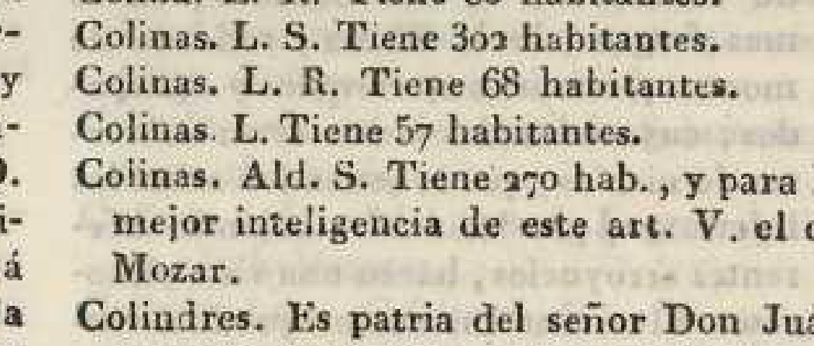
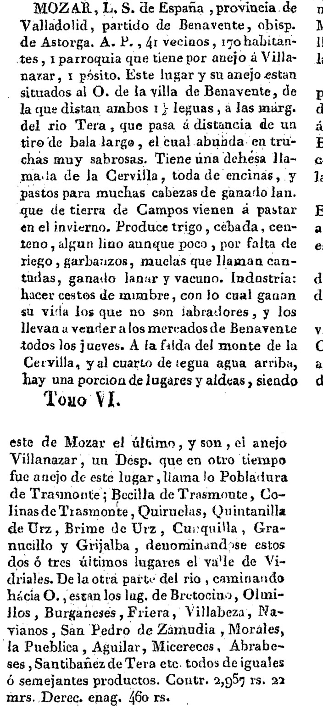

# «Cercado de colinas» — Miñano, 1826

> **Estado: ✅ FUENTE VISTA Y TRANSCRITA**, 22 de septiembre de 2026. Veintiún años antes que Madoz,
> el Diccionario de Miñano trae la **descripción más antigua del pueblo escrita para ser leída**
> —el Catastro y Floridablanca son formularios— y **dice de dónde viene el nombre**.

---

## Ficha

| Campo | Valor |
|---|---|
| Obra | MIÑANO Y BEDOYA, Sebastián de: *Diccionario geográfico-estadístico de España y Portugal, dedicado al Rey nuestro Señor* |
| Tomo | **III** \[Castro-Espanillo\] |
| Pie de imprenta | Madrid, **Imprenta de Pierart-Peralta**, Plazuela del Cordón, n.º 1, **1826** |
| Entrada | **COLINAS**, p. **142**, columna 1 |
| Ejemplar digitalizado | Universidad de Granada, DIGIBUG, `https://digibug.ugr.es/handle/10481/7803` |
| Facsímiles | [`minano-t3-p142-colinas.png`](minano-t3-p142-colinas.png) (la entrada, 300 ppp) · [`minano-t3-p142-143-pagina.jpg`](minano-t3-p142-143-pagina.jpg) (las dos planas) |

**Cómo se ha leído.** El PDF de DIGIBUG **no tiene capa de texto**. La entrada se ha localizado
recorriendo los encabezados de página y se ha transcrito **sobre un recorte de la columna a 380
ppp**.

---

## Transcripción

> **COLINAS**, Ald. S. de España, prov. de Valladolid, part. de Benavente, obisp. de Astorga.
> A. P., **55 vecinos, 226 hab.**, **1 parroquia, 1 pósito**. Sit. al S. del valle de Vidriales, á
> la orilla del rio Tera, 2 leguas al S. O. de la villa de Benavente, **cercado de colinas**.
> Produce toda clase de granos. Contr. **1,683 rs.** Derec. enag. **700 rs.**

Desarrollo de las abreviaturas: *Ald. S.* = aldea de señorío · *A. P.* = alcalde pedáneo ·
*Contr.* = contribución · *Derec. enag.* = derechos enajenados.

---

## 1. Es nuestro pueblo, y consta por cinco coincidencias

Miñano lo titula **«COLINAS» a secas**, sin «de Trasmonte», y la entrada siguiente ya es *Colinas de
Abajo* (Asturias). La identificación no depende, por tanto, del nombre, sino del contenido:

| Dato de Miñano | Contraste |
|---|---|
| Provincia de **Valladolid**, partido de **Benavente** | Idéntico a lo que da el **Censo de Floridablanca (1787)**: intendencia VAL, partido BEN |
| **Aldea de señorío**, **alcalde pedáneo** | Idéntico a Floridablanca: `A` / `AP` / `SS` |
| Obispado de **Astorga** | Confirma por vía independiente la nota metodológica del inventario: la parroquia **no** depende de Zamora |
| Al **S. del valle de Vidriales**, orilla del **Tera** | Es exactamente la posición de Colinas |
| **2 leguas** de Benavente | Madoz da **2 ½** en 1847 |

★ **El obispado de Astorga es el dato que más rinde.** Es la primera fuente **anterior a Madoz** que
lo dice por escrito, y confirma que los libros sacramentales hay que buscarlos en el **Archivo
Histórico Diocesano de Astorga** (frente nº 8), no en el de Zamora.

---

## 2. «Cercado de colinas»

Tres palabras, y son la **explicación del topónimo dada por una fuente de época**. Hasta ahora el
repertorio simbólico sostenía la lectura orográfica del nombre apoyándose en Madoz, que sólo dice
«situada en una ladera con esposición al S.». Miñano va más lejos: describe el pueblo **rodeado**
por las elevaciones que le dan nombre.

> **Estatuto de la afirmación.** Miñano **describe**, no etimologiza: dice que el pueblo está
> cercado de colinas, no que se llame así por eso. La inferencia —topónimo descriptivo de la
> orografía— sigue siendo **interpretación nuestra**, pero pasa de apoyarse en el paisaje actual a
> apoyarse en un texto de 1826. Ver `06-identidad-simbolos/repertorio-simbolico.md`.

---

## 3. El pósito

**«1 parroquia, 1 pósito»**. El pósito es el **granero común** del concejo: presta grano de sembrar
a los vecinos y lo recobra en la cosecha. No aparece ni en el Catastro de 1752 —que sí detalla
**molino y fragua del común**— ni en la entrada de Madoz.

Es, por tanto, **una institución comunal más** que sumar al retrato del concejo: hacia 1826 Colinas
tenía molino, fragua y granero propios. **Frente nuevo**: los libros de pósitos del siglo XIX suelen
conservarse en el **Archivo Histórico Provincial de Zamora** (frente nº 13).

---

## 4. La cifra: 226 habitantes, y el problema que crea

| Año | Fuente | Vecinos | Almas |
|---|---|---:|---:|
| 1752 | Catastro de Ensenada | 27 | — |
| 1787 | Censo de Floridablanca | — | **156** |
| **1826** | **Miñano, t. III, p. 142** | **55** | **226** |
| 1842 | Censo (INE) | — | *132* |
| 1847 | Madoz, t. VI, p. 521 | 33 | 132 |
| 1857 | Censo (INE) | — | 386 |

★ **La serie sube, baja a plomo y vuelve a subir** —156, 226, **132**, 386— y eso no es una curva
demográfica: es un problema de fuentes. Miñano y Madoz cuentan además **igual** (226/55 = 4,1
almas por vecino; 132/33 = 4,0), luego la discrepancia no está en el coeficiente sino en el
recuento. El dato de 1842-1847 queda **por debajo de dos mediciones anteriores**, en un pueblo que
venía creciendo. Ver la cautela §6.4 del inventario.

> ⚠️ **Y una cautela sobre el propio Miñano.** Su Diccionario se redacta con materiales de muy
> distinta calidad —respuestas de intendentes, datos eclesiásticos, cifras heredadas del censo de
> 1787— y sus vecindarios se tienen por **menos fiables que los de Madoz**. El 226 de 1826 **no se
> da por cerrado**: se registra como lo que es, la cifra que publica Miñano, y no se usa para
> calcular tasas de crecimiento.

---

## 5. Lo que queda pendiente en esta fuente

- **Cotejar la entrada «TRASMONTE»** y la de **«VIDRIALES»** en los tomos correspondientes (VIII-IX),
  por si el nombre completo del pueblo aparece allí.
- Buscar **«SAN MIGUEL DE CASTROFERROL»** en el tomo VIII: Madoz sí recoge «San Miguel de Castro
  Ferrol» bajo Quiruelas, y si Miñano lo trae sería la mención impresa más antigua del despoblado
  (frente nº 6).
  → ✅ **Comprobado que no está bajo *Castro-*.** La p. 3 de este mismo tomo lleva la secuencia
  alfabética **CASTRODEZA — CASTROFEITO — CASTROFOY — CASTROFUERTE**, leída a 300 ppp: la casilla
  donde tendría que ir *Castroferrol* está ocupada y el nombre **no aparece**. Si Miñano lo recoge,
  es bajo *San Miguel*.
- El *Suplemento* (tomo XI, 1829) corrige y amplía entradas: **comprobar si retoca la de Colinas**.

---

*Ficha redactada el 22 de septiembre de 2026.*

---

# ✅✅ `TAR-17` — el Suplemento de 1829, y el artículo que esconde

> **3 de octubre de 2026.** La tarea era pequeña: ver si el **Suplemento** del Diccionario —tomo
> **XI**, **1829**— retocaba la entrada de Colinas. **La retoca.** Y al seguir la remisión que trae,
> aparece **un artículo del propio Diccionario que este proyecto no había leído**, y que resulta ser
> **la descripción más completa del valle que tenemos para el siglo XIX**.

## 1. Lo que dice el Suplemento

> «**Colinas. Ald. S. Tiene 270 hab., y para [la] mejor inteligencia de este art. V. el [de]
> Mozar.**» — Suplemento, t. XI, p. **229**

| | t. III (**1826**) | Suplemento, t. XI (**1829**) |
|---|---|---|
| Categoría | **Ald. S.** | **Ald. S.** |
| Vecinos | **55** | — |
| Habitantes | **226** | **270** |

> ⚠️ **Eso no es crecimiento: es una corrección.** Cuarenta y cuatro habitantes más **en tres
> años** —un **19,5 %**— no se producen en un pueblo de este tamaño sin una causa que el autor
> contaría. Lo que el Suplemento hace es **enmendar la cifra**, como hace en centenares de entradas.
> **La buena, para 1826-1829, es 270.**

> ✅ **Y es nuestro Colinas, sin duda.** El Suplemento trae **cuatro** entradas seguidas con ese
> nombre —«L. S.» 302 hab., «L. R.» 68, «L.» 57 y «**Ald. S.**» 270— y sólo la cuarta repite la
> categoría **Ald. S.** que el t. III da a Colinas de Trasmonte. Además, **el grupo de pueblos que
> el Suplemento remite al mismo artículo de Mozar es exactamente el nuestro**: Abrabeses de Tera,
> Aguilar de Tera, **Becilla de Trasmonte**, Bretocino, Brime de Urz, Burganes, Cunquilla, Friera
> de Valverde, Granucillo y Grijalba de Vidriales.

## 2. 🚨🚨🚨 Y la remisión lleva a **MOZAR**, que es el hallazgo

**MIÑANO**, *Diccionario*, **t. VI** \[Mena-Pesqueiras\], Madrid, 1827, **pp. 168-169**.
Ejemplar digitalizado: **DIGIBUG**, `https://digibug.ugr.es/handle/10481/7806` — ⚠️ **sin capa de
texto**, localizado recorriendo los encabezados.

### Transcripción

> «**MOZAR**, L. S. de España, provincia de Valladolid, partido de Benavente, obisp. de Astorga.
> A. P., **41 vecinos, 170 habitantes**, 1 parroquia **que tiene por anejo á Villanazar**, 1 pósito.
> Este lugar y su anejo estan situados al O. de la villa de Benavente, de la que distan ambos
> **1½ leguas**, á las márg. del **rio Tera**, que pasa á distancia de **un tiro de bala largo**, el
> cual **abunda en truchas muy sabrosas**. Tiene una **dehesa llamada de la Cervilla, toda de
> encinas**, y pastos para muchas cabezas de ganado lan\[ar\] **que de tierra de Campos vienen á
> pastar en el invierno**. Produce trigo, cebada, centeno, **algun lino aunque poco, por falta de
> riego**, garbanzos, **muelas que llaman cantudas**, ganado lanar y vacuno. Industria: **hacer
> cestos de mimbre**, con lo cual ganan su vida los que no son labradores, y **los llevan á vender
> á los mercados de Benavente todos los jueves**.
>
> **A la falda del monte de la Cervilla, y al cuarto de legua agua arriba, hay una porcion de
> lugares y aldeas**, siendo este de Mozar el último, y son, el anejo **Villanazar**; **un Desp. que
> en otro tiempo fue anejo de este lugar, llama\[d\]o Pobladura de Trasmonte**; **Becilla de
> Trasmonte**, **Colinas de Trasmonte**, **Quiruelas**, **Quintanilla de Urz**, **Brime de Urz**,
> **Cunquilla**, **Granucillo** y **Grijalba**, denominándose estos dos ó tres últimos lugares **el
> valle de Vidriales**. De la otra parte del rio, caminando hácia O., estan los lug. de
> **Bretocino, Olmillos, Burganeses, Friera, Villabeza, Navianos, San Pedro de Zamudia, Morales,
> la Pueblica, Aguilar, Micereces, Abrabeses, Santibañez de Tera etc., todos de iguales ó
> semejantes productos**. Contr. **2.957 rs. 22 mrs.** Derec. enag. **460 rs.**»

---

## 3. 🚨🚨 Lo que esto le da al proyecto

### ★★★ (a) Pobladura de Trasmonte: **era anejo de Mózar**, y está puesta en su sitio

> «**un Desp. que en otro tiempo fue anejo de este lugar, llama\[d\]o Pobladura de Trasmonte**»

**Dos cosas nuevas en una frase.**

1. 🚨 **La dependencia parroquial**: Pobladura **fue anejo de Mózar**. Este proyecto sabía que era
   despoblado, que en 1706 era vecino de Vecilla y que en 1587 tenía **pila propia** —`TAR-18`—;
   **no sabía de quién dependió después**. Miñano lo dice, en 1827, en pasado.
   ⚠️ **Y no dice cuándo.** «En otro tiempo» no es una fecha; y entre la pila propia de 1587 y el
   anejo de Mózar hay sitio para más de un cambio. **Queda como noticia fechada en 1827, no como
   cronología.**
2. ★★★ **La posición.** La lista va **aguas arriba** desde Mózar, que es «el último»; y el orden es
   **Villanázar → Pobladura → Becilla de Trasmonte → Colinas**. **Pobladura va entre Villanázar y
   Vecilla.**

> ✅✅ **Eso es exactamente dónde `TAR-26` la colocó**, por un camino que no tenía nada que ver
> —el reparto de propietarios de 1750 barrido sobre una retícula, y luego el rótulo de la
> planimetría—. **Un impreso de 1827, leído hoy, ordena los pueblos igual**
> → [inventario § 8.2](../../03-archivos/inventario-documental.md).
> ⚠️ **Una lista no es una coordenada**: dice orden, no distancia. Pero **el orden es el mismo**.

### ★★ (b) La Cervilla: tercer testimonio, y el primero que dice **qué había en ella**

El proyecto tenía **La Cervilla** por dos vías: el pago **Pico de la Cervilla** en el parcelario y
en los planos de 1977, y el apeo de **Vecilla de 1706**, que linda a levante «con el monte y
**término de La Cervilla**». Miñano añade, en 1827, **lo que era**:

| | |
|---|---|
| Qué es | una **dehesa**, y un **monte** —usa las dos palabras— |
| De qué | «**toda de encinas**» |
| Para qué | «**pastos para muchas cabezas de ganado lanar que de tierra de Campos vienen á pastar en el invierno**» |
| Dónde | los pueblos del valle están «**a la falda del monte de la Cervilla**» |

> ★★ **Y eso explica un hueco.** La Cervilla aparece en los papeles como **linde** y como **nombre
> de pago**, nunca como población. Miñano dice por qué: **no era un lugar, era un monte de encinas
> con aprovechamiento de pastos de invierno**, y de esos no se escriben vecindarios. ★ **Es además
> trashumancia documentada**: ganado de **Tierra de Campos** invernando aquí
> → [`significado-de-los-nombres.md`](../../04-cartografia/significado-de-los-nombres.md).

### ★ (c) Y tres cosas de uso cotidiano

- **El mercado de Benavente era los jueves**, y a él bajaban a vender **cestos de mimbre** «los que
  no son labradores». Es una **industria de los sin tierra**, dicha así.
- **El Tera «abunda en truchas muy sabrosas»** —y el Catastro de 1752 ya decía que el conde
  arrendaba la pesca—.
- **«muelas que llaman cantudas»**: una legumbre con **nombre local**, recogido por un forastero en
  1827 → para el vocabulario del valle.

---

## 4. ⚠️ La cautela que hay que poner al usar todo esto

**El artículo describe a Mózar, no a Colinas.** Lo que dice de productos, de la dehesa y de los
cestos lo dice **de Mózar**, y lo extiende a los demás con una fórmula —«**todos de iguales ó
semejantes productos**»— que es **del autor, no de una observación en Colinas**.

> **Lo documentado**: que Miñano describe así el conjunto, y que **mete a Colinas dentro de él por
> remisión expresa** —el Suplemento manda leer este artículo «para la mejor inteligencia» del de
> Colinas—.
> **Lo que no se puede decir**: «en Colinas se hacían cestos de mimbre» o «Colinas tenía dehesa de
> encinas». **Eso lo dice de Mózar.** Para Colinas hace falta su propio papel.

> 📏 **Y una cosa más, sobre la última frase.** «Denominándose estos **dos ó tres últimos**
> lugares el valle de Vidriales» —es decir, Cunquilla, Granucillo y Grijalba—: **Miñano deja a
> Colinas fuera del valle de Vidriales**, en el del Tera. ⚠️ Pero en **1587** el arciprestazgo que
> encuadra a Colinas se llama **de Valdevidriales** (`TAR-18`), y el priorato de **San Salvador de
> Villaverde** cobraba en Colinas desde ese mismo valle. **Las dos cosas pueden ser ciertas**: una
> es **geografía física** y la otra **circunscripción eclesiástica**. Conviene no mezclarlas.

---

## 5. Dónde está cada cosa

| Tomo | Qué trae | Dónde |
|---|---|---|
| **III** (1826) | la entrada **COLINAS**, p. 142 | DIGIBUG `10481/7803` · facsímiles en esta carpeta |
| **VI** (1827) | ★★★ el artículo **MOZAR**, pp. 168-169 | DIGIBUG `10481/7806` · ❌ sin capa de texto · recorte: [`minano-t6-p168-169-mozar.jpg`](minano-t6-p168-169-mozar.jpg) |
| **XI** (1829) | el **Suplemento**, con los 270 hab. | **Repositorio del Banco de España**, `repositorio.bde.es/handle/123456789/5554` (sign. FEV-SV-M-00011) · ✅ **con capa de texto**, 560 planas · recorte: [`minano-t11-supl-colinas-270hab.jpg`](minano-t11-supl-colinas-270hab.jpg) |

> 📏 **No se guardan los libros enteros** —el Suplemento solo pesa 104 MB—: se guardan **los dos
> recortes** y se escriben las URL, que es como este proyecto trata lo voluminoso.

> ⚠️ **Lo que el Suplemento NO trae**: no hay entrada nueva para **Pobladura**, ni para
> **Quiruelas**, ni para **Quintanilla de Urz**; y la de **Becilla de Trasmonte** sólo dice «para la
> mayor inteligencia de este artículo (V. Mozar)», **sin dar cifra**.

*Leído el 3 de octubre de 2026 (`TAR-17`). El Suplemento, sobre su capa de texto; el artículo
MOZAR del t. VI, **a imagen**, sobre un recorte a 6×.*
