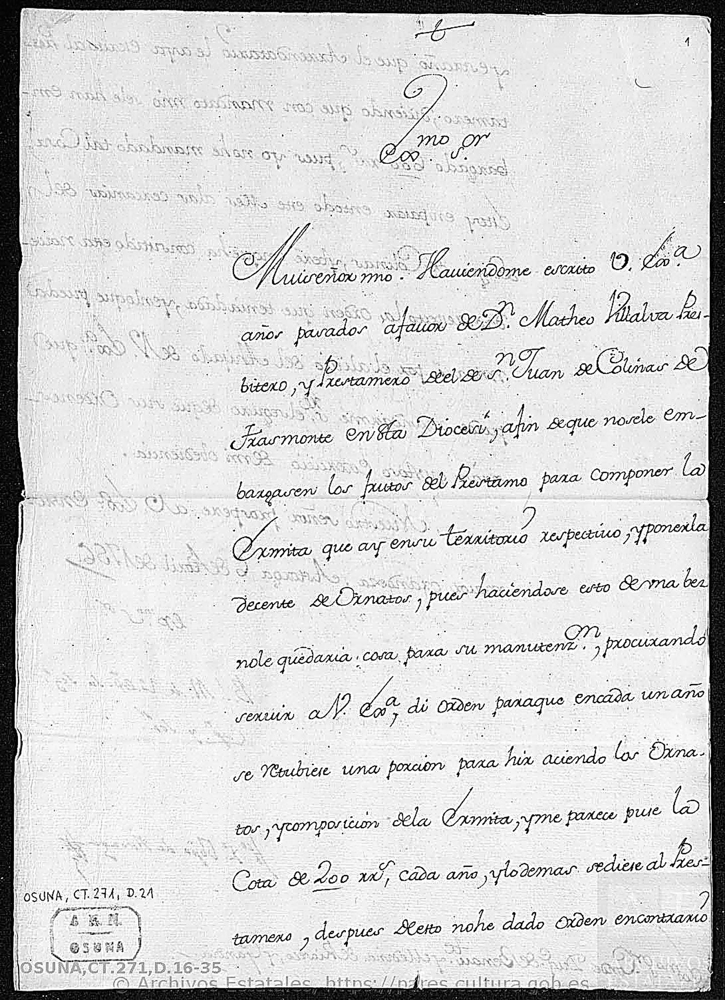
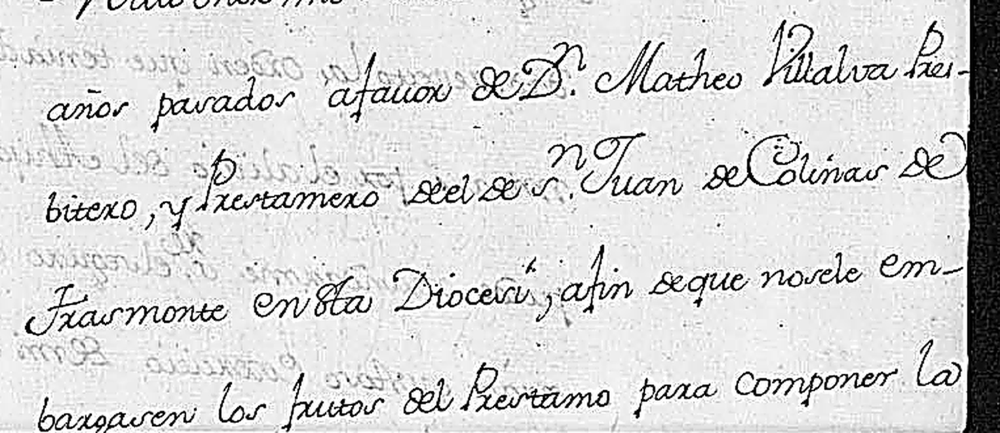
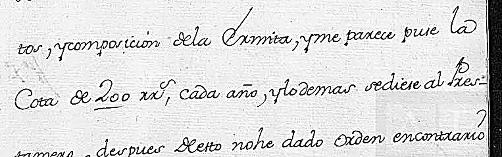
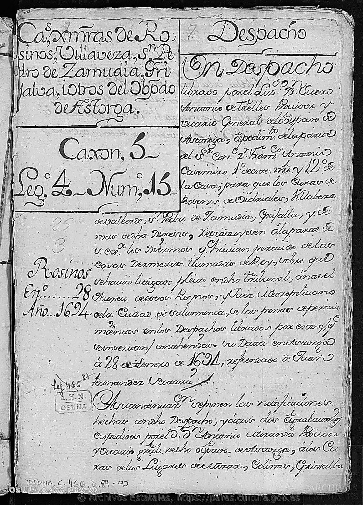
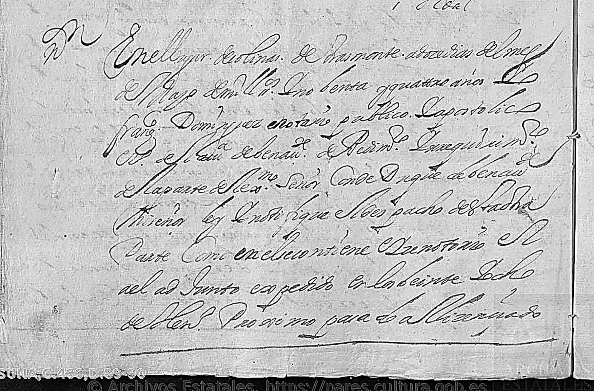
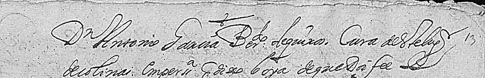
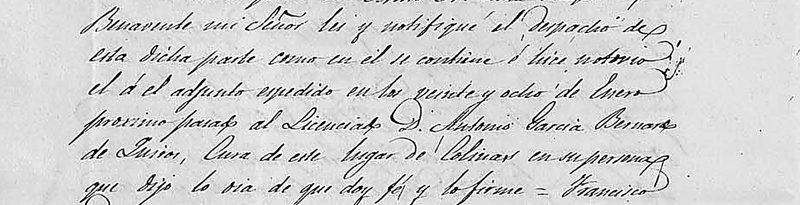

# El obispado de Astorga y el conde-duque: **una ermita en 1756** y **los diezmos en 1694**

> **Estado: ✅ DOS UNIDADES DESCARGADAS Y LEÍDAS.** 23 de septiembre de 2026.
>
> Eran las **dos últimas unidades digitalizadas del fondo Osuna** que el proyecto tenía localizadas
> y sin abrir (frente nº 10). Las dos nombran a Colinas, y las dos dicen bastante más de lo que
> prometía su título.
>
> 🚨 **1756** — El obispo de Astorga escribe al conde-duque de Benavente sobre **una ermita en
> Colinas**, y da su nombre, su dotación y su problema: **200 reales al año**.
> 🚨 **1694** — Un notario de Benavente notifica en Colinas, **el 12 de mayo**, el despacho que
> obliga a quince curas a restituir los diezmos al conde-duque. Y **nombra al cura de Colinas**.

---

## UNIDAD A — `OSUNA,CT.271,D.16-35` · la carta de la ermita, 1756

| | |
|---|---|
| **Archivo** | Archivo Histórico de la Nobleza (Toledo) |
| **Signatura** | **OSUNA,CT.271,D.16-35** · el documento de Colinas es el **D.21** |
| **Serie** | Archivo de los Duques de Osuna → Ducado de Osuna → **Correspondencia particular** |
| **Fechas de la unidad** | 1646-1800 (20 cartas de obispos de Astorga) |
| **Imágenes** | 42, descargadas — el D.21 son las **p13, p14 y p15** |
| **PARES** | `catalogo/description/3910149` |

### La carta

**Astorga, 6 de abril de 1756.** De **Francisco Javier Sánchez Cabezón, obispo de Astorga**
(1750-1767), a **Francisco Alonso Pimentel de Borja, XI conde-duque de Benavente**.

> «Muy señor mío: Haviéndome escrito V[uestra] Ex[celenci]a años pasados a favor de **D[o]n Matheo
> Villalva, Presbítero y Prestamero del de S[a]n Juan de Colinas de Trasmonte en esta Diócesi**, a
> fin de que no se le embargasen los frutos del Préstamo **para componer la Ermita que ay en su
> territorio respectivo, y ponerla decente de Ornatos**, pues haciéndose esto de una bez no le
> quedaría cosa para su manutenz[ión]; procurando servir a V[uestra] Ex[celenci]a, **di orden para
> que en cada un año se retubiese una porción para hir aciendo los Ornatos y composición de la
> Ermita, y me parece pues la Cota de 200 r[eale]s cada año**, y lo demás se diese al Prestamero;
> después de esto no he dado orden en contrario,
>
> y estraño que el **Arrendatario** le aya escrito al Prestamero **diciendo que con mandato mío se
> le han embargado 600 r[eale]s, pues yo no he mandado tal cosa**; estoy en **pasar en todo este mes
> a las cercanías del Lugar de Colinas, y beré en qué ha convertido esta novedad**, respecto la
> orden que tenía dada, y en lo que pueda miraré por el alivio del **Ahijado de V[uestra]
> Ex[celenci]a** […]
>
> Nuestro Señor prospere a V.Ex.ª en su mayor grandeza. **Astorga, 6 de Abril de 1756.**
> […] **Fr[ancis]co Ja[vie]r, Ob[is]po de Astorga** [rúbrica]»
>
> *Sobrescrito:* «Ex[celentísi]mo S[eño]r **Conde Duq[u]e de Benav[en]te y Medina de Ríoseco y
> Gandía**.»
> *Carpetilla:* «Astorga. 6 de Abril de 1756. El Ill[ustrísi]mo S[eño]r Obispo de Astorga.
> R[ecibi]da en 14 del. Dándole gracias `[?]`.»

### 🚨 Lo que este papel mete en el proyecto

**1. Una ermita en el término de Colinas, con dotación anual.**

> **Lo documentado:** en 1756 hay **una ermita** en el territorio del préstamo de San Juan de
> Colinas de Trasmonte; está necesitada de **composición y de ornatos**; y el obispo tiene dada
> orden de **retener 200 reales cada año** de los frutos del préstamo para irla arreglando.

⚠️ **Y aquí hay que separar el documento del catálogo.** PARES resume esta carta diciendo «la
cuota anual que debía dedicarse a la composición y ornato de **la ermita de San Juan Bautista en
Colinas de Trasmonte**». **La carta no dice eso.** Dice que Villalva es prestamero **del de San
Juan de Colinas** —el **beneficio**, no la ermita— y que hay **una ermita en su territorio**.

> **La advocación de la ermita no consta en el documento.** Puede ser la misma San Juan, puede ser
> otra. **El «de San Juan Bautista» del catálogo es una identificación del catalogador**, y este
> proyecto ya ha visto adónde lleva darlas por buenas.
>
> ★★ **Pero abre una pregunta que vale mucho**, porque el proyecto arrastra tres cosas que podrían
> ser la misma: el pago **San Juan-El Valle**, el yacimiento excavado allí en 1993, y la
> **tradición oral que llama a ese paraje «el Convento de San Juan»**. Una ermita en el término,
> documentada en 1756 y con dinero asignado, **es exactamente el tipo de edificio que deja ese
> rastro**.
> ⚠️ **No se afirma la identificación.** La carta **no dice dónde estaba la ermita**.

**2. Un vecino con nombre: don Matheo Villalva**, presbítero y prestamero de San Juan de Colinas
de Trasmonte, **ahijado del conde-duque de Benavente** — que por eso había escrito al obispo años
antes para que no le embargasen los frutos.

**3. Un conflicto con el arrendatario**, que dice haber embargado **600 reales** invocando al
obispo, y el obispo lo desmiente: «**yo no he mandado tal cosa**».

**4. ★ Y un obispo que anuncia que va a ir.** «Estoy en pasar en todo este mes a las cercanías del
Lugar de Colinas, y beré en qué ha convertido esta novedad.» **Abril de 1756.** Si el viaje se
hizo, debió dejar rastro en el archivo diocesano de Astorga (frente nº 8).

**5. ★ Dónde encaja en el tiempo.** Es **cuatro años después del Catastro de Ensenada (1752)** y
**doce antes del Censo de Aranda (1768)**, que dará la parroquia de San Juan y 114 almas
→ [`censo-aranda-1768/`](../censo-aranda-1768/README.md).

> ⚠️ **Las otras dos cartas del grupo (D.22 y D.23) no hablan de la ermita.** Leídas: son sobre el
> **provisorato vacante** del obispado y un recomendado, **don Juan Manuel Sánchez de Herrera**
> (D.23 está fechada en Astorga, 30 de marzo de 1753). El catálogo agrupa los dos asuntos bajo
> «D.21-23»; **el de Colinas es sólo el D.21**.

---

## UNIDAD B — `OSUNA,C.466,D.89-90` · los diezmos, 1694

| | |
|---|---|
| **Archivo** | Archivo Histórico de la Nobleza (Toledo) |
| **Signatura** | **OSUNA,C.466,D.89-90** |
| **Serie** | Ducado de Benavente → **JURISDICCIÓN SEÑORIAL → Pleitos sobre jurisdicción** |
| **Signatura antigua** | «**Caxón 5, Leg.º 4, Núm.º 15**» (en la carpetilla) |
| **Fechas** | 1694-01-28 (Astorga) — **copia sacada en Madrid el 18 de enero de 1842** por el escribano Claudio Sanz y Barca `[?]` — **cotejo judicial en Madrid, 18-20 de marzo de 1848** (ver abajo) |
| **Imágenes** | 68, descargadas — **Colinas está en la p28-p29** |
| **PARES** | `catalogo/description/5315338` |

> *Carpetilla:* «**Ca[rt]as ex[ecutorias] `[?]` de Rosinos, Villaveza, S[a]n Pedro de Zamudia,
> Grijalva, i otros del Ob[is]p[a]do de Astorga**. — Caxón 5, Leg.º 4, Núm.º 15. — Rosinos.
> En[er]º 28. Año 1694.»
>
> *Y el resumen, de mano de archivero:* «[Suero] **Antonio de Trelles** `[?]`, **Provisor y Vicario
> General del Obispado de Astorga**, a pedimento de la parte del S[eño]r Conde […] **para que los
> Curas de Rosinos de Vidriales, Villabeza, S[an] Pedro de Zamudia, Grijalba y [otros] de [la]
> Diócesis restituyesen** a la parte de S[u] Ex[celenci]a **los Diezmos que havían percivido de las
> cavas `[?]` Dezmeras llamadas del Rey**, sobre que [había] litigado pleito en dicho tribunal, ante
> el [Nuncio de estos] Reynos y **Juez Metropolitano de Salamanca** `[?]`, bajo las penas […]. Su
> data en Astorga, [28] de henero de **1694** […]»

**Los quince lugares**, según el catálogo de PARES: Rosinos de Vidriales, Villaveza de Valverde,
San Pedro de Zamudia, Mózar, **COLINAS DE TRASMONTE**, Grijalba, Santibáñez de Vidriales, Fuente
Encalada, Villageriz, Verdenosa, San Román del Valle, Morales de Valverde, Santa Cristina de la
Polvorosa, Bercianos de Vidriales y San Pedro de la Viña.

### ★★★ La notificación en Colinas

El legajo no es sólo el despacho: lleva **las notificaciones, una por lugar**, con su fecha, su
notario y el cura que la recibe. La de Colinas está en la **imagen 28**:

> «**En el lugar de Colinas de Trasmonte a doze días del mes de Mayo de mill y s[eiscien]tos y
> nobenta y quatro años, yo Fran[cis]co Domínguez, escri[bano] notario público y apostólico,
> v[ecin]o de la villa de Benav[en]te**, de pedimento […] **de la parte del Ex[celentísi]mo Señor
> Conde Duque de Benav[en]te**, […] **notifiqué el despacho de esta otra parte** como en él se
> contiene […] **del auto junto, expedido en los veinte y ocho de Henero próximo** […]»

### ★★★ Y el cura de Colinas, por su nombre

> «…al Licenciado **D[o]n Antonio García Bernardo de Quirós** `[?]`, **Cura de este Lug[ar]**
> [de Colinas], **en persona, q[ue] dixo lo oya, de que doi fee. Lo firmé.**
> [rúbrica] Fran[cis]co Domínguez»

> ★★★ **Es el eclesiástico más antiguo de Colinas que el proyecto conoce por su nombre**, sesenta y
> tres años antes del arcipreste Francisco Escudero de 1757.

---

## 🚨 CORRECCIÓN GRAVE del 23 de septiembre de 2026 (tarde): el nombre estaba mal leído, y con él un dato

**Lo que esta ficha decía, y era falso:**

> ~~«D[o]n **Antonio Sanna** `[?]`, **B[eneficia]do de Quiruelas**, Cura del lug[ar] de Colinas»~~
> ~~★★★ **El cura de Colinas en 1694 era al mismo tiempo beneficiado de Quiruelas**, un vínculo~~
> ~~institucional entre Colinas y Quiruelas dos siglos y medio antes de la incorporación de 1975.~~

**Lo que dice el papel:**

> «…al Licenciado **D. Antonio García Bernardo de Quirós** `[?]`, **Cura de este Lugar de Colinas**…»

### Cómo se ha visto

Porque **el mismo acto está escrito dos veces en este legajo**. El **D.90** es una **copia
autorizada del D.89**, hecha en papel sellado de 1842, y **vuelve a copiar la notificación de
Colinas** —imagen **55**— con una letra decimonónica clara y sin abreviaturas.

> «…proximo pasado al **Licenciado D. Antonio García Bernardo de Quirós**, **Cura de este Lugar de
> Colinas**, en su persona, que dijo lo oía, de que doy fe, y lo firmé = **Francisco Domínguez**»

Y, vista la copia, **el original de 1694 se lee sin dificultad y dice lo mismo**: «D.n Antonio
Garcia **Ber.do de Quiros**, Cura de este Lug[ar]». ✅ **Los dos testimonios concuerdan.**

### Dónde estuvo el error, exactamente

| Lo que hay escrito | Lo que se leyó | Qué produjo |
|---|---|---|
| «**Garcia**» | «**Sanna** `[?]`» | un apellido inventado |
| «**Ber.do**» *(Bernardo, con el «do» volado)* | «**B[eneficia]do**» | un cargo que no existe |
| «**de Quiros**» | «**de Quiruelas**» | **un vínculo con Quiruelas que nunca hubo** |

> 🚨 **Las tres se apoyaban entre sí.** Leído «B[eneficia]do», lo que seguía tenía que ser un lugar;
> leído «Quiruelas», el «B.do» quedaba confirmado. **Una abreviatura mal resuelta y una expectativa
> —el pueblo vecino, el que absorbió a Colinas en 1972— fabricaron un dato entero.**
>
> ✅ **La cautela del proyecto funcionó a medias**: se advirtió que «de aquí no sale ninguna
> explicación de 1975» y que el apellido era dudoso. **Pero se dio por firme «B[eneficia]do de
> Quiruelas», que era justamente lo que estaba mal.** La lección no es que faltara prudencia en la
> conclusión: es que **faltó un segundo testimonio antes de escribir la premisa**.

### Lo que queda en pie y lo que se cae

- ✅ **En pie:** el 12 de mayo de 1694, **Francisco Domínguez**, notario público y apostólico vecino
  de Benavente, notifica el despacho **en persona al cura de Colinas**. Sigue siendo **el clérigo de
  Colinas más antiguo conocido por su nombre**.
- ✅ **Mejor que antes:** el nombre ya no lleva `[?]` en su parte principal. Es
  **Antonio García Bernardo de Quirós**, y el documento lo trata de **Licenciado**.
  ⚠️ El `[?]` queda sólo en el último elemento —*Quirós*—, por la grafía de la mayúscula; el resto,
  «**Antonio García Bernardo**», se lee limpio en las dos copias.
- 🚨 **Se cae entero:** el «**beneficiado de Quiruelas**». **No existe.** Debe borrarse de cualquier
  argumento sobre la relación histórica entre Colinas y Quiruelas.
- ⚠️ **Y se cae también la frase de esta ficha** «el cura de Colinas en 1694 era al mismo tiempo
  beneficiado de Quiruelas». **Queda tachada arriba a propósito**, no borrada: el criterio del
  proyecto es que los errores se vean.

---

### Lo que este pleito dice del pueblo

> **Lo documentado:** en 1694 el cura de Colinas —con los de otros catorce lugares del obispado de
> Astorga— **había estado cobrando unos diezmos que el conde-duque de Benavente reclamaba como
> suyos**, se litigó, y **el conde-duque ganó**: el provisor de Astorga libra despacho para que se
> los restituyan, y se les notifica uno a uno entre enero y mayo de 1694.
>
> ★★ **Encaja con lo que el proyecto ya sabía del señorío.** El cuaderno de dezmeros de 1561/65
> —el mismo fondo Osuna— es el barrido fiscal del conde-duque lugar por lugar
> → [`dezmeros-benavente/`](../dezmeros-benavente/README.md). **Ciento treinta años después, el
> conde-duque sigue peleando por los mismos diezmos, y ahora contra los curas.**
>
> ✅ **RESUELTO el 23 de septiembre por la tarde, y por la misma vía: no son «cavas», es una
> CASA.** La copia limpia de 1842 escribe, sin lugar a duda, «los **diezmos de la Casa que llaman
> de Rey**». La lectura «cavas `[?]`» era del trazo apretado del original.
>
> ★★★ **Y eso enlaza el pleito con una línea del Catastro de Ensenada que el proyecto ya tenía.**
> En 1752, la respuesta 2.ª declara que el conde de Benavente «goza una **casa diezmera** en este
> dicho lugar, **la que elige después de una para sí el cura**»
> → [`catastro-ensenada-1752/`](../catastro-ensenada-1752/README.md).
> **Dos fuentes, cincuenta y ocho años, y la misma institución**: una *casa dezmera* de la que el
> cura elige primero y el señor después. **Por eso se pleiteaba en 1694.**
> ⚠️ **No se afirma que sean la misma casa física**; se afirma que es la misma figura.
>
> ⚠️ **Lo que sigue sin saberse:** si Colinas aparece además en el cuerpo del pleito con cifras
> propias. **El despacho y el traslado siguen sin transcribir enteros**: son 68 imágenes, y aquí
> sólo se ha leído lo que se lee.

---

## Ficheros

| Fichero | Qué es |
|---|---|
| `carta-1756-ermita-folio1.jpg` · `-folio2.jpg` | La carta del obispo, entera |
| `carpetilla-1756.jpg` | El sobrescrito y la nota de recibo |
| `detalle-ermita-1756.png` | El pasaje de la ermita, ampliado |
| `detalle-200-reales-1756.png` | «la Cota de 200 r[eale]s cada año» |
| `carpetilla-1694.jpg` | La carpetilla del legajo de diezmos, con la signatura antigua |
| `notificacion-colinas-1694.jpg` | «En el lugar de Colinas de Trasmonte a doze días del mes de Mayo…» |
| `cura-de-colinas-1694.png` | El original de 1694: «D.n Antonio Garcia **Ber.do de Quiros**, Cura de este Lug[ar]» |
| **`cura-de-colinas-copia-1842.jpg`** | ★ **La copia limpia** del D.90: «al Licenciado D. Antonio García Bernardo de Quirós, Cura de este Lugar de Colinas» — la que corrige la lectura |
| **`carpetilla-copia-1842-lista-de-pueblos.jpg`** | ★★ **La carpetilla de la copia**: la lista de los dieciséis lugares y la fecha del traslado, 18 de enero de 1842 |
| **`facsimil/c466-d89-d90-diezmos-1694/`** | ★★★ **Las 68 imágenes del legajo**, incorporadas al proyecto el 23-IX-2026 |
| **`facsimil/ct271-d16-35-obispos-astorga/`** | Las 42 imágenes de las cartas de los obispos, con el D.21 de la ermita |
| **`curas-1694.tsv`** | ★★★ **La nómina**: los curas de la comarca notificados en 1694, con lugar, fecha, notario y respuesta |

---

## Cómo se obtuvo

1. Las dos unidades estaban **localizadas desde el 22 de septiembre** en el frente nº 10 y
   verificadas como digitalizadas → [`pares-colinas.tsv`](../../03-archivos/pares-colinas.tsv).
2. Descarga con la **receta de PARES** que el proyecto ya tenía escrita
   (`bajar.sh <idDesc> <dbCodeBase> <total> <carpeta>`) → ver
   [`dezmeros-benavente/`](../dezmeros-benavente/README.md). Los `dbCode` base se sacan de la
   página del visor: **43938819** (42 img) y **38046311** (68 img).
3. **Hoja de contactos** de las 42 y de las 68 imágenes, para ver la estructura sin abrirlas todas.
4. ★ **Truco que ahorró el trabajo:** en el fondo Osuna, **la signatura de cada documento va escrita
   a lápiz en el margen inferior izquierdo de su primera plana** («OSUNA, CT. 271, D. 22»).
   Recortando esa esquina de las 42 imágenes se obtiene el índice del legajo en una sola vista, y
   con él **el D.21 cae directamente en la imagen 13**.
5. Para el legajo de 1694, **tira con los arranques de párrafo** de las planas 21-32 —donde van las
   notificaciones—, que situó la de Colinas en la **28** sin leer las demás.
6. Lectura de los folios a 1,3-3,2 aumentos con realce.

---

## Lo que falta

1. **Buscar la ermita.** Es lo que más vale de aquí. Qué advocación tenía, dónde estaba, y si es la
   que está detrás de **San Juan-El Valle** y del «Convento de San Juan» de la tradición oral.
   El sitio donde mirar es el **libro de fábrica** en el archivo diocesano de Astorga (frente nº 8),
   y el **Catastro de Ensenada de 1752**, que el proyecto ya tiene transcrito: **si hubo ermita con
   200 reales de dotación, el Catastro debería decir algo**.
2. **Comprobar si el obispo hizo el viaje** anunciado para abril de 1756.
3. **Buscar a Matheo Villalva** en el Catastro de 1752 y en los libros de Astorga.
4. **Transcribir el despacho de 1694 entero.** ✅ Ya no hace falta averiguar qué son las «cavas»:
   son la **casa dezmera llamada de Rey**, y la copia de 1842 lo escribe claro.
   ★ **Y hay un atajo que antes no se veía**: el **D.90 copia el D.89 en letra decimonónica**. Para
   cualquier pasaje dudoso del original, **hay que ir primero a la copia**.
5. ✅ **HECHO: vaciadas las notificaciones** de las imágenes 49-55 → **doce curas de la comarca
   con nombre, fecha y respuesta**, en [`curas-1694.tsv`](curas-1694.tsv) y en la sección siguiente.
   ⚠️ **Faltan las imágenes 45-48 y 56-57**, donde deben estar los tres lugares que aún no se
   identifican.
6. ✅ **HECHO: leído el traslado (D.90)** en sus imágenes 55-68. No era casual: es una **copia de
   1842 cotejada judicialmente en 1848 frente al fiscal de la Hacienda Nacional**. Ver la sección
   siguiente. **Quedan sin leer línea a línea las imágenes 45-54.**
7. ✅ **HECHO: confirmado el apellido del cura** de 1694 — y corregido. Ver la corrección de arriba.
---

## 🚨 El D.90 no es sólo un traslado: es un **pleito con la Hacienda Nacional en 1848**

Leídas las **últimas catorce imágenes** (p. 55-68), el D.90 resulta tener **dos capas de papel
sellado**, y la segunda cambia lo que este documento significa:

| Capa | Papel | Qué es |
|---|---|---|
| **1.ª** | **Sello 4.º, año de 1842** | La **copia** del despacho de 1694 y de **todas sus notificaciones**, en letra decimonónica |
| **2.ª** | **Sello 4.º, año de 1848** | Las **diligencias judiciales de cotejo**, en Madrid, ante un juez de primera instancia |

### La diligencia de cotejo, Madrid, marzo de 1848

> «…y previa citación del **Promotor Fiscal de este Juzgado como representante de la Hacienda
> Nacional**, y con su asistencia, se proceda a presencia de V. S. al **cotejo de uno y otro
> documento con la mayor escrupulosidad**, y estendiendo diligencias de su resultado se me entregue
> todo original para los efectos que quedan indicados en uso del derecho de mi principal, pues así
> procede de justicia que pido. = **Madrid, diez y ocho de Marzo, año del sello**»

El auto lo provee, el mismo día, **D. José María Montemayor, Ministro togado honorario de la
Audiencia territorial de Granada y Juez de primera instancia** de Madrid; ante el escribano
**Claudio Sanz y Barcal** `[?]`. Se notifica al **Licenciado D. Joaquín Sánchez de Fuentes,
Promotor fiscal del Juzgado**, que «se dio por citado y ofreció asistir». Y se notifica también a

> «**[Santiago] Apesteguía**, vecino de esta Corte y **Archivero general de la Casa y Estados del
> Exc[elentísi]mo Sr. **Duque de Osuna y del Infantado, Conde Duque de Benavente**, en su persona;
> quedó enterado y ofreció asistir al cotejo, y lo firmó, de que doy fe = **Santiago Apesteguía**»

El **cotejo se celebra en audiencia pública el 20 de marzo de 1848**, y al final «el Archivero de la
Casa del Señor Duque se entregó del original para custodiarle en oficina».

### ★★★ Lo que esto significa, y toca al frente nº 13

> **En 1848 la Casa de Osuna está autenticando ante un juzgado, y frente a la Hacienda Nacional,
> sus títulos de 1694 sobre los diezmos de quince lugares — Colinas entre ellos.**

El **diezmo se había suprimido en 1837**. Lo que se dirime en 1848 no es ya el cobro, sino **la
indemnización y la liquidación de derechos**: por eso la Casa desentierra el despacho del provisor
de Astorga, lo hace copiar en 1842 y lo hace **cotejar judicialmente en 1848**, con el fiscal de la
Hacienda delante.

★★ **Es el documento más concreto que el proyecto tiene del proceso desamortizador tocando a
Colinas**, con fechas, juzgado y nombres. Va al **frente nº 13** (AHP Zamora, desamortización).

⚠️ **Y obliga a corregir la datación de esta unidad.** La ficha daba el D.90 como «traslado hecho en
Madrid el 18 de enero de 1842». Lo que se ha leído ahora es: **cuerpo en papel de 1842** y
**diligencias de cotejo de 18 y 20 de marzo de 1848**. `[?]` **La fecha de 18 de enero de 1842 no
se ha vuelto a localizar** en esta lectura; puede estar en las imágenes 45-54, que no se han leído
línea a línea. **Se deja anotada la duda en vez de borrarla.**

---

## ★★★ La nómina del clero de la comarca en 1694

La copia de 1842 **transcribe las notificaciones una a una**, con el nombre del cura de cada lugar y
lo que cada uno respondió. Vaciadas las imágenes 49-55 → **[`curas-1694.tsv`](curas-1694.tsv)**.

| Lugar | Cura | Notificado | Qué respondió |
|---|---|---|---|
| **Mózar** [de Valverde] `[?]` | Ldo. **D. José Peláez Villarroel** | 30-I-1694 | entregará dentro del término |
| **COLINAS DE TRASMONTE** | Ldo. **D. Antonio García Bernardo de Quirós** `[?]` | **30-I-1694** | obedece, **pero apela** |
| Grijalba | Ldo. **D. Matheo de Nágera** | 1-II-1694 | lo llevarán los alcaldes a Benavente |
| Santibáñez de Vidriales | Ldo. **D. Antonio de Bellán Osorio** `[?]` | 1-II-1694 | pedirá el recibo al dezmero |
| Ginestacio | Ldo. **D. Pedro Morante de Salcedo** | II-1694 | entregará, y reclama 50 r. de subsidio |
| Villa de la B… `[?]` | Ldo. **D. Santiago Fernández de Arrabalde** | II-1694 | el arrendatario no ha ido por ellos |
| San Román del Valle | Ldo. **D. Antonio de Cabañero** | 3-II-1694 | obedece |
| Villaveza de Valverde | Ldo. **D. Juan Montero Robledo** | 7-II-1694 | entregará |
| Morales de Valverde *y sus anejos* | Dr. **D. José de Urnia** `[?]` | 7-II-1694 | granados y menudos del lugar y anejos |
| **San Pedro de la Viña** | **D. Justo de Albar González** | 20-II-1694 | 🚨 **se resiste** — ver abajo |
| Fuente Encalada | Ldo. **D. Tomás Crespo de Oña** `[?]` | 1694 | liquidará como heredero de otro cura |
| Villageriz `[?]` | Ldo. **D. Isidro Prada Valadriz** `[?]` | 2-II-1694 | le quedan «dos corderas y un cordero» |
| Bercianos de Vidriales | Ldo. **D. Juan Fierro de Losada** | 15-V-1694 | responde «con la moderación y respeto debido» |
| Rosinos de Vidriales · **San Pedro de Zamudia** | *sin nombre* | | nombrados en la cabecera del despacho — ✅ el segundo topónimo, corregido el 23-IX-2026: se venía leyendo «Santa Cruz de Zamu…» `[?]` |

> ★★★ **Es, de golpe, doce clérigos de la comarca con nombre y fecha** — y el proyecto sólo tenía
> tres para todo el Antiguo Régimen. ⚠️ Varios topónimos y apellidos van con `[?]`: la letra es
> clara, pero son nombres sin contexto con el que cotejarlos.

### 🚨 Colinas fue notificada **dos veces**, y la primera vez apeló

Este proyecto conocía la notificación del **12 de mayo de 1694**. La copia trae **otra anterior**:

> «**Otra** — En el Lugar de **Colinas de Trasmonte** a los dichos **treinta días del mes de Enero**
> de dicho año, yo el dicho notario notifiqué dicho Despacho al Licenciado **D. Antonio García
> Bernardo de Quirós, Cura de dicho Lugar**, en su persona, que dijo **lo obedece con el respeto
> debido** […] **y que en cuanto a su cumplimiento no ha lugar, y que desde luego de este Despacho
> y sus autos apela** para ante quien y con derecho puede y debe.»

> ★★ **El cura de Colinas no obedeció: apeló.** Y por eso se le vuelve a notificar en mayo. Es la
> primera vez que el proyecto ve a un vecino de Colinas —clérigo, en este caso— **resistiendo por
> escrito a una orden del señor**.
> ✅ **Y es un tercer testimonio del nombre**, independiente del de mayo: **García Bernardo de
> Quirós** queda confirmado tres veces.

### ★★ El que plantó cara de verdad: el cura de San Pedro de la Viña

> «…dijo que dichas letras y censuras en ellas discernidas **no se entienden con él**, respecto de
> haber ganado **absolución del Señor Provisor de Astorga**, en virtud y por **[Real pro]visión de
> la Real Chancillería**, y en dos de Febrero haber entregado los autos en virtud de dicha Real
> provisión para la determinación […]; y que **en el ínterin que no viniere otro despacho que
> derogue dicha Real provisión no entrega los frutos**.»

⚠️ **Esto cambia el tamaño del asunto.** No era sólo un pleito eclesiástico: **los curas llevaron el
caso a la Real Chancillería de Valladolid** por vía de **fuerza**, y al menos uno obtuvo Real
Provisión a su favor. El despacho del provisor de 1694 es **la respuesta del tribunal eclesiástico a
esa maniobra**, no el final de la historia. → Conecta con el frente nº 9 (Chancillería).

### ★ Y aparecen el obispo de Astorga y su provisor, con todos sus títulos

> «**Nos el Doctor D. Antonio de Miranda, Provisor y Vicario general de la Ciudad y Obispado de
> Astorga por el Ilustrísimo Señor D. Fray Antonio de Sanjurjo y Miranda, por la gracia de Dios
> Obispo de dicha Ciudad y Obispado, del Consejo de S. M.**»

- **Obispo de Astorga en 1694: Ilmo. Sr. D. Fray Antonio de Sanjurjo y Miranda.** El proyecto tenía
  documentado el de **1756** (Francisco Javier Sánchez Cabezón); ahora tiene **dos**, con sesenta y
  dos años de distancia.
- **Provisor y vicario general: Dr. D. Antonio de Miranda**; secretario, **Juan Fernández**.
- El despacho de **28 de enero de 1694** lo firma «**Ldo. D. [Josef] Antonio Téllez**» `[?]`.
- Y por encima de todos, la autoridad que lo pone en marcha: el **Nuncio de Su Santidad en estos
  Reynos**.

### ★ Cómo funcionaba el diezmo, en concreto

Las respuestas de los curas describen el circuito mejor que ninguna síntesis:

- Los diezmos de la **casa dezmera de Rey** de **1692** son los reclamados; el **arrendatario** de
  aquel año era **Francisco Rodríguez Crespo**.
- En Grijalba el cura lo entrega **a los alcaldes del lugar, que lo llevan a la villa de Benavente**
  «por ser de su obligación». **El acarreo lo pone el concejo.**
- En Villageriz quedan «**dos corderas y un cordero**», ya vendidos a **Marcos Hernández, vecino de
  Moratones**; el recibo lo guarda **Domingo de Castro, dezmero de aquel año**.
- Varios reclaman que se les abone **el subsidio** que pagaron por esa casa: **cincuenta reales**.

### ★★ Y una comprobación cruzada que sale gratis

El cura de Fuente Encalada responde como **heredero de D. Juan de la Torre, «Cura que fue del Lugar
de Rosinos **y Moratones**»**. **Setenta y cuatro años después**, el Censo de Aranda de 1768 declara
exactamente lo mismo: **Moratones es anexa de San Salvador de Rosinos de Vidriales**
→ [`censo-aranda-1768/`](../censo-aranda-1768/README.md), §7. Lo mismo con **Morales de Valverde
«y sus anejos»**, que en 1768 sigue siendo matriz con anejos.

> **Dos fuentes independientes, setenta y cuatro años, y la misma geografía parroquial.** No prueba
> nada nuevo; **confirma que las dos lecturas son buenas**, que es justo para lo que sirve un cotejo.

### ★★★ Santibáñez de Vidriales, 16 de mayo de 1694: la criada, el notario y el papel en el suelo

De las quince notificaciones, una no llegó a hacerse — y **el notario dejó constancia de los tres
intentos**. Es la escena mejor contada de todo el legajo:

> «**Diligencia** — En la villa de Santibáñez de Vidriales, el dicho día diez y seis de Mayo de
> dicho año, yo el dicho notario **fui a las casas de la morada** del Licenciado D. Antonio Bellán
> Osorio, Cura de este lugar, para efecto de notificarle dichos despachos; y **preguntando por él a
> Antonia, su criada —que no quiso decir su apellido—**, respondió que dicho su amo **estaba fuera**
> de este dicho lugar…»
>
> «**Otra** — En la dicha Villa de Santibáñez, dicho día, yo el dicho notario **volví a las casas**
> de dicho cura, y preguntando por él a dicha su criada respondió que **no estaba en ellas y que no
> había vuelto**…»
>
> «**Diligencia y entrega de traslado del despacho** — […] **volví a las casas** del dicho
> licenciado […]; y habiendo hecho pregunta por el suso dicho a la referida Antonia su criada,
> respondió que, como tenía dicho, **estaba fuera** de esta dicha Villa; y para que a dicho cura le
> constase el efecto a que venía, **saqué un traslado auténtico de dicho despacho** y, queriéndole
> entregar a la suso dicha para que lo diese a dicho su amo, **no lo quiso recibir**; a cuya causa
> **se le arrojó en el suelo y dejé cerca de ella**, apercibiéndola lo entregase a dicho su amo.»

> ★★ **Un cura que no está en casa tres veces el mismo día, una criada que no da su apellido ni
> toca el papel, y un notario que acaba tirándolo al suelo y marchándose.** Es **resistencia
> pasiva**, y está levantada en acta.
>
> ⚠️ **No es de Colinas**, y por eso se anota aquí y no en la cronología del pueblo. Pero **es del
> mismo despacho que se notificó a Colinas**, y dice mejor que ninguna glosa qué recibimiento tuvo
> la orden del conde-duque en el obispado.

### ★★ Y el que más lejos llegó: San Pedro de la Viña, dos veces

En **febrero** alegó **absolución del provisor** y **Real Provisión de la Chancillería**. En
**mayo**, vuelto a notificar, añade la pieza que faltaba:

> «…**Metropolitano de Salamanca** `[?]`, **por quien se expidieron letras inhibitorias para el
> Señor Provisor de Astorga**, **como con efecto lo está inhibido**; y mediante lo referido no se
> deben entender con el que responde dichos despachos; y en caso necesario, hablando devidamente,
> **apela** de las censuras impuestas en ellos.»

★★★ **El provisor de Astorga estaba inhibido por su superior.** Es decir: **el tribunal que firma el
despacho que se notifica a Colinas tenía encima unas letras inhibitorias**, y los curas lo sabían.
⚠️ `[?]` La lectura «**Metropolitano de Salamanca**» es la que da el papel; el metropolitano de
Astorga era Santiago de Compostela, de modo que **o es un juez delegado o la lectura falla**.
**No se resuelve aquí.**

⚠️ **Y queda una discrepancia sin cerrar**: en febrero este cura firma «**Justo** de Albar González»
`[?]` y en mayo «**Juan** Albar González». O son dos clérigos de la misma casa, o una de las dos
lecturas está mal.

✅ **Leídas también las imágenes 45-48** (ver la sección siguiente). De los quince lugares,
**trece tienen ya cura con nombre**; faltan los de **Rosinos de Vidriales** y **Santa Cruz de
Zamu…** `[?]`, que sólo aparecen nombrados en la cabecera.
✅ **Y se resuelve el primer topónimo dudoso**: el auto de Astorga nombra «los Curas de **Villaveza
de Valverde, de Grijalba, Mozar** y más de esta Diócesis», de modo que el «Morar `[?]`» de la
primera notificación es **Mózar** [de Valverde].
---

## 🚨🚨 El pleito entero, de arriba abajo: el Nuncio amenaza de excomunión al provisor de Astorga

Leídas las imágenes **45-48**, el despacho que se notificó en Colinas deja de ser un papel suelto:
es **el último eslabón de una cadena que empieza en Roma y baja hasta la puerta de quince curas**.

### La cadena, con sus fechas

| | Qué pasa | Fecha |
|---|---|---|
| 1 | El **conde-duque de Benavente**, *Sumiller de Corps de la Real Persona de Su Majestad*, pleitea con los curas del obispado de Astorga por los **diezmos «llamados de Casa de Rey»**, y gana ante el tribunal del Nuncio | antes de 1693 |
| 2 | Los curas **ganan inhibición del «Metropolitano de Salamanca»** `[?]`, que **paraliza al provisor de Astorga** | — |
| 3 | El Nuncio libra mandamiento para que se restituyan los diezmos | **16-XII-1693** |
| 4 | El provisor de Astorga **no lo cumple**, alegando que está inhibido | — |
| 5 | El procurador del conde-duque pide al Nuncio **agravatoria y multa** contra el provisor por «**la inobediencia repetida del Ordinario**» | — |
| 6 | El Nuncio libra **letras agravatorias**: veinticuatro horas, **excomunión mayor *latae sententiae*** y **doscientos ducados** para la Cámara Apostólica | **19-I-1694, Madrid** |
| 7 | El provisor de Astorga **obedece** y manda a los curas restituir | **28-I-1694, Astorga** |
| 8 | **Notificación a Colinas. El cura apela** | **30-I-1694** |
| 9 | Segunda ronda de notificaciones; **Colinas, otra vez** | **12-V-1694** |
| 10 | La Casa de Osuna manda **copiar todo** en papel sellado | **1842** |
| 11 | **Cotejo judicial en Madrid** frente al fiscal de la **Hacienda Nacional** | **III-1848** |

### Quién amenaza a quién

> «**Nos Don Federico Caccia** `[?]`, por la gracia de Dios y de la Santa Sede Apostólica,
> **Arzobispo de la Odicia** `[?]` **y de Milán**, y de nuestro Santísimo Padre y Señor
> **Inocencio, por la divina Providencia Papa Duodécimo**, **Nuncio y Colector General Apostólico
> en estos Reynos de España con facultad de Legado *a latere***, etc. — **Al Licenciado
> D. Antonio Téllez, Provisor y Vicario General de la Ciudad y Obispado de Astorga**, salud en
> Nuestro Señor Jesucristo…»

Y lo que le manda, sin rodeos:

> «…en virtud de **Santa Obediencia y pena de excomunión mayor apostólica *latae sententiae***, y de
> **doscientos ducados** aplicados para gastos de la **Reverenda Cámara Apostólica**, que **dentro
> de veinte y cuatro horas**, que le damos de benignidad, cumpla con los mandamientos por Nos
> librados el día diez y seis de Diciembre próximo pasado […]; y pasado dicho término y no lo
> habiendo cumplido, **le habemos y declaramos por incurso en las dichas censuras** […]; y mandamos
> a los curas y sus lugares tenientes de las Parroquiales de la dicha Ciudad de Astorga y demás de
> estos Reynos […] que **tengan, publiquen y denuncien por público excomulgado al susodicho** en sus
> Iglesias **los domingos y fiestas de guardar**, y **no le admitan a las horas de oficios
> divinos**…»

> ## **El provisor de Astorga tenía veinticuatro horas para obedecer o ser leído como excomulgado desde los púlpitos de su propio obispado.**
>
> ★★★ **Eso es lo que hay detrás del papel que un notario le leyó al cura de Colinas el 30 de enero
> de 1694.** Y explica por qué el provisor, que llevaba meses resistiéndose, cumplió **nueve días
> después** de las letras.

Y la petición del conde-duque que lo provocó, en su propia voz:

> «…en esto se descubre **la inobediencia repetida del Ordinario** y oposición a los despachos de
> este Tribunal, a que se debe ocurrir con **remedio y castigo**; por que pido y suplico a V. S. I.
> se sirva de mandar despachar **agravatoria con las penas y censuras agravadas** […] **y que se le
> saque una buena multa por la inobediencia repetida**.»

### ⚠️ Dos cosas que hay que dejar abiertas

1. **El nombre del provisor no cuadra entre los dos documentos.** Las letras del Nuncio se dirigen
   «al Licenciado **D. Antonio Téllez**, Provisor y Vicario General»; el auto de Astorga de 28 de
   enero lo firma «Licenciado **D. Suero Antonio de Ferreras**, **Colegial en el Mayor de San
   Salvador de Oviedo de la Universidad de Salamanca**, Provisor y Vicario general». `[?]`
   **Probablemente la misma persona** —el nombre completo pudo ser *Suero Antonio Téllez de
   Ferreras*— **pero no se afirma**: pudo haber cambio de provisor entre diciembre y enero.
   ⚠️ Y en **mayo** el provisor es el **Dr. D. Antonio de Miranda** (imagen 54). **Tres nombres para
   un mismo cargo en cinco meses, sin resolver.**
2. **«Metropolitano de Salamanca»** `[?]`. El documento lo escribe así **dos veces**, y en 1694 el
   metropolitano de Astorga era **Santiago de Compostela**. O es un **juez metropolitano delegado
   con sede en Salamanca**, o la lectura falla. **Se anota como está.**

### ★ Y el dato de contexto que más dice del señor

El conde-duque de Benavente aparece titulado «**Sumiller de Corps de la Real Persona de Su
Majestad**» — el oficio palatino más cercano al rey. **No es un señor rural pleiteando por trigo:
es un alto cortesano de Carlos II moviendo al Nuncio para cobrar los diezmos de quince aldeas de
Vidriales**, una de ellas Colinas.

~~✅ **Y con esto el D.90 queda leído entero**, imágenes 45-68.~~ 🚨 **No era entero: la copia
empieza en la 37.** Ver la sección final de esta ficha. Del D.89 —el original de 1694, imágenes
1-36— sigue leído sólo lo que se ha citado.

---

## 🚨🚨 Las imágenes 37-44, que nadie había abierto — y lo que devuelven

⚠️ **Primero, una corrección de bulto sobre esta misma ficha.** Aquí se escribió que **«el D.90
queda leído entero (imágenes 45-68)»**. **Es falso, y por una razón simple: el D.90 no empieza en
la 45.** Las imágenes **37 a 44 llevan ya el papel sellado de 1842**, de modo que la copia ocupa
**37-68, treinta y dos planas**, y **ocho de ellas estaban sin abrir**. ✅ **Leídas ya las treinta y dos** (37-68): ver la
sección siguiente.

### ✅ Y en la primera de ellas estaba la fecha que esta misma tarde se dio por perdida

El inventario databa el D.90 como **«traslado hecho en Madrid el 18 de enero de 1842»**. Al leer las
imágenes 55-68 esa fecha no apareció, y se anotó con `[?]` que **«no se ha vuelto a localizar»**.
**Estaba en la imagen 37**, que es la carpetilla de la copia:

> «Es un Testimonio sacado de d[ic]ho Despacho [por el] D. **Claudio Sanz y Barca** `[?]`,
> **Esc[riba]no del número de [la villa] de Madrid**, con f[ec]ha en ella a **18 de Enero de
> 1842**.»

> ✅ **El dato original era bueno.** Se retira el `[?]`: el traslado es de **Madrid, 18 de enero de
> 1842**, y el escribano que lo saca es **Claudio Sanz y Barca** `[?]` —esta ficha venía leyendo
> «Barcal»—. **La duda la causó no haber leído ocho planas, no el documento.**

### ✅✅ Y se cae un topónimo que el proyecto llevaba mal: no es «Santa Cruz»

La nómina de curas daba como decimoquinto lugar **«Santa Cruz de Zamu… `[?]`»**. **No existe tal
cosa.** Los tres textos nuevos coinciden:

| Imagen | Qué escribe |
|---|---|
| **37**, carpetilla | «**San Pedro de Zamudio**» |
| **38**, cabecera del despacho | «**San Pedro de Zamudia**» |
| **43**, petición del procurador | «**S. Pedro de Zamudia**» |

> ✅ **Es San Pedro de Zamudia** (Zamora). Corregido en
> [`curas-1694.tsv`](curas-1694.tsv). ⚠️ **Su cura sigue sin nombre**: no se ha localizado su
> notificación, igual que la de Rosinos de Vidriales.

### ★ La cabecera del despacho, y una fecha nueva en la cadena

La imagen 38 copia en limpio el arranque del despacho de Astorga:

> «[Fray Antonio de] **Sanjurjo y Miranda**, por la gracia de Dios y de la Santa Sede Apostólica
> Obispo de dicha Ciudad y Obispado, del Consejo de S. M. = **A los curas de Rosinos de Vidriales,
> Villabeza de Valverde, San Pedro de Zamudia, Grijalba y más de esta Diócesis**, a quien lo que se
> dirá tocare y a cada uno *in solidum* por lo que le toca, hacemos saber que **en el pleito y causa
> que con ellos ha litigado el Exc[elentísi]mo Sr. Conde Duque de Benabente sobre la percepción de
> ciertos diezmos de unas Casas de Rey**, y lo más deducido en los autos por el Ill[ustrísi]mo Sr.
> **Nuncio de su Santidad en estos Reynos en primero de Octubre del año pasado de mil y seiscientos
> y noventa y tres**…»

> ★ **Un eslón más, y es anterior a todos los que teníamos.** La cadena empezaba en el
> **mandamiento del Nuncio de 16 de diciembre de 1693**. Aquí aparece una actuación suya de
> **1.º de octubre de 1693**, dos meses y medio antes. **El pleito ya estaba sentenciado en Madrid
> cuando empieza lo que este legajo cuenta.**

### ★★ El procurador del conde tiene nombre — y trae una tercera lista de pueblos

La imagen 43 copia la **petición** que abre el expediente:

> «**Ill[ustrísi]mo Sr.** = **Francisco de Maza**, en nombre del Exc[elentísi]mo Sr. **Conde
> Duque de Benavente, Sumiller de Cor[p]s de la Real Persona de su Magestad**, en el pleito **con los
> Curas de Rosinos y Mosarcilla `[?]`, Vega de Valverde `[?]`, S. Pedro de Zamudia, Grijalba,
> S. Román, la Verdenosa `[?]`, Colinas, Milgar `[?]` del Obispado de Astorga y otros, sobre los
> diezmos de la casa de Rey**…»

✅ Confirma por tercera vez el título cortesano del conde-duque, **Sumiller de Corps**. Y da por fin
**el nombre del procurador que mueve todo el asunto**, que el proyecto venía llamando «el procurador
del conde».

### ✅ Y con las planas 39-42 y 44, la copia de 1842 queda leída entera (37-68)

Leídas las cinco que faltaban, el D.90 no tiene ya ninguna plana sin abrir. Dan cinco cosas.

#### 🚨★★ 1. El «Metropolitano de Salamanca» deja de ser una contradicción

Esta ficha dejaba abierta una pregunta que parecía irresoluble: el papel habla de un
«**Metropolitano de Salamanca**» `[?]`, **pero el metropolitano de Astorga era Santiago de
Compostela**. La plana 39 lo escribe de otra manera, y la diferencia lo cambia todo:

> «…para que **sin embargo de sus autos y del de el Metropolitano que reside en la Salamanca
> Vieja** `[?]`, la agravatoria despachada, ejecut[as]e el primer mandamiento, **reduciéndolo a
> citación**, y oída a las partes haga justicia como hallare por derecho…»

> ✅ **No dice «Metropolitano *de* Salamanca»: dice el Metropolitano *que reside en* Salamanca.**
> Y eso ya no choca con nada: describe **dónde se sienta un juez**, no de qué sede es titular, lo
> cual es perfectamente compatible con un **juez metropolitano delegado** —la figura normal en los
> recursos de esta época— sin necesidad de inventar una metrópoli que no existía.
> ⚠️ **Lo que sigue con `[?]` es «la Salamanca Vieja»**, que no se entiende y no se fuerza. Y
> **no se afirma** quién era ese juez. Lo que se retira es **la contradicción**, no la duda.

#### ★★ 2. El tribunal del Nuncio, por dentro

El auto que remite el pleito a Astorga lo firma un oficial que el proyecto no tenía:

> «…así lo proveyó y mandó su Ilustrísima y **lo firmó el Señor Auditor** = **Guido Antonius
> Torna[nus]** `[?]`, *auditor* = **Ante mí, Baltasar Hernández Men[tero]** `[?]`»

★ **Un auditor de nombre italiano latinizado y un notario español**: es la planta ordinaria de la
Nunciatura de Madrid, y aquí aparece con nombres.

#### ★★ 3. Los dos juristas del conde-duque — y una corrección de esta misma ficha

Las peticiones van firmadas por dos:

> «…pido justicia y para ello etc. = **Licenciado D. Juan Gutiérrez Coronel** = **Francisco de
> Maza** = Y por nos visto, mandamos dar y dimos las presentes…»

- **Abogado: Ldo. D. Juan Gutiérrez Coronel.** Nombre nuevo.
- **Procurador: Francisco de Maza.**

> ⚠️ **Corrección.** Hace un rato esta ficha escribió **«Francisco de Malaza `[?]`»**, leído sobre
> la plana 43. **Estaba mal, y el error fue de corte de línea**: allí el nombre se parte
> «Francisco de Ma-» / «-za», y la sílaba de arrastre se sumó al apellido. Las planas **41 y 44**
> lo escriben seguido y sin lugar a duda: **de Maza**. Corregido aquí, en el inventario y en la
> cronología.

#### ★ 4. Adónde iban los doscientos ducados

La multa con que se amenaza al provisor no era para el conde: iba **«aplicados para gastos de la
Reverenda Cámara Apostólica»**, es decir, **a la hacienda del Papa**. Detalle pequeño que sitúa la
amenaza en su sitio: es una pena de derecho canónico, no una indemnización.

#### ★★★ 5. Y lo que el Nuncio manda de verdad: que Astorga deshaga sus propios autos

Aquí está el núcleo del mandamiento, y es más duro de lo que la cadena dejaba ver:

> «…mandamos al dicho **Ordinario Eclesiástico de Astorga**, en virtud de **Santa Obediencia** y so
> pena de **excomunión mayor apostólica** y de **doscientos ducados** —aplicados para gastos de la
> Reverenda Cámara Apostólica—, que siendo requerido con las presentes **proceda a la ejecución del
> auto de nuestro Tribunal**, y en su cumplimiento **mande recoger y recoja las agravatorias que en
> razón de lo referido tiene libradas**, y **reduzca sus mandamientos a simple citación**, y en su
> consecuencia **mande restituir al Señor Conde Duque**… y que esto sea **sin embargo de
> cualesquiera autos del Ordinario y Metropolitano, despachos y letras suyas**.»

> ★★ **No se le manda sentenciar: se le manda retirar lo que ya había firmado.** El Nuncio ordena
> al provisor **recoger sus propias agravatorias**, rebajar sus mandamientos a simple citación y
> restituir al conde —y hacerlo **pasando por encima del Metropolitano**—. Visto así, que el
> provisor tardase y hubiera que amenazarle con la excomunión **deja de parecer desobediencia
> gratuita**: se le estaba pidiendo desdecirse en su propio tribunal.

> ★ **Y aclara una cosa de la cadena**: hay **dos mandamientos del Nuncio**, no uno. El propio
> texto habla del «**primer mandamiento**» y de la «**agravatoria**» que lo sigue, y las planas
> 39-42 y 44-48 traen cada una su despacho con la misma fórmula. **La cadena de once pasos de esta
> ficha es correcta en el orden, pero contaba como uno lo que el papel cuenta como dos.**

### 🚨 Las cuatro listas de lugares, y lo que sale de compararlas

⚠️ **Antes que nada, una corrección de quien esto escribe.** Al leer la carpetilla se anotó aquí
que añadía **Santa Cristina** y **Verdenosa** «a la lista del proyecto». **Falso**: esta misma
ficha, unos párrafos más arriba, **ya traaía las dos** desde el catálogo de PARES, junto con
**San Pedro de Zamudia**. Lo que el facsímil hace no es añadirlas: es **confirmarlas sobre el
papel**, que es distinto y vale más.

El legajo enumera los lugares **cuatro veces, y las cuatro de distinta manera**:

| Dónde | Cuántos | Qué nombra |
|---|---:|---|
| **Catálogo de PARES** *(descripción, no documento)* | **15** | Rosinos de Vidriales · Villaveza de Valverde · San Pedro de Zamudia · Mózar · **Colinas** · Grijalba · Santibáñez de Vidriales · Fuente Encalada · Villageriz · Verdenosa · San Román del Valle · Morales de Valverde · Santa Cristina de la Polvorosa · Bercianos de Vidriales · San Pedro de la Viña |
| **Carpetilla de la copia** (img. 37) | **16** | **los quince de PARES, más GINESTACIO** |
| **Cabecera del despacho** (img. 38) | 4 + *«y más»* | Rosinos de Vidriales · Villabeza de Valverde · San Pedro de Zamudia · Grijalba |
| **Petición del procurador** (img. 43) | 8 + *«y otros»* | Rosinos · **Mosarcilla** `[?]` · **Vega de Valverde** `[?]` · S. Pedro de Zamudia · Grijalba · S. Román · **la Verdenosa** · **Colinas** · **Milgar** `[?]` |
| *(Auto de Astorga de 28-I-1694, img. 48)* | 3 + *«y más»* | Villaveza de Valverde · Grijalba · Mózar |

**De comparar las cuatro salen tres cosas, y sólo la primera es firme.**

1. ✅★★ **El catálogo de PARES se deja uno: son DIECISÉIS, no quince.** La carpetilla nombra
   además **Ginestacio**, y Ginestacio **no es una conjetura**: tiene **su propia notificación**
   en el legajo, con cura —**Ldo. D. Pedro Morante de Salcedo**—, respuesta y hasta una
   reclamación de cincuenta reales de subsidio. **El documento y la nómina lo respaldan los dos;
   la descripción del archivo, no.** Es la **tercera corrección** que este proyecto hace al
   catálogo de PARES.
   > ⚠️ **Con una cautela**: la carpetilla es de **1842**. Que cuente dieciséis no prueba que el
   > papel de 1694 contase dieciséis. Lo que sí está probado es que **Ginestacio fue notificado**,
   > y eso basta para que falte en la lista de PARES.
2. ✅✅ **«Verdenosa» y «San Pedro de Zamudia» quedan identificados, y con su señor** *(25 de
   septiembre de 2026)*. Los dos eran lugares reales del alfoz de Benavente, y **los dos eran de
   la Iglesia de Astorga**, que es justamente lo que explica que estuviesen en un pleito de diezmos
   con ella:
   > «Dentro del alfoz concejil son varios los enclaves dependientes de la **mitra asturicense**:
   > San Adrián del Valle en la Polvorosa, Camarzana y Santa Marta en la merindad del Tera,
   > Villaobispo en la de Vidriales y **San Pedro de Zamudia en la de Valverde**. Por su parte, **el
   > cabildo de Astorga tenía la Verdenosa en la merindad de la Polvorosa**.»
   > — GONZÁLEZ RODRÍGUEZ, R., «Poblamiento medieval y estructuras de poder en el norte de Zamora»,
   > *Brigecio* **17** (2007)
   ★★ **San Pedro de Zamudia tuvo además monasterio propio**, estudiado por **A. QUINTANA PRIETO**,
   «El monasterio de San Pedro de Zamudia», *Studia Monastica* IX, 2 (1967), pp. 287-325 —y sus
   documentos están en el **Tumbo Negro justo antes de los de Castroferrol**—.
   ⚠️ **Lo que sigue sin fijarse es su sitio exacto sobre el mapa**, sobre todo el de **la
   Verdenosa**, que la merindad sitúa **en la Polvorosa**.
3. ⚠️ **Y el «Villa de la B… `[?]`» de la nómina se estrecha, pero no se cierra.** De los dieciséis
   lugares, la nómina identifica catorce por su nombre. Los dos que no aparecen en ella son
   **Verdenosa** y **Santa Cristina de la Polvorosa**. Luego el «Villa de la B…» **tiene que ser
   uno de esos dos** —y el otro **no tiene fila en la nómina en absoluto**—.
   **Cuál de los dos, no se decide**: ninguna de las dos formas se parece a lo que la letra da, y
   el proyecto ya se equivocó hoy una vez por casar una lectura dudosa con lo que esperaba
   encontrar.
4. ⚠️ **Nombres de la petición que no se identifican**: «**Mosarcilla**» `[?]` y «**Milgar**»
   `[?]` —esta última **parece** Melgar de Tera, y por eso mismo no se afirma—. Tampoco
   «**Vega de Valverde**» `[?]`, que **puede** ser un desliz del copista por *Villaveza de
   Valverde*. **Ninguno se resuelve aquí.**

> ✅ **La copia de 1842 (D.90) queda leída entera: las treinta y dos planas, 37-68.** No le falta
> ninguna.
>
> **Lo que queda de este legajo** es el **D.89** —el original de 1694, imágenes **1-36**—, del que
> sólo está leído lo citado. ⚠️ **Y la urgencia es baja, por una razón que conviene decir**: la
> copia de 1842 **transcribe el mismo expediente en letra limpia**, y cada vez que se han podido
> confrontar las dos, la copia ha resultado fiel —y ha corregido al original tres lecturas nuestras,
> no al revés—. El D.89 sirve para **cotejar**, no para descubrir.
>
> Con el facsímil ya dentro del proyecto
> ([`facsimil/c466-d89-d90-diezmos-1694/`](facsimil/c466-d89-d90-diezmos-1694/)), es trabajo de
> lectura, no de adquisición.

---

## Nota de reutilización

**Archivo Histórico de la Nobleza**, fondo **Osuna**, signaturas `OSUNA,CT.271,D.16-35` y
`OSUNA,C.466,D.89-90`. Imágenes obtenidas de **PARES** (Ministerio de Cultura), documentos en
dominio público. Cítese el Ministerio de Cultura, el archivo, la signatura y la URL de PARES.

---

*Ficha redactada el 23 de septiembre de 2026.*
