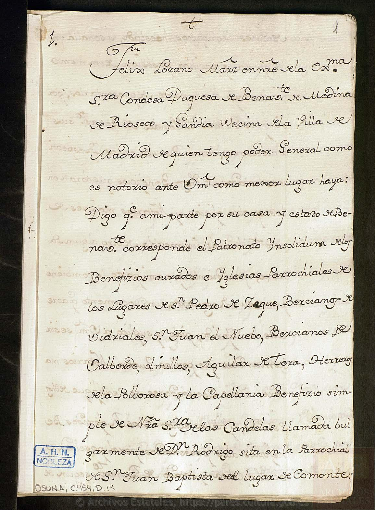
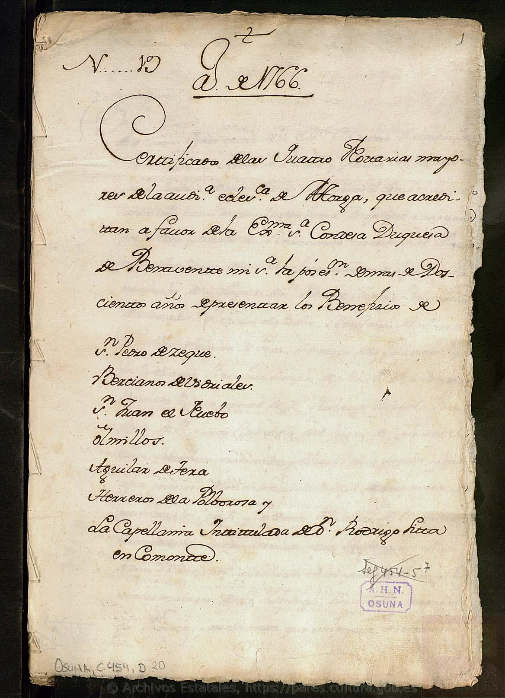
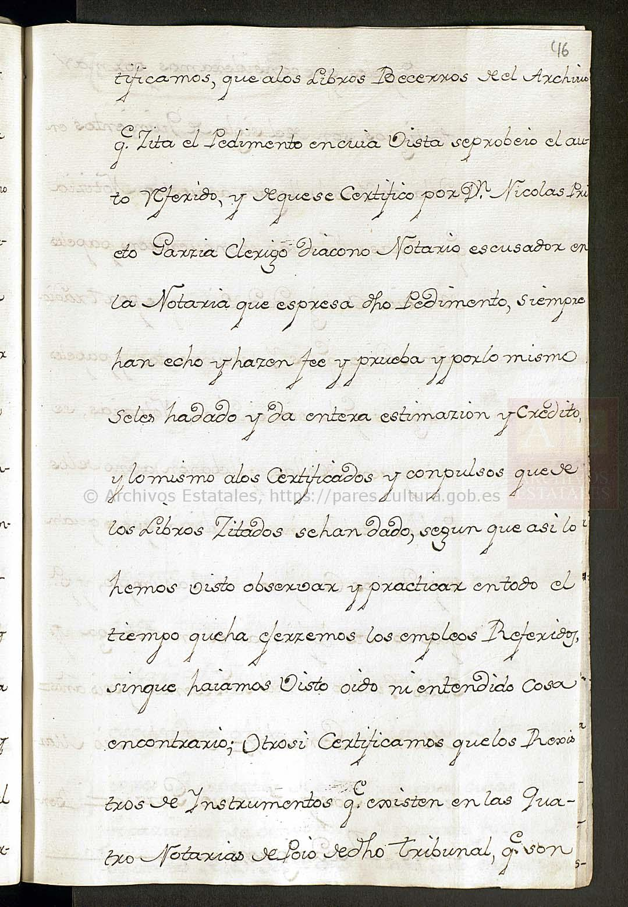
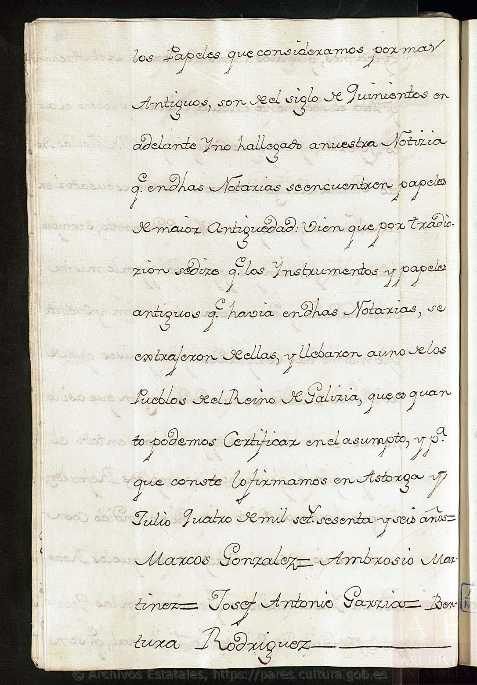
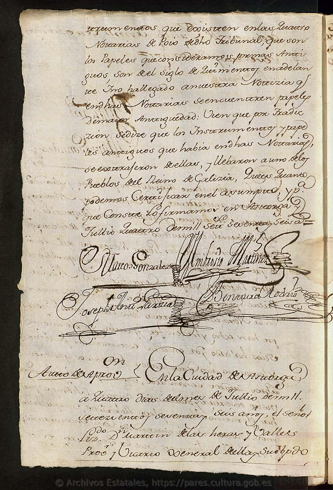
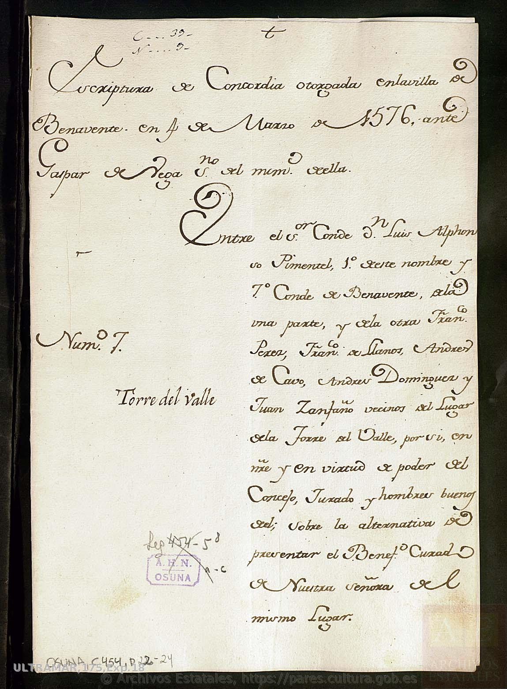
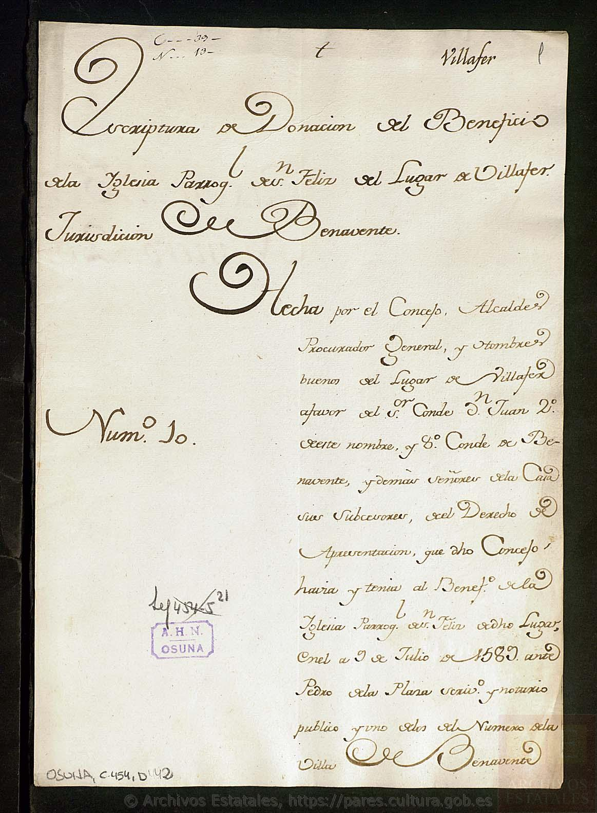
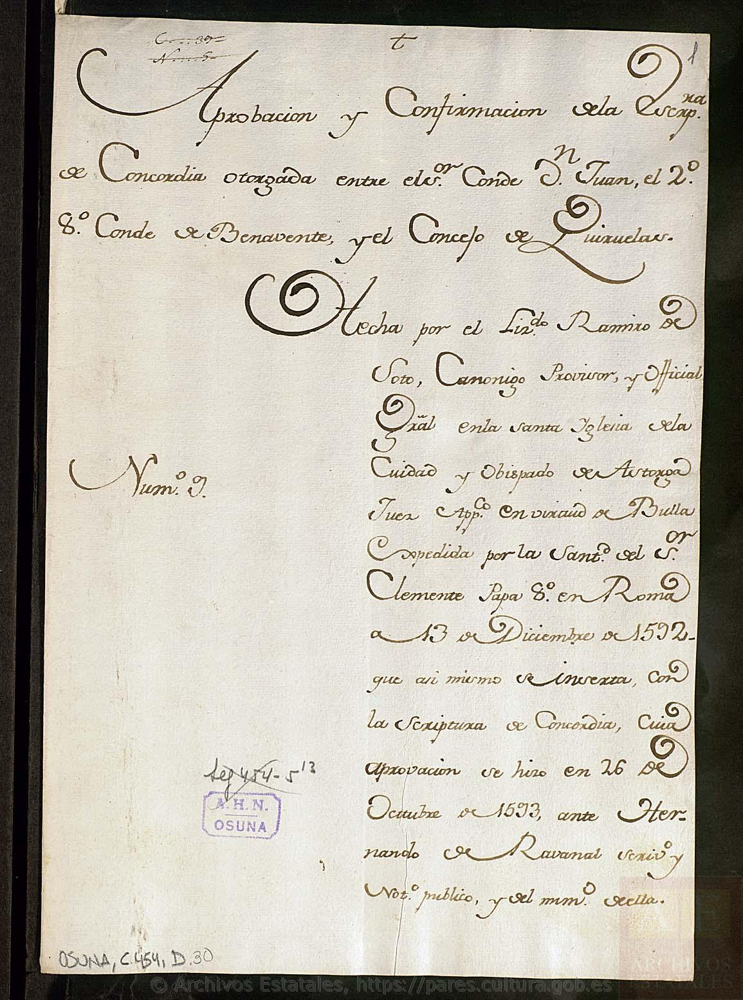
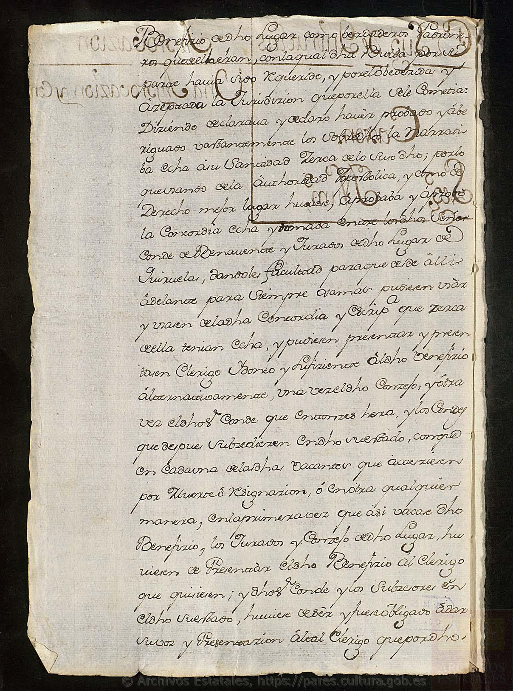

# El patronato de los curatos del estado de Benavente — **la certificación de 1766**

> **Estado: ✅ LEÍDO.** 5 de octubre de 2026. `OSUNA,C.454,D.19-20` (157 planas), más
> `D.21`, `D.22-24`, `D.30-31` y `D.42`, todas del **Archivo Histórico de la Nobleza**.
>
> 🚨 **Esto es lo que `ARCH-27` mandaba ir a buscar a Toledo. Está en abierto.** El «**y otros**»
> de la certificación de 1766 —la frase de la carpetilla que abrió la pregunta en `TAR-30`— **ya no
> es un enigma: el documento nombra a los siete, uno por uno. Colinas no es ninguno de ellos.**
>
> 🚨🚨 **Y trae, de paso, algo que vale para todo el proyecto y no sólo para esta pregunta:** los
> cuatro notarios mayores del obispado de Astorga certifican, firmando, **por qué en su archivo no
> hay nada anterior al siglo XVI**.

---

## 1. Qué es, y por qué estaba donde estaba

En `TAR-30` se leyó la **carpetilla del legajo 454** de Osuna, que lo describe como el legajo de los
«*papeles que en su mayoría se refieren al derecho de patronato y presentación que tenían los condes
en los beneficios y curatos del estado de Benavente*», y nombraba una «*certificación de 1766 sobre
pertenecer al conde el patronato de los beneficios curados de **S. Pedro de Ceque y otros***».

> 📏 **Ese «y otros» es lo que abrió `ARCH-27`**, con la pregunta que este proyecto arrastra desde
> el pleito de diezmos de 1694, el préstamo de 1756 y la respuesta 2.ª del Catastro:
> **¿quién nombraba al cura de Colinas?**

| | |
|---|---|
| **Archivo** | Archivo Histórico de la Nobleza (Toledo) |
| **Signaturas** | **`OSUNA,C.454,D.19-20`** (las dos copias) · `D.21` (su carpetilla) |
| **Qué es** | expediente instado por la **casa de Benavente** ante el **tribunal eclesiástico de Astorga** para que éste certifique, de sus propios registros, las presentaciones hechas por los condes |
| **Fechas** | petición y auto, **11 de enero de 1766**; certificaciones, **28 y 30 de junio y 2 de julio**; firma y aprobación, **4 y 10 de julio de 1766** |
| **Extensión** | **157 imágenes**, digitalizadas y sin restricciones |
| **Firma comprobada** | en el folio: `OSUNA, C.454, D.19` y `OSUNA, C.454, D.20`, sello **A.H.N. OSUNA**, «leg 454-5» |

---

## 2. 🚨 Los siete beneficios, transcritos del folio

> «**Félix Lozano Mártir**, en nombre de la Ex[celentísi]ma S[eño]ra **Condesa Duquesa de Benavente,
> de Medina de Rioseco y Gandía**, vecina de la villa de Madrid, de quien tengo poder general como
> es notorio, ante V[uestra] m[erced] como mejor lugar haya: **Digo que a mi parte, por su casa y
> estado de Benavente, corresponde el Patronato *in solidum* de los Beneficios curados e Iglesias
> Parroquiales de los Lugares de**…»

Y la portada de la segunda copia los pone en lista, uno debajo de otro:

> «**Año de 1766.** Certificado de las cuatro Notarías mayores de la Audiencia eclesiástica de
> Astorga, que acreditan a favor de la Ex[celentísi]ma S[eño]ra Condesa Duquesa de Benavente **la
> posesión inmemorial de más de doscientos años de presentar los Beneficios de**:
>
> **S[a]n Pedro de Zeque · Bercianos de Vidriales · S[a]n Juan el Nuevo · Olmillos · Aguilar de
> Tera · Herreros de la Polvorosa** · y **la Capellanía intitulada de D. Rodrigo, sita en
> Comonte**.»

| | |
|---|---|
| ✅ **Documentado** | **siete** beneficios curados y una capellanía, en el obispado de Astorga, presentados *in solidum* por la casa de Benavente **desde 1541** |
| ❌ **Colinas** | **no figura**. Barridas las **157 planas** y todas sus notas marginales —que es donde la certificación va rotulando el beneficio y el año—, **el nombre no aparece ni una vez** |
| 🚨 **Y una que sí nos toca** | «**San Juan el Nuevo**» es el **San Juanico el Nuevo** que el proyecto localizó en `TAR-15` y documentó con 19 pecheros en 1526 → [`censo-pecheros-1528`, § 3](../censo-pecheros-1528/README.md). **Su parroquia la presentaba el conde** |

### ⚠️ Hasta dónde llega este negativo, y dónde se para

**Hay que decirlo con precisión, porque es fácil pasarse.**

> ⚠️ **1. El auto limita la certificación.** El provisor manda certificar «*según los documentos que
> obran en sus respectivos archivos **correspondientes a los Beneficios que expresa la petición***».
> Es decir: **el tribunal contesta sólo por los siete que se le preguntan**. Esto **no es un
> inventario del obispado**.
>
> ⚠️ **2. Y la petición dice *in solidum*.** La casa reclama el patronato **entero y sin compartir**
> —«*sin mezcla de otro algún Patrono*»—. 🚨 **Y este proyecto sabe que en este señorío había otra
> figura**: en **Quiruelas** el patronato se ejercía **alternando** con el concejo
> → [`osuna-astorga`, `TAR-30`](../osuna-astorga/README.md). **Un curato de patronato alterno no
> tendría por qué salir en una lista de patronatos *in solidum*.**
>
> 📏 **Conclusión, y es la que el criterio permite:** ✅ **queda documentado que Colinas no estaba
> entre los curatos que la casa de Benavente presentaba por sí sola en el obispado de Astorga.**
> ⚠️ **No queda documentado que el conde no tuviera parte en el nombramiento del cura de Colinas**,
> porque la forma que el propio señorío usaba —la alternativa— cae fuera de lo que este papel
> certifica.

---

## 3. 🚨🚨 Por qué en Astorga no hay nada medieval: los notarios lo escriben y lo firman

Al cerrar su certificación, los cuatro notarios mayores añaden un *otrosí* que no les pedía nadie.
Está en las dos copias, con las mismas palabras.

> «**Otrosí certificamos** que los Archivos de Instrumentos que existen en las cuatro Notarías de
> dicho tribunal, que son **los Papeles que consideramos por más Antiguos, son del siglo de
> quinientos en adelante**; y **no ha llegado a nuestra Noticia que en dichas Notarías se encuentren
> papeles de mayor Antigüedad**: bien que **por tradición se dice que los Instrumentos y papeles
> antiguos que había en dichas Notarías, se extrajeron de ellas y llevaron a uno de los Pueblos del
> Reino de Galicia**, que es cuanto podemos Certificar en el asumpto.»

> Astorga, **4 de julio de 1766** · **Marcos González — Ambrosio Martínez — Josef Antonio García —
> Bentura Rodríguez**, notarios mayores de asiento de la Audiencia eclesiástica de la ciudad y
> obispado de Astorga.

> 🚨 **Esto es de primer orden, y no es sobre Colinas: es sobre toda búsqueda en Astorga.** Los
> funcionarios del propio tribunal declaran, bajo firma, que **su archivo notarial empieza en el
> siglo XVI** y que lo anterior **salió de allí**. Explica, con la autoridad de quien custodiaba los
> papeles, **por qué este proyecto no encuentra documentación medieval de Colinas en Astorga**: no
> es que no se haya buscado bien; es que **en 1766 ya no estaba**.
>
> ⚠️ **Y hay que leerlo como lo que es.** Los notarios **no afirman** el traslado: dicen «*por
> tradición se dice*». ✅ **Lo que sí afirman como hecho**, y es lo que importa, es el **estado de
> su archivo en 1766**: nada anterior a quinientos. **Lo de Galicia es la explicación que corría
> entre ellos, y se cita como tal, sin pueblo y sin fecha.**

---

## 4. ★★ Tres concejos, siete años, tres desenlaces

Leyendo el resto del legajo aparece un patrón que ninguna de las piezas dice por separado:

| Año | Lugar | Qué pasó con el derecho de presentar al cura | Signatura |
|---|---|---|---|
| **1576** | **La Torre del Valle** | **concordia**: se reparte, «*sobre la **alternativa** de presentar el Beneficio Curado de Nuestra Señora*» | `C.454,D.22-24` |
| **1582** | **Quiruelas de Vidriales** | **concordia**: **alternando a perpetuidad**, confirmada en 1583, bula de 1592, aprobación apostólica de 1593 | `C.454,D.2`, `D.1`, `D.30-31` |
| **1583** | **Villafer** | **donación**: el concejo **entrega** al conde el derecho que tenía | `C.454,D.42` |

> «**Escriptura de Concordia otorgada en la villa de Benavente en 4 de Marzo de 1576**, ante Gaspar
> de Vega, n[otari]o del número de ella. Entre el S[eñ]or Conde **D. Luis Alphonso Pimentel, 1.º de
> este nombre y 7.º Conde de Benavente**, de la una parte, y de la otra **Fran[cis]co Pérez, Juan de
> Llanos, Andrés de Cavo, Andrés Domínguez y Juan Zanfaño**, vecinos del Lugar de **la Torre del
> Valle**… **sobre la alternativa de presentar el Beneficio Curado de Nuestra Señora** del mismo
> Lugar.»

> «**Escriptura de Donación del Beneficio a la Iglesia Parroq[uia]l de S[a]n Félix del Lugar de
> Villafer**, Jurisdicción de Benavente. Hecha por el **Concejo, Alcaldes, Procurador General y
> hombres buenos** del Lugar de Villafer a favor del S[eñ]or Conde **D. Juan, 2.º de este nombre y
> 8.º Conde de Benavente**, y demás señores de la Casa sus subcesores, **del Derecho de Presentación
> que dicho Concejo había y tenía** al Benef[ici]o de la Iglesia Parroquial de S[a]n Félix de dicho
> Lugar, en el a[ño] **9 de Julio de 1583**, ante **Pedro de la Plana**, escriv[an]o y notario
> público… de la Villa de Benavente.»

> ★★ **Lo interpretado, y se marca como tal.** Entre **1576 y 1583** los condes de Benavente
> **estaban recogiendo, pueblo por pueblo, el patronato de las parroquias de su estado**: unas por
> acuerdo repartido, otra por cesión. Son **tres casos en siete años**, y los tres acabaron en el
> mismo legajo.
>
> ⚠️ **Lo que no se puede decir:** que a Colinas le pasara lo mismo. **No hay papel de Colinas.**
> Lo que el patrón aporta es **qué buscar y de qué años**: una concordia o una donación del
> **último cuarto del siglo XVI**, ante escribano de Benavente.

---

## 5. ✅ La cadena de Quiruelas, cerrada — y el catálogo, corregido

`TAR-30` dejó la concordia de Quiruelas documentada hasta la bula de Clemente VIII de 1592, y anotó
que faltaba la ejecución. **Está en `C.454,D.31`** — que el catálogo de PARES describe, junto con
`D.30`, como «**dos carpetillas vacías**».

> 🔁 **No lo son.** `D.30` sí es carpetilla; **`D.31` lleva el texto íntegro de la aprobación
> apostólica de 1593**.

> «…usando de la **autoridad apostólica**… **aprobaba y aprobó la Concordia** hecha y tomada entre
> los dichos Señor Conde de Benavente y Jurados de dicho Lugar de **Quiruelas**… y pudiesen
> presentar y presentasen clérigo idóneo y suficiente a dicho Beneficio **alternativamente, una vez
> el dicho Concejo, y otra vez el dicho Conde**… **en la primera vez que así vacare** dicho
> Beneficio, los Jurados y Concejo de dicho Lugar **hubieren de presentar al clérigo que quisieren;
> y dichos Conde y los subcesores en dicho su estado, hubiere de ser y fuese obligado a dar su voz y
> presentación al tal clérigo**… guardando lo dicho **inviolablemente desde entonces para siempre
> jamás**… **con penas y censuras**. En la Ciudad de **Astorga a 26 días del mes de octubre año del
> Señor de 1593**, ante **Hernando de Rabanal**, escribano y notario público y apostólico.»

> 🚨 **Y repárese en el reparto exacto, que es más fuerte de lo que `TAR-30` pudo decir.** No es sólo
> que se alternaran: **la primera vacante es del concejo**, y **el conde queda *obligado* a dar su
> voz al clérigo que el concejo elija**. La aprobación la firma un **juez apostólico**, con penas y
> censuras. En este señorío, por escrito y con Roma detrás, **un concejo de labradores podía obligar
> a un conde de Benavente a nombrar a su candidato**.

---

## 6. 🔁 Tres avisos sobre el catálogo de PARES

Se anotan juntos porque los tres se descubrieron igual —**mirando la imagen**— y los tres
desaconsejan fiarse de la ficha:

| Unidad | Lo que dice el catálogo | Lo que hay |
|---|---|---|
| `C.454,D.30-31` | «Dos carpetillas **vacías**» | `D.30` es carpetilla; **`D.31` trae el texto completo** de la aprobación de 1593 |
| `C.454,D.42` | «Carpetilla vacía que conservaba el testimonio **sobre los títulos de beneficios** que posee [el III conde]» | la imagen servida es la **carpetilla de la donación de Villafer, 1583** |
| `C.457,D.36` | «**1 Documento(s) en Papel. Hoja(s)**» | un cuaderno de **42 folios** → [el apeo de Cejinas](../apeo-cejinas-1663/README.md) |

> 📏 **La regla que sale de aquí, y ya van dos veces en un día:** en PARES, **la descripción orienta;
> decide la imagen**. Y el **id hay que casarlo por el título**, no por el orden de los resultados
> —esto último ya costó 51 imágenes del documento equivocado, y está escrito donde pasó.

---

## 7. Qué queda de `ARCH-27` para una persona

Enumerado el legajo en el catálogo: **21 unidades devueltas, y las 21 digitalizadas**
→ [`legajo-454-osuna.tsv`](../../03-archivos/legajo-454-osuna.tsv).

> ⚠️ **No es «el legajo entero está en línea».** La carpetilla dice «**N.º 1-23**» y PARES numera
> hasta `D.43`, con huecos que la búsqueda no devuelve —se sabe que **`D.4` existe**, porque de él
> se bajaron por error 51 imágenes en `TAR-30`—. **Lo que se puede afirmar es lo enumerado.**

| | |
|---|---|
| ✅ **Hecho desde casa** | las **dos piezas que `ARCH-27` nombraba**: la certificación de 1766 y la concordia de Torre del Valle. Más `D.21`, `D.30-31` y `D.42` |
| 📏 **Lo que quedaría** | las unidades de `C.454` **que el catálogo no devuelve** en la búsqueda por signatura, y que sólo se ven en el inventario de sala |
| 🚨 **Y la vía que esto abre en su lugar** | si Colinas tuvo concordia o donación como Torre del Valle, Quiruelas y Villafer, **el escribano sería de Benavente y la fecha del último cuarto del XVI**. Eso se busca en **protocolos notariales de Benavente**, no en Osuna |

---

## Nota de reutilización

**Archivo Histórico de la Nobleza**, fondo **Osuna**, signaturas `OSUNA,C.454,D.19-20`, `D.21`,
`D.22-24`, `D.30-31` y `D.42`. Imágenes obtenidas de **PARES** (Ministerio de Cultura); documentos
en dominio público. Cítese el Ministerio de Cultura, el archivo, la signatura y la URL de PARES.
Se depositan aquí **nueve planas**, las citadas; **se leyeron las 157 de `D.19-20`** y todas las de
las demás unidades.

---

*Ficha redactada el 5 de octubre de 2026 · `TAR-33`, en preparación de `ARCH-27`.*
