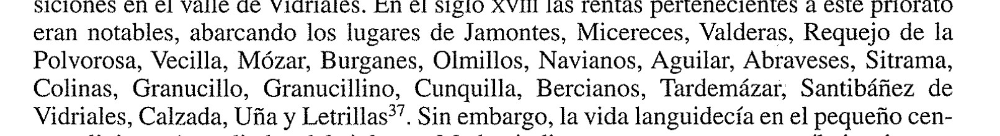

# El priorato de San Salvador de Villaverde — y las rentas que cobraba en Colinas

> **Estado: ⚠️ NOTICIA DE SEGUNDA MANO. El papel que nombra a Colinas NO se ha visto.**
> 3 de octubre de 2026 (`TAR-09`).
>
> Lo que este proyecto ha leído entero son **dos artículos**: el de **Rafael González Rodríguez
> (2001)**, que estudia el priorato, y el de **Juan Carlos de la Mata Guerra (2005)**, que
> inventaría el archivo donde está la documentación. El documento que nombra a Colinas es un
> **manuscrito inédito** del *Archivo del Hospital de la Piedad de Benavente* que **el proyecto no
> tiene**. Todo lo que sigue descansa en **la lectura de otro**, y se dice.

> 🚨 **Lo que abre es esto.** En el **siglo XVIII**, **Colinas de Trasmonte** figura entre los
> veintidós lugares de los que cobraba rentas el **priorato de San Salvador de Villaverde**, un
> pequeño cenobio del valle de Vidriales que desde **1525** pertenecía al **Hospital de la Piedad de
> Benavente**. Sería un **tercer canal de renta** saliendo del pueblo, distinto del foro al conde y
> del censo al hospital de San Juan de Astorga — y **el Catastro de 1752 no lo menciona**
> (ver [§ 7](#7-️-y-el-hueco-el-catastro-de-1752-no-lo-dice)).

---

## 1. Las dos fuentes leídas, y la que falta

| | |
|---|---|
| **Estudio** | **GONZÁLEZ RODRÍGUEZ, R.**, «El monasterio de San Salvador de Villaverde de Vidriales», *Brigecio* **11** (2001), **pp. 43-62** |
| Facsímil local | [`02-bibliografia/san-salvador-villaverde-vidriales-brigecio11.pdf`](../../02-bibliografia/san-salvador-villaverde-vidriales-brigecio11.pdf) — 20 planas, **escaneo sin capa de texto**, leídas a imagen el 3-X-2026 |
| **Inventario del archivo** | **DE LA MATA GUERRA, J. C.**, «Avance de los trabajos de inventario del Archivo del Hospital de la Piedad de Benavente», *Brigecio* **15** (2005), **pp. 105-128** |
| Facsímil local | [`02-bibliografia/mata-guerra-2005-archivo-piedad-brigecio15.pdf`](../../02-bibliografia/mata-guerra-2005-archivo-piedad-brigecio15.pdf) — **con capa de texto**, descargado de Dialnet (art. 2002801) el 3-X-2026 |
| **🔴 La fuente que falta** | ***Libro Becerro del Hospital de la Piedad de Benavente*** — manuscrito del s. XVIII, **inédito**. Es el que trae la lista con Colinas |
| Dónde está | **Archivo del Hospital de la Piedad de Benavente** (A.H.P.B.), en el propio edificio, hoy residencia de ancianos. Archivo **de fundación particular**, bajo su Patronato |
| Inventariado | **Desde julio de 2004**, por acuerdo entre el **C.E.B. «Ledo del Pozo»** y el **Patronato del Hospital**. El fondo del Hospital de la Piedad son **257 legajos y 133 libros** |

> ⚠️ **Cautela de método.** González Rodríguez cita el *Libro Becerro* **sin signatura de legajo**,
> sólo por título y folio. La signatura que esta ficha propone en el [§ 6](#6--dónde-está-ese-papel-el-inventario-de-2005-da-las-signaturas)
> sale de **cruzar su cita con el inventario de 2005**, que es trabajo de este proyecto y no de
> ninguno de los dos autores: **es una propuesta, no una referencia comprobada**.

---

## 2. ★★★ Lo documentado por el artículo: Colinas, en la lista de rentas

El pasaje, en la **p. 53**, dice literalmente:

> «Durante los siglos siguientes el priorato siguió ampliando su patrimonio, a través de distintas
> adquisiciones en el valle de Vidriales. **En el siglo XVIII las rentas pertenecientes a este
> priorato eran notables, abarcando los lugares de Jamontes, Micereces, Valderas, Requejo de la
> Polvorosa, Vecilla, Mózar, Burganes, Olmillos, Navianos, Aguilar, Abraveses, Sitrama, Colinas,
> Granucillo, Granucillino, Cunquilla, Bercianos, Tardemázar, Santibáñez de Vidriales, Calzada, Uña
> y Letrillas**[nota 37]. Sin embargo, la vida languidecía en el pequeño centro religioso.»

**La nota 37 dice sólo «*Ibid.*»**, y la 36 —la inmediatamente anterior— remite al ***Libro Becerro
del Hospital de la Piedad de Benavente*, fol. 21v.-22r.** De modo que la lista sale de ese libro,
pero **el folio exacto no se da**: la nota arrastra el del quindenio, que es otra cosa.

### Los veintidós lugares

Se transcriben **como los escribe el artículo**. La tercera columna es **interpretación de este
proyecto**, no del autor:

| # | Como lo escribe el artículo | Cómo se entiende hoy |
|---:|---|---|
| 1 | Jamontes | Santa Marina de Jamontes `[?]`, despoblado de Vidriales |
| 2 | Micereces | Micereces de Tera |
| 3 | Valderas | Valderas (León) — **el único lejos**; villa del orbe Pimentel |
| 4 | Requejo de la Polvorosa | Requejo de la Vega `[?]` / Requejo, Santa Cristina de la Polvorosa |
| 5 | **Vecilla** | **Vecilla de Trasmonte** `[?]` — ⚠️ pero hay también **Vecilla de la Polvorosa**, y el nombre anterior de la lista es «de la Polvorosa» |
| 6 | Mózar | Mózar de Valverde |
| 7 | Burganes | Burganes de Valverde |
| 8 | Olmillos | Olmillos de Valverde |
| 9 | Navianos | Navianos de Valverde `[?]` |
| 10 | Aguilar | Aguilar de Tera |
| 11 | Abraveses | Abraveses de Tera |
| 12 | Sitrama | Sitrama de Tera |
| 13 | ★★★ **Colinas** | **Colinas de Trasmonte** — ver la cautela de abajo |
| 14 | Granucillo | Granucillo de Vidriales |
| 15 | Granucillino | despoblado junto a Granucillo `[?]` |
| 16 | Cunquilla | Cunquilla de Vidriales |
| 17 | Bercianos | Bercianos de Vidriales |
| 18 | Tardemázar | Tardemézar |
| 19 | Santibáñez de Vidriales | Santibáñez de Vidriales |
| 20 | Calzada | Calzada de Tera |
| 21 | Uña | Uña de Quintana |
| 22 | Letrillas | sin identificar |

> ⚠️ **Y «Colinas», ¿cuál?** El artículo escribe el nombre **a secas**, sin apellido. En la diócesis
> de Astorga hay **dos Colinas**, y este proyecto ya tropezó con las dos: el Censo de Aranda de 1768
> pone **«Colinas del Campo de Martín Moro»** en el asiento 172 y **Colinas de Trasmonte** en el 173
> → [`censo-aranda-1768`](../censo-aranda-1768/README.md).
>
> **Por qué se lee «Colinas de Trasmonte»:** porque **los otros veintiún nombres de la lista están
> todos en los valles del Tera, Vidriales, Valverde y la Polvorosa**, en un radio corto de
> Benavente; porque Colinas va **encajada entre Sitrama de Tera y Granucillo de Vidriales**, que son
> sus vecinos; y porque **Colinas del Campo está en la montaña berciana**, a más de cien kilómetros,
> fuera por completo del espacio del priorato y del señorío Pimentel. **Es lo interpretado, no lo
> documentado** — pero no se ve otra lectura posible.

---

## 3. El sitio, la casa y el nombre que le dan los vecinos

El priorato **no desapareció**: sus ruinas siguen en pie.

> «La finca que ocupa actualmente se encuentra en medio de los campos de cultivo que separan
> **Santibáñez de Vidriales y San Pedro de la Viña, en término de este último pueblo**, siendo
> conocido coloquialmente por los lugareños como **"El Conventico"**. El paraje describe una suave
> ladera hasta encontrarse con el **arroyo de La Almucera**, principal curso fluvial colector de
> toda la comarca, con la **Sierra de Carpurias** al fondo dominando el horizonte.» — p. 43-44

> ★ **El arroyo es el nuestro.** La Almucera es **el arroyo de Colinas**: el que Madoz dice que
> fertiliza su vega, el que da nombre al «**Valle de la Almucera**», y aquel sobre el que Pobladura
> de Trasmonte tenía **un molino en 1446** → [`madoz-1847`](../madoz-1847/README.md),
> [`inventario § 8.2`](../../03-archivos/inventario-documental.md). El priorato está **aguas
> arriba**; Castroferrol, **en la desembocadura**.

Lo que queda, descrito por E. Sáinz en la prensa local (*La Opinión-El Correo. Dominical*, 6 de
abril de 1997, p. VII), que el artículo reproduce entero:

- Una **casa de dos plantas**, de sillarejo y ladrillo rojo, con arco de medio punto: **residencia
  de los sacerdotes**, aparentemente de finales del XIX o principios del XX.
- A pocos metros y en el mismo eje, la **capilla**: muro de piedra, dos pináculos y espadaña de
  ladrillo. En sus muros hay **dos arcos antiguos reaprovechados** —uno barroco en el lado del
  evangelio, otro menor hacia la sacristía— que «debieron pertenecer a **un templo anterior bien
  orientado**, que sin duda hubo de ser el de San Salvador».
- En el suelo de la finca, **fragmentos de ladrillo y cerámica y restos de sepulturas**, entre ellas
  **un sarcófago monolítico en forma de pila**, roto, arrinconado junto a una tapia: «un evidente
  testimonio del pasado medieval del enclave».

> ⚠️ **No está excavado ni protegido.** El autor del reportaje cierra diciendo que «su destino
> inmediato parece ser irremediablemente el de un lento, pero total, aniquilamiento». El artículo es
> de **2001** y la descripción, de **1997**: **no se sabe en qué estado está hoy**.

---

## 4. La cadena: de Alfonso VI a una residencia de ancianos

El artículo lleva **apéndice documental de cinco piezas**, tres de ellas **inéditas**:

| | Fecha y lugar | Qué es | Edición / signatura |
|---:|---|---|---|
| **1** | **1100, enero 25** · Castro Froila | **Alfonso VI** dona al monasterio de **Sahagún** y a su abad Díaz (Diego) el monasterio de **San Salvador con su villa de Villaverde**, en el valle de Vidriales. Había sido del **conde Munio Fernández**, desterrado «por su soberbia», y el rey lo había dado en vida a su mujer **la reina Berta** | ed. M. HERRERO, *Colección diplomática del monasterio de Sahagún*, III, León, 1988, **doc. 1045** |
| **2** | **1112, mayo 1** · Astorga | **Doña Aldonza** (*Islontia*), hija del conde Gómez Díaz y viuda de Munio Fernández, con su hija **Elvira Muñiz**, dona el mismo monasterio a **Cluny**. Dice que lo habían perdido «*vi regia*» de Alfonso VI y que **la reina Urraca se lo restituyó** | ed. BERNARD y BRUEL, *Recueil des chartes de l'Abbaye de Cluny*, V, **doc. 3900** |
| **3** | **1510, mayo 3** · monasterio de San Salvador de Villaverde | **Toma de posesión** por **Gonzalo Magaz**, clérigo, en nombre de **don Juan Pimentel**, con bula de **Julio II**. Le entregan las llaves, el ara, los ornamentos y **las sogas de las campanas, y las tañó** | A.H.P.B., *Libro del Priorato de Villaverde* (sin foliar) · **INÉDITO** |
| **4** | **1510, mayo 8**, miércoles · monasterio de Nogales | **Ratificación** de esa posesión por el propio don Juan Pimentel | ídem · **INÉDITO** |
| **5** | **1525, diciembre 1** · Roma | **Clemente VII anexiona el priorato al Hospital de la Piedad de Benavente** | ídem · **INÉDITO** |

**Lo que pasó después, según el artículo:**

- La anexión de 1525 **obligaba a mantener dos monjes o presbíteros seculares** en la iglesia
  prioral para el culto y las misas diarias; si en **seis meses** los rectores del Hospital eran
  negligentes, **la anexión se consideraría disuelta**.
- **Sahagún pleiteó.** Un breve de Clemente VII de **9 de diciembre de 1529** comisiona a los abades
  de **San Martín de Castañeda** y **San Juan de Aguilar** y al **arcediano de Benavente** para que
  los obispos de **Oviedo y Astorga** no molesten al administrador en la percepción de diezmos y
  frutos. En **1544** la curia romana condena a Sahagún **a perpetuo silencio** y declara válidas las
  anexiones; las secuelas llegan a **1545** y Sahagún paga **60 ducados y 4 florines de oro** de
  costas.
- El Hospital pagaba a Roma los ***quindenios***, cada quince años: en el siglo XVIII, **2.000
  reales** más **460** de cobranza y desplazamiento.
- A mediados del XIX **Madoz** dice que ya sólo ejercían allí **dos sacerdotes nombrados por el
  conde de Benavente**. La actividad, «casi vegetativa», se mantuvo **hasta bien entrado el siglo
  XX**, y se extinguió cuando el Hospital de la Piedad **pasó a ser asilo de ancianos** (1962, según
  el inventario de 2005). **La fundación conserva hoy la propiedad de la finca.**

> ★ **Y una coincidencia de fechas que el artículo no subraya.** Juan Pimentel toma posesión del
> priorato el **3 de mayo de 1510**; las licencias reales para fundar el **Hospital de la Piedad**
> son del **21 de agosto de 1510** (de la Mata Guerra, 2005). **El mismo año**: el V conde estaba
> montando a la vez la fundación y la renta que había de sostenerla.

---

## 5. ★★ El otro San Salvador — la pregunta que abría esta tarea, contestada

Esta lectura se registró para **comparar este San Salvador con el de 1006**. La respuesta es
**limpia: son dos, y el artículo lo dice él mismo**, en su primera página:

> «el valle de Vidriales contaría con **tres fundaciones medievales conocidas**. Una **en su
> cabecera: San Fructuoso de Ageo**; otra **en el tramo final, ya en su unión con el valle del
> Tera: San Miguel de Castroferrol**; y **este que nos ocupa, prácticamente en el centro del
> valle**, muy próximo al antiguo campamento romano de *Petavonium*, en Rosinos de Vidriales.» — p. 44

| | **San Salvador de Castroferrol** | **San Salvador de Villaverde** |
|---|---|---|
| Dónde | **término de Colinas de Trasmonte**, en la confluencia **Tera-Almucera** | término de **San Pedro de la Viña**, centro del valle de Vidriales |
| Primera noticia | **1006** `[?]` (la fecha es enmienda) | **1100** |
| Advocación después | pasa a **San Miguel** | sigue **San Salvador** |
| Final | desaparece en la Edad Media | llega **al siglo XX**, y queda en pie |
| Quién lo tuvo | abadesa Benedicta → catedral de Astorga | Munio Fernández → Sahagún → Cluny → Pimentel → Hospital de la Piedad |

> ✅ **No hay confusión que deshacer, y sí una confirmación que apuntar.** El mismo autor que estudió
> Castroferrol lo sitúa aquí, **de pasada y en otro artículo**, «en el tramo final, ya en su unión
> con el valle del Tera» — que es exactamente el término de Colinas. Es **un testimonio más**, y
> especialmente limpio porque **no está defendiendo esa tesis**: la da por sabida
> → [`castroferrol-962-1170`](../castroferrol-962-1170/README.md).

> ⚠️ **Lo que sí conviene no mezclar.** Las dos casas comparten advocación inicial, valle y arroyo.
> **No comparten nada más.** Que Colinas pagara rentas al priorato de Villaverde en el siglo XVIII
> **no tiene relación conocida** con que en su término hubiera habido un San Salvador en el siglo XI:
> median setecientos años y dos instituciones distintas. **Se anota para que nadie lo junte.**

---

## 6. 🚨 Dónde está ese papel: el inventario de 2005 da las signaturas

El artículo de 2001 cita sus fuentes **sin signatura**. El inventario de **de la Mata Guerra (2005)**
las pone. Cruzando los dos:

| Lo que cita González Rodríguez (2001) | Lo que inventaría de la Mata Guerra (2005) | Fuerza del enlace |
|---|---|---|
| ***Libro de Priorato de Villaverde*** (sin foliar), de donde salen los **tres documentos inéditos** | **Legajo 175, Exp. 1** — «*Noticias de la fundación del Priorato de San Salvador de Villaverde*», **1799** | ★★★ **casi segura**: el título coincide |
| ***Libro Becerro del Hospital de la Piedad de Benavente***, fol. 21v.-22r. — **el que trae a Colinas** | **Libro 19** — «*Libro becerro de heredades, foros y censos*, s. XVIII», descrito también como «*Libro Becerro de foros y zensos del hospital de Nuestra Señora de la Piedad*», **320 folios** | ★★ **propuesta fuerte**, no comprobada: ningún autor cita al otro |

**Y hay más en ese armario, que ninguno de los dos artículos usa:**

| Signatura | Qué es | Por qué importa a Colinas |
|---|---|---|
| ★★★ **Libro 15** | **Apeos antiguos. Priorazgo de Villaverde, 1560-1562** | Un **apeo** es un deslinde finca a finca **con nombres de propietarios y linderos**. Si el priorato tenía tierra en Colinas, aquí estarían **sus parcelas y sus vecinos, en 1560** |
| ★★★ **Libro 17** | **Apeos 1694** (copia de 1701, reformado en 1836) | **El mismo año** que el pleito de diezmos del conde-duque que este proyecto tiene entero → [`osuna-astorga`](../osuna-astorga/README.md) |
| ★★ **Libro 16** | **Apeos 1741-1747** | **Cinco años antes del Catastro de Ensenada**: permitiría cotejar nombre a nombre |
| **Libro 20** | **Inventario del Archivo, 1829 / 1835 / 1851** | Los inventarios antiguos del propio archivo |
| ⚠️ **Libro 27** | Visitas del Priorato de Villaverde, **1580-1641** | **NO LOCALIZADO en 2005.** Figuraba en los inventarios antiguos |
| ⚠️ **Libro 28** | Visitas al Priorato de Villaverde, **1700-1867** | **NO LOCALIZADO en 2005.** Ídem |

> ✅ **La errata del inventario de 2005, resuelta el mismo día.** Decía que el Libro Becerro «consta
> de **320** folios numerados, si bien solamente **320** de ellos fueron utilizados», lo que no puede
> ser. **El artículo de 1998 del que de la Mata parafrasea da la cifra buena**: **320 folios
> numerados, de los que están escritos 230**. Es un <s>320</s> por **230**.

### 🚨 Y el *Libro Becerro* no es lo que su nombre sugiere

Lo describe **el mismo González Rodríguez**, tres años antes de citarlo:

> «el principal instrumento de descripción del archivo, el denominado ***Libro de Bezerro de foros
> y zensos del hospital de Nuestra señora de la Piedad*. Se trata de **un inventario-catálogo de
> toda la documentación del hospital de la Piedad correspondiente a los siglos XVI, XVII y
> XVIII**. El libro, de gran tamaño, está encuadernado en pergamino —de ahí su denominación—.
> Consta de **320 folios numerados**, si bien solamente una parte de ellos —concretamente **230
> folios**— están escritos. La mayor parte del texto es obra de **una misma persona que escribe en
> la segunda mitad del siglo XVIII**. El autor extractó con encomiable minuciosidad el contenido de
> toda la documentación de la institución, **distribuyéndola por asuntos y fechas**.»
> — GONZÁLEZ RODRÍGUEZ (1998), **p. 170**

**Tres consecuencias, y las tres importan:**

1. ✅ **La identificación de la [§ 6](#6--dónde-está-ese-papel-el-inventario-de-2005-da-las-signaturas)
   deja de ser propuesta.** No hace falta cruzar a dos autores: **es el mismo**. González Rodríguez
   **describe el libro en 1998** y **lo cita en 2001** por el folio. Y de la Mata (2005) lo
   inventaría como **Libro 19**, con el mismo título y los mismos 320 folios. ★★★ **Son el mismo
   libro.**
2. 🚨 **Lo que trae no es un libro de rentas: es un índice de archivo.** La lista de los veintidós
   lugares con **Colinas** dentro **no es la cuenta de un año**: es el **extracto que un archivero
   de la segunda mitad del XVIII** hizo de los papeles del priorato. Eso explica el «en el siglo
   XVIII» sin año del artículo de 2001: **el siglo es el del compilador**, no necesariamente el de
   la renta.
3. ★★ **Y por eso puede valer más que el original.** El propio González Rodríguez cuenta que el
   **`Cajón I, legajo I`** —donde el Becerro dice que estaban **las escrituras fundacionales del
   hospital**— **ha desaparecido del archivo**, «en fecha imposible de precisar, pero sin duda
   posterior a la confección del Becerro». **El Becerro describe papeles que ya no existen.**

> 📌 **Y da la signatura antigua de lo que aquí interesa.** Los papeles del priorato estaban en el
> **`Cajón I, legajo III`**, «en el que se incluían **todas las escrituras relacionadas con las
> posesiones del hospital en el monasterio de San Salvador de Villaverde**» —hoy una miscelánea—.
> Es, con toda probabilidad `[?]`, el origen del **Legajo 175** de de la Mata.

> ⚠️ **Una nota de conservación, y no es menor.** En 1998 el archivo estaba **sin ordenar** —«los
> papeles y libros se amontonan … de una forma totalmente anárquica»—; se inventarió **a partir de
> julio de 2004**. Y del propio Libro Becerro dice el autor que «ya en fechas muy recientes,
> alguien … **subrayó con bolígrafo** aquellos pasajes más útiles o interesantes a su parecer».

> 📏 **Lectura parcial, y se dice.** Esto sale de **`TAR-27`**, leído el 3-X-2026 **sólo hasta la
> p. 179 de 192**: la introducción, el estudio y el principio del apéndice. **Las transcripciones
> de 1517 y 1526 quedan sin terminar de leer.** Lo visto hasta aquí dice que la **fundación y
> dotación de 1517 no nombra ningún lugar del valle del Tera** —son juros sobre Benavente y
> molinos del Órbigo—: **la renta de Colinas, si existió, llega con la anexión de 1525**, no con la
> fundación.

> ⚠️ **Y una cautela sobre el acceso.** Es un **archivo de fundación particular**, no público: se
> entra por el **Patronato del Hospital de la Piedad**, y la vía razonable es el **Centro de Estudios
> Benaventanos «Ledo del Pozo»**, que fue quien hizo el inventario en 2004-2005. El artículo de 2005
> es un **«avance»**: el inventario completo que anuncia **no consta que se haya publicado**.
> **Esto necesita una persona**, no una descarga → `ARCH-20` en el registro.

---

## 7. ⚠️ Y el hueco: el Catastro de 1752 no lo dice

Aquí está el problema honesto de esta ficha, y conviene dejarlo escrito antes de que lo encuentre
otro.

**Las Respuestas Generales de Colinas de 1752 declaran dos cargas**, y sólo dos:

| Carga | A favor de | Cuánto |
|---|---|---|
| **Foro perpetuo** (terrazgo, montes, fuentes y sitio del molino) | **conde de Benavente** | 41 fanegas 8 celemines de pan mediado |
| **Censo al 3 %** | **hospital de San Juan, de la ciudad de Astorga** | sobre 6.600 reales |

**El priorato de Villaverde no aparece. Ni el Hospital de la Piedad.** Y el Catastro se hizo en
**1752**, dentro del mismo siglo del que habla la lista.

**Las salidas posibles, sin elegir ninguna:**

1. **Que la renta fuera privada, no del común.** Las Respuestas Generales declaran lo que paga **el
   concejo**; un foro o un censo sobre **fincas de vecinos concretos** no sale ahí, sino en las
   **Respuestas Particulares** y en los **libros de lo Real**, donde el priorato figuraría como
   **hacendado forastero eclesiástico**. ⚠️ **Este proyecto sólo tiene las Generales.**
2. **Que fuera poca cosa.** El artículo dice «rentas notables» del conjunto, no de cada lugar.
3. **Que la lista no sea de 1752.** Dice «en el siglo XVIII», sin año; el folio citado alrededor
   trae un recibo de **1736**.
4. **Que «Colinas» sea otra cosa** — ver la cautela del [§ 2](#2--lo-documentado-por-el-artículo-colinas-en-la-lista-de-rentas).

> ★ **El hueco también es un dato.** Mientras no se vea el Libro Becerro o las Respuestas
> Particulares, **lo documentado es que una fuente del XVIII pone a Colinas en una lista de rentas y
> otra fuente del XVIII no la recoge**. Las dos cosas se escriben, y ninguna se tacha
> → [`catastro-ensenada-1752`](../catastro-ensenada-1752/README.md).

---

## 8. Lo que esta lectura deja abierto

| | |
|---|---|
| 🔎 | **Ver el *Libro Becerro*** (Libro 19 `[?]`) y leer la lista en el original, con su folio: cuánto pagaba Colinas, por qué concepto y desde cuándo |
| 🔎 | **Los tres apeos** —1560-62, 1694, 1741-47—: si tocan Colinas, son **listas nominales de vecinos y fincas** de tres siglos distintos |
| 🔎 | **Las Respuestas Particulares de Colinas de 1752** y el libro de eclesiásticos: ahí estaría el priorato, si estuvo |
| 🔎 | **Dónde está exactamente «El Conventico»**, y en qué estado: no hay coordenada en el artículo |
| ⚠️ | **Los Libros 27 y 28** (visitas al priorato, 1580-1867) **no se localizaron en 2004-2005**. Puede que estén y no se hayan encontrado, o puede que falten |
| ⚠️ | **Nada de esto se ha visto.** La ficha entera es la lectura de dos artículos |

---

*Leído el 3 de octubre de 2026 (`TAR-09`). Las 20 planas del artículo de 2001 se leyeron **a
imagen**, por carecer de capa de texto; el de 2005 trae texto y se leyó sobre él.*
