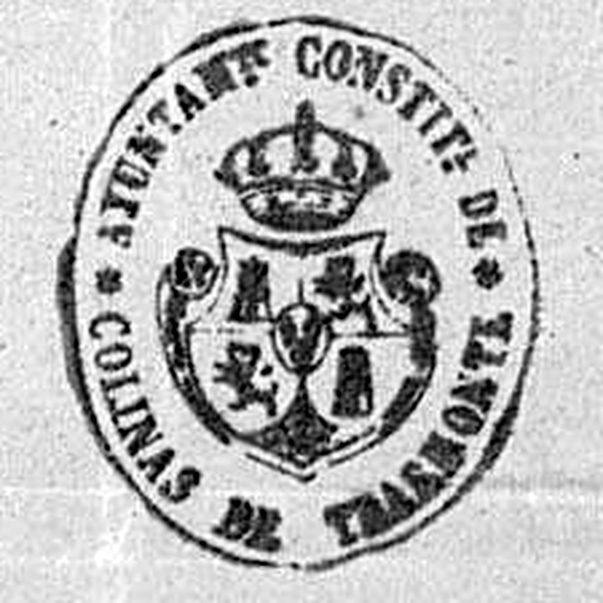
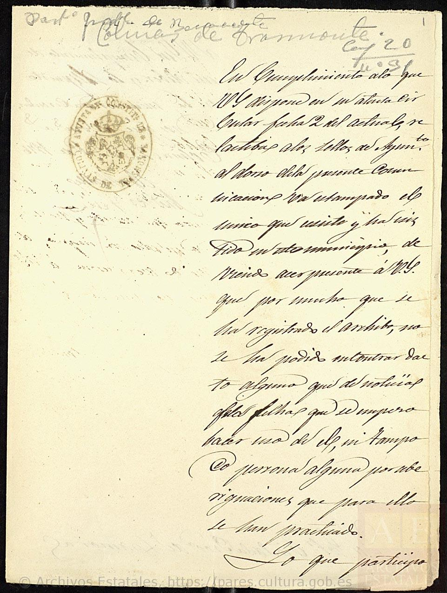

# El sello del Ayuntamiento de Colinas, 1876

> **Estado: ✅ FUENTE VISTA.** 22 de septiembre de 2026.
>
> ⚠️ **Precisión, porque importa:** el proyecto **ya citaba esta signatura** y ya citaba la frase
> clave — están en
> [`06-identidad-simbolos/repertorio-simbolico.md`](../../06-identidad-simbolos/repertorio-simbolico.md).
> Lo que **no** tenía era el documento. Esta ficha no descubre la fuente: **la sube de escalón**, de
> «citada» a «vista», que es la diferencia que este proyecto se toma en serio.
>
> Lo que aporta de nuevo: **las cuatro imágenes**, la **transcripción completa sobre el facsímil**,
> la **descripción del sello**, y tres datos que la cita no traía — que el Ayuntamiento **no supo
> fechar su propio sello**, que **su archivo ya estaba incompleto en 1876**, y el **nombre del
> alcalde**.

---

## La ficha

| | |
|---|---|
| **Archivo** | Archivo Histórico Nacional |
| **Signatura** | **SIGIL-TINTA_ZAMORA,20,N.31** |
| **Código de referencia** | `ES.28079.AHN/5.2.16.7.5.9//SIGIL-TINTA_ZAMORA,20,N.31` |
| **Fecha** | **1876** |
| **Fondo** | 5. Colecciones → 5.2. Documentos figurativos → Colección de sellos en tinta → municipales → Castilla y León → **Zamora** |
| **Contenido** | «Sellos del Ayuntamiento Constitucional de Colinas de Trasmonte (Zamora)» |
| **Volumen** | 2 sellos *(dos impresiones del mismo)* |
| **Imágenes** | **4, digitalizadas y en abierto** en PARES |

Localizado en **PARES** el 22 de septiembre de 2026, buscando por la frase exacta «Colinas de
Trasmonte» → [inventario, §13](../../03-archivos/inventario-documental.md).

---

## El sello

**Leyenda**, alrededor del óvalo:

> ★ AYUNTAM.TO CONSTIT.L DE ★ COLINAS DE TRASMONTE

**Campo**: un **escudo oval coronado con las armas reales de España**. Se distinguen el **castillo**
y el **león** en los cuarteles de la izquierda del espectador; los dos de la derecha, que por su
posición corresponderían a **Aragón** y **Navarra**, `[?]` **no se leen con seguridad** por el
entintado. En el centro, un **escusón** —el de Borbón-Anjou— y encima, **corona real**. A ambos
lados del escudo, dos elementos que por posición son las **columnas de Hércules** `[?]`.

> 🚨 **Lo que importa, y hay que decirlo con todas las letras: en este sello no hay nada de
> Colinas salvo el nombre.** El emblema es el del Estado. Lo local es la leyenda.

---

## La carta, transcrita sobre el facsímil

En el ángulo superior, de otra mano: «Part.do J[udicial] de Benavente — **Colinas de
Trasmonte**», y la signatura de archivo «Caj.ª 20 / n.º 31».

> «En cumplimiento a lo que V.S. dispone en su atenta circular fecha 2 del actual, relativa a los
> sellos de Ayuntam.to, **al dorso de la presente comunicación va estampado el único que
> existe y ha existido en este municipio**; debiendo hacer presente á V.S. que **por mucho que se ha
> registrado el Archivo, no se ha podido encontrar dato alguno que dé noticias de las fechas que se
> empezó á hacer uso de él**, ni tampoco persona alguna, por las indagaciones que para ello se han
> practicado. Lo que participo á V.S. [en] cumplimiento de mi deber y lo dispuesto en la mencionada
> circular.
>
> Dios gu.e á V.S. m.s a.s
>
> **Colinas 2? de D.bre de 1876** `[?]` *(el día no se lee con seguridad)*
>
> **El Alcalde, Andrés Pérez**» *(rubricado)*
>
> Dirigida al **Sr. Gobernador Civil de la Provincia de Zamora**.

---

## Lo que resuelve

### ★★★ 1. Colinas nunca tuvo emblema propio — ahora **visto**, no citado

El repertorio simbólico ya lo daba por documentado con esta misma signatura. La diferencia es que
ahora **se ha leído el papel**, y dice exactamente lo que se le atribuía. Dos afirmaciones, las dos
del alcalde:

1. El sello remitido es **«el único que existe y ha existido en este municipio»**.
2. Registrado el archivo municipal, **no hay dato de cuándo empezó a usarse**, y **nadie sabe
   decirlo**.

> **Consecuencia para [`06-identidad-simbolos`](../../06-identidad-simbolos/repertorio-simbolico.md):**
> lo que se proponga hoy como escudo, bandera o colores de Colinas **no recupera nada**: es
> **creación nueva**. Eso el repertorio ya lo decía; lo que cambia es que **la web puede enseñar el
> documento**, que es otra cosa que citarlo.
>
> Y no es una anomalía de Colinas: el precedente de **Bretocino** (*Brigecio* 16, 2006) y el de
> **Tábara** (*Brigecio* 20, 2010) describen lo mismo para sus pueblos. Lo que este documento añade
> es que **para Colinas está probado**, no supuesto.

### ★★ 2. Un alcalde con nombre: Andrés Pérez, 1876

Nombre nuevo para el inventario, y de los pocos cargos municipales documentados del XIX.

### ★ 3. Y una pequeña lección de método, escrita en 1876

El propio Ayuntamiento **registró su archivo y no encontró nada**. Es el testimonio más antiguo que
tiene el proyecto de que **el archivo municipal de Colinas ya estaba incompleto en el siglo XIX** —
dato que conviene tener presente antes de esperar demasiado del frente nº 13.

---

## Lo que esta fuente **no** dice

- **No fecha el sello.** Es de los modelos que el Estado generalizó tras 1868-1876, pero **la carta
  dice expresamente que no se sabe cuándo se empezó a usar**. Aquí no se le pone fecha de creación.
- **No dice que Colinas no tuviera símbolos**, sino que **no tuvo sello municipal propio**. Señas de
  identidad —el pendón parroquial, las marcas de ganado, los colores de una cofradía— son otra cosa
  y no pasan por esta circular.
- **La lectura del escudo es parcial.** Dos de los cuatro cuarteles no se leen con seguridad, y no
  se han inventado.

---

## Ficheros

| Fichero | Qué es |
|---|---|
| `sello-1876-carta-recto.jpg` | La carta del alcalde, con el sello estampado al margen |
| `sello-1876-carta-verso.jpg` | El final de la carta, la fecha y la firma |
| `sello-1876-impresion-1.jpg` | La impresión limpia del sello, en hoja aparte |
| `sello-1876-impresion-2.jpg` | La segunda impresión |
| `sello-1876-detalle.png` | El sello ampliado ×5 y con el contraste ajustado |

---

## Nota de reutilización

Imágenes del **Archivo Histórico Nacional**, obtenidas de **PARES** (Portal de Archivos Españoles,
Ministerio de Cultura). Las condiciones de la propia ficha de PARES establecen que *«la información
descriptiva y las imágenes de documentos en dominio público conservados en Archivos Estatales y
accesibles a través de PARES pueden reproducirse y utilizarse sin permiso previo»*, con mención del
Ministerio de Cultura y cita de la fuente: **AHN, SIGIL-TINTA_ZAMORA,20,N.31**,
`https://pares.cultura.gob.es/ParesBusquedas20/catalogo/description/4536201`.

---

*Ficha redactada el 22 de septiembre de 2026.*
