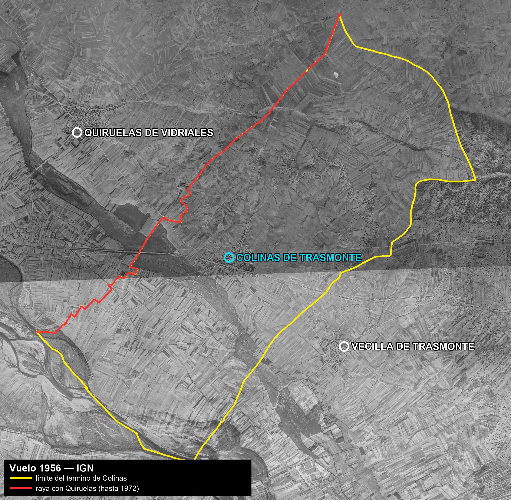
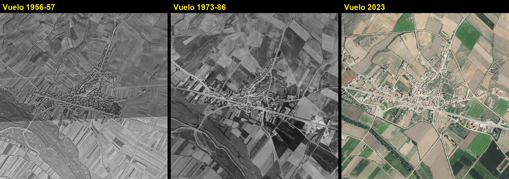
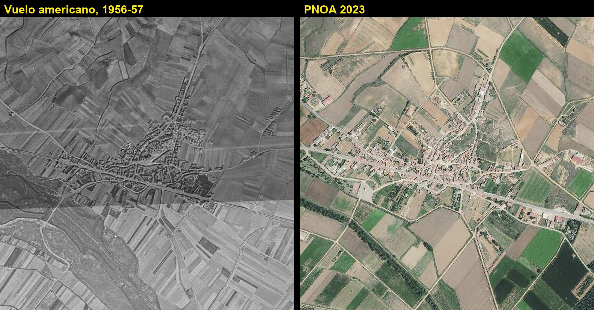

# El término desde el aire: 1956, 1973-86 y 2023

> **Estado: ✅ OBTENIDO Y COTEJADO.** 23 de septiembre de 2026. Frente nº 14.
>
> Tres ortofotos del **término completo de Colinas**, con el límite superpuesto, descargadas del
> servicio WMS del **Instituto Geográfico Nacional**. La comparación **acota la fecha de la
> concentración parcelaria**, y el BOE la cierra
> → [`01-fuentes-primarias/boe-gazeta/`](../../01-fuentes-primarias/boe-gazeta/README.md).

---

## Qué hay y de dónde sale

| Vuelo | Capa WMS | Resolución | Qué es |
|---|---|---|---|
| **1956-1957** | `AMS_1956-1957` | 0,50 m | **Vuelo americano, Serie B.** El primer retrato aéreo completo de España |
| **1973-1986** | `Interministerial_1973-1986` | 0,50 m | Vuelo interministerial |
| **2023** | `PNOA2023` | 0,25 m | Plan Nacional de Ortofotografía Aérea |

Servicio: `https://www.ign.es/wms/pnoa-historico`. Encuadre: **41,9787 – 42,0305 N** y
**5,8413 – 5,7703 O**, que cubre el término entero con margen. Imágenes de 2.400 × 2.350 px.

> **Consultado al propio servicio qué vuelos cubren este punto** (`GetFeatureInfo`): Americano
> 1956-57, Interministerial 1973-86, OLISTAT 1997-98, SIGPAC 1997-2003 y PNOA 2004, 2006, 2008,
> 2010, 2011, 2014, 2017, 2020 y 2023. ⚠️ El vuelo **Nacional 1981-1986 no cubre Colinas**.

**El límite superpuesto es el del proyecto**, no el del IGN: sale del polígono catastral
reconstruido en [`limite-del-termino.md`](../limite-del-termino.md) —959 vértices, 1.026,6 ha—.
En amarillo, el límite del término; **en rojo, la raya con Quiruelas**, que dejó de ser línea
municipal en 1972.

---

## 1. El término en 1956

**Lo que se ve, y es observable sin interpretar:**

- **Minifundio cerrado.** Todo el término está dividido en **parcelas largas y estrechas**, en
  haces paralelos que cambian de orientación de pago a pago. No hay un solo bloque grande.
- **Caminos sinuosos** que salen del casco en abanico y se adaptan al terreno.
- Las **vegas** del NO y del SO —las manchas oscuras y las trazas de meandro— se distinguen del
  secano por el dibujo de las parcelas.
- El casco es **un solo núcleo compacto**, sin nada disperso alrededor.

### Dos vecinos en el encuadre, y una distancia que dice algo

Geocodificados en **CartoCiudad**, no puestos a ojo:

| Lugar | Coordenadas | ¿Dentro del término? | Distancia al casco |
|---|---|---|---|
| **Colinas de Trasmonte** | 42,003823 N · 5,809477 O | ✅ sí | — |
| **Vecilla de Trasmonte** (Villanázar) | 41,994611 N · 5,793474 O | ❌ no | **1.673 m** |
| **Quiruelas de Vidriales** | 42,016769 N · 5,830578 O | ❌ no | **2.261 m** |

> ★ **Vecilla está más cerca de Colinas que Quiruelas** —1,7 km frente a 2,3— y sin embargo el
> municipio con el que Colinas se fusionó en 1972 fue **Quiruelas**.
> ⚠️ **Esto es geometría, no explicación.** La incorporación se decidió por la raya, que es
> administrativa, no por la distancia. Pero conviene tenerlo delante: **Vecilla es el vecino
> físico**, y es con Vecilla —no con Quiruelas— con quien Colinas pleiteó en 1600-1608 por el agua
> del Calero (§frente 9 del inventario).

---

## 2. ★★ La concentración parcelaria, vista y fechada

| | 1956-57 | 1973-86 | 2023 |
|---|---|---|---|
| **Parcelario** | haces de tiras estrechas | **bloques grandes y regulares** | bloques, consolidados |
| **Caminos** | sendas sinuosas | **red recta, de trazado nuevo** | la misma red, asfaltada |
| **Casco** | núcleo compacto | el mismo núcleo | **el mismo núcleo** |

> 🚨 **La conclusión es directa: entre 1957 y el vuelo interministerial, el término se rehízo
> entero.** Y no es una impresión: el propio BOE lo fecha —**Decreto 3119/1970, de 8 de octubre**,
> declara la concentración parcelaria de la zona de Colinas, y la **Orden de 1976** aprueba el plan
> de obras, que consiste precisamente en «**red de caminos y red de saneamiento**». Es exactamente
> lo que la foto de 1973-86 enseña y la de 1956 no tenía.

---

## 3. El casco: 1956 contra 2023

*Recorte de 1.200 × 1.200 m centrado en el casco.*

> ★★ **El pueblo no ha crecido.** Sesenta y siete años después, **el perímetro edificado y el
> trazado de las calles son reconocibles uno sobre otro**: la misma calle larga, el mismo cruce, el
> mismo remate por el este. Lo que ha cambiado no es el pueblo: **es el campo**.
>
> Cambios que sí se ven en 2023: naves agrícolas en el borde oriental, parcelas de regadío —los
> verdes intensos—, y caminos anchos y rectos donde en 1956 había sendas.
>
> ⚠️ **Que el casco no crezca no prueba despoblación por sí solo.** Lo que prueba es que **no hubo
> expansión urbana**. La caída de población está documentada aparte, en la serie demográfica del
> inventario.

---

## Ficheros

| Fichero | Qué es |
|---|---|
| `termino-1956-vuelo-americano.jpg` | El término entero en 1956, con límite y raya |
| `termino-1973-1986-interministerial.jpg` | Ídem, vuelo interministerial |
| `termino-2023-pnoa.jpg` | Ídem, PNOA 2023 |
| `comparacion-tres-vuelos.jpg` | Los tres, lado a lado, sobre el casco y su entorno |
| `casco-1956-vs-2023.jpg` | El casco, 1956 contra 2023 |

---

## Lo que falta

1. **Fechar el vuelo interministerial en esta hoja.** El servicio sólo declara el rango
   «1973-1986»; el año exacto afinaría el antes/después de la concentración.
2. ★ **Cotejar el parcelario de 1956 con los parajes del Catastro actual**
   → [`parajes-catastro.md`](../parajes-catastro.md). Los haces de tiras de 1956 **marcan los pagos
   antiguos**, y su orientación debería coincidir con los nombres. Es el cotejo pago por pago que
   el frente 14 lleva pendiente.
3. **Rastrear en la foto de 1956 los elementos que citan las fuentes**: la *vereda* del deslinde de
   1129, la fuente o caño del **Calero**, las eras, los palomares.
4. **Georreferenciar el plano de concentración parcelaria** (AHP Zamora / INRA), que daría el
   parcelario **anterior** con nombres de propietario.

---

## Nota de reutilización

Ortofotos del **Instituto Geográfico Nacional** (PNOA histórico), servidas por WMS. Uso permitido
citando la fuente: *«Ortofotos del PNOA histórico. © Instituto Geográfico Nacional de España»*.
Geocodificación de núcleos: **CartoCiudad**, IGN.

---

*Ficha redactada el 23 de septiembre de 2026.*
